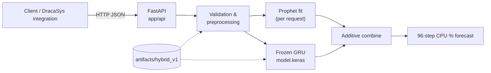
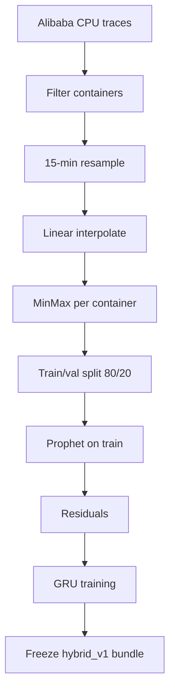
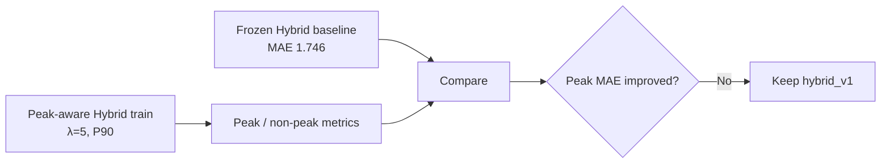

# Chapter 4 — Approach, Analysis and Design

**Module:** Module 1 — Long-Term Resource Forecasting (Hybrid Prophet + GRU)  
**Evidence basis:** `module1/app/`, `module1/artifacts/hybrid_v1/`, `module1/experiments/`  
**Companion chapters:** Technologies (Ch. 3); Implementation & Evaluation (Ch. 5)

---

## Part A — Your Approach

## 4.1 Overall Approach

Module 1 solves **24-hour container CPU forecasting** as an additive hybrid problem:

1. Prepare regular 15-minute CPU series from Alibaba traces.
2. Learn / apply per-container scaling.
3. Fit Prophet to capture trend and daily seasonality.
4. Train a GRU to forecast Prophet residuals over 96 steps.
5. At serving time, refit Prophet on the client history, run the frozen GRU, and combine components into CPU %.

This matches the production `hybrid_v1` service. Peak-aware training is a **research branch** evaluated against the frozen hybrid baseline, not part of the default serving path.

### Proposed versus implemented (core technique)

| Aspect | Proposed | Implemented evidence |
|--------|----------|----------------------|
| Hybrid stats + DL | Prophet + LSTM | Prophet + **GRU** (`hybrid_prophet_gru`) |
| Additive residual combine | Implied | Explicit in `hybrid_pipeline.py` |
| Peak-aware learning | Novelty | Research only; not in `hybrid_v1` |
| Missing-data handling | Simulation + interpolation | Pipeline: resample + **linear interpolate** |
| Target | Long-term resources | **CPU % only** |

---

## 4.2 Users, Inputs, and Outputs

### Users

- **Researcher:** runs evaluation under `experiments/` and inspects CSVs/JSON.
- **Integrator:** HTTP client to Module 1 FastAPI (`POST /forecast`).
- **Planner (intended):** consumes 96-step CPU forecasts for capacity decisions.

### Inputs

| Stage | Input | Format |
|-------|-------|--------|
| Offline | Alibaba `container_usage.csv` | CPU utilisation traces |
| Model train | Scaled CPU + Prophet residuals | Windows `(96,1) → 96` |
| API | `container_id`, timestamps, `historical_cpu` | JSON; ≥200 steps @ 15 min |

### Outputs

| Output | Meaning |
|--------|---------|
| `predicted_cpu_percent[96]` | Final hybrid forecast |
| Prophet / GRU components | Optional decomposition fields |
| Research metrics | MAE, RMSE, MAPE on Day-1 cohort |

---

## 4.3 Processing Workflow

```text
[1] Load Alibaba CPU traces; filter containers (≥1100 rows, non-degenerate)
[2] Resample to 15-minute means
[3] Linear interpolate gaps
[4] Chronological 80/20 train/val per container
[5] Fit per-container MinMax scalers
[6] Fit Prophet on train; compute residuals
[7] Train GRU on residual windows (96→96)
[8] Freeze artifacts → artifacts/hybrid_v1/
[9] Serve: validate → scale → Prophet refit → GRU → combine → inverse scale
```

---

## 4.4 Dataset and Horizon Design

| Item | Design choice |
|------|----------------|
| Dataset | Alibaba Cluster Trace (container CPU) |
| Containers retained | 486 after filters; 435 scalers in production bundle |
| Eval cohort | 99 containers (Day-1 primary) |
| Approx. series length | ~8 days after resampling (≈613 train + ≈154 val points) |
| Interval | 15 minutes |
| Horizon | **96 steps = 24 hours** (hard max in service) |
| GRU input window | 96 residual steps |

---

## 4.5 Prophet Forecasting Design

Prophet is treated as an **on-request seasonal engine**, not a frozen weight file:

- `daily_seasonality=True`
- `weekly_seasonality=False`
- Fit on the scaled history supplied in the HTTP request
- Emit history-aligned fitted values and 96-step future `yhat`

This supports new containers without storing thousands of Prophet models.

---

## 4.6 Residual Calculation and GRU Design

```text
residual_scaled_t = zscore(cpu_scaled_t − prophet_yhat_t)
```

GRU consumes the last 96 residual steps and predicts the next 96 residual steps. Architecture is stacked GRU + dense head (Chapter 3). Residual z-score statistics are **global and frozen**.

---

## 4.7 Final Hybrid Forecast Generation

```text
y_hat_scaled = prophet_future_scaled + residual_hat_unscaled
y_hat_cpu = inverse_MinMax(y_hat_scaled)
```

Clamping to a valid CPU range (0–100) is applied as needed by the service validation/response path.

---

## 4.8 Peak-Aware Mechanism (Research Path)

**Figure 4.4** (Part B) separates this path from production.

1. Detect peaks on training targets (P90 rule in the peak-aware Hybrid study).
2. Train GRU with weighted MSE (λ=5 on peaks).
3. Evaluate overall vs peak vs non-peak MAE/RMSE.
4. Compare to frozen Hybrid baseline.

**Outcome used in design:** do **not** replace `hybrid_v1` with peak-aware weights (peak error did not improve for Hybrid).

---

## 4.9 Missing-Data Handling Design

| Layer | Behaviour |
|-------|-----------|
| Offline pipeline | 15-min resample + linear interpolate → regular series for train/eval |
| Online API | Client must send complete 15-min history; gaps not accepted/filled by the service |

This keeps inference deterministic and pushes gap-filling responsibility to the integrator’s collector.

---

## 4.10 Long-Term Prediction Process (Serving)

For one forecast request:

```text
validate length ≥ 200, 15-min spacing, CPU in [0,100]
  → select/fit MinMax scaler
  → Prophet.fit(history_scaled)
  → build residual window (96)
  → GRU.predict → 96 residual steps
  → add Prophet future + residual
  → inverse scale → JSON response
```

Typical latency is dominated by Prophet fitting (seconds), not GRU.

---

## Part B — Analysis and Design

## 4.11 Top-Level Architecture

**Figure 4.1: Module 1 Hybrid Long-Term Resource Forecasting Architecture**



Figure 4.1 shows the production service boundary: research notebooks are outside the serving path; only frozen artifacts are read.

---

## 4.12 Data-Flow Design

**Figure 4.2: Offline Data Preparation and Training Flow**



Figure 4.2 is the research/production training lineage that produces the serving artifacts.

---

## 4.13 Prophet + GRU Hybrid Structure

**Figure 4.3: Additive Hybrid Forecast Composition**

```text
CPU history (scaled)
    │
    ├─► Prophet ──► seasonal baseline (hist + 96 future)
    │                      │
    │                      ▼
    └─► residual = cpu − prophet_hist
                           │
                           ▼
                      GRU (96→96)
                           │
                           ▼
              final = prophet_future + residual_hat
                           │
                           ▼
                    inverse MinMax → CPU %
```

Figure 4.3 is the concrete realisation of Novelty 1 (robust hybrid forecasting) as implemented—with **GRU**, not LSTM.

---

## 4.14 Peak-Aware Research Workflow

**Figure 4.4: Peak-Aware Evaluation Path (Non-Production)**



Figure 4.4 records the design decision not to ship peak-aware weights after evaluation.

---

## 4.15 Component Interaction Table

| Component | Responsibility | Reads | Writes (runtime) |
|-----------|----------------|-------|------------------|
| API routes | HTTP contract | JSON request | JSON response |
| Preprocessing | Validate, scale | History, scalers | Scaled arrays |
| Prophet module | Seasonal fit/forecast | Scaled history | `yhat` |
| GRU inference | Residual forecast | `model.keras`, residual window | Residual vector |
| Hybrid pipeline | Combine + inverse scale | All above | CPU % forecast |
| Artifact loader | Startup load | `artifacts/hybrid_v1/` | In-memory models |

---

## 4.16 Design Alternatives Considered

| Alternative | Outcome |
|-------------|---------|
| LSTM residual net (proposal) | Replaced by **GRU** in implementation |
| Global GRU only | Higher Day-1 MAE than Hybrid (1.924 vs 1.746) |
| Input window 288 | Slightly worse MAE than 96 in Hybrid ablation |
| Peak-aware Hybrid | Not adopted (peak MAE up) |
| Hybrid context features (HCERL V1–V4) | Did not beat V0 baseline MAE |

---

## 4.17 Summary of Design Decisions

1. **CPU-only, 15-min, 96-step horizon** matches capacity planning and service limits.
2. **Prophet + GRU additive hybrid** is the production core (not LSTM).
3. **Per-request Prophet fit** enables new containers without stored seasonal models.
4. **Frozen GRU + residual stats** keep serving deterministic and non-adaptive.
5. **Pipeline interpolation** regularises training data; API requires pre-filled gaps.
6. **Peak-aware** remains a documented research result, not a production upgrade.
