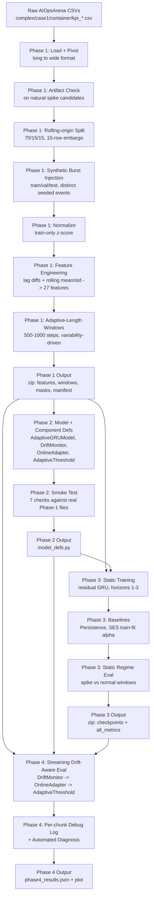
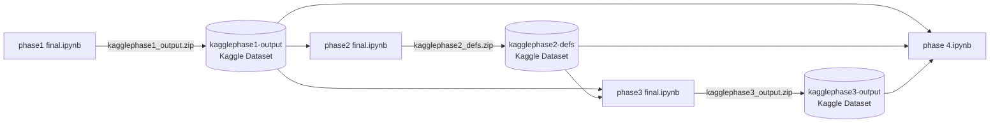

# 01 — Project Overview & Architecture

> Part of a 5-file documentation set for Module 2 ("Drift-Aware Short-Term Resource
> Prediction in Containerized Environments using a GRU-based Model"). This file covers
> the research objective, the actual (as-built) system architecture, the project's
> folder structure, and the high-level execution flow. See `04_final_model_results_and_reproducibility.md`
> for numeric results and `03_experiments_and_research_history.md` for how the
> architecture below was arrived at.

---

## 1. Research Objective and Problem Statement

**Stated research topic** (source: `docs/PROPOSAL_ROADMAP.md`, proposal text quoted
verbatim in that file):

> "Drift-Aware Short-Term Resource Prediction in Containerized Environments using a
> GRU-based Model" — forecast short-term resource usage (CPU, memory, network, and
> disk) in containerized environments to enable proactive scaling and prevent
> performance degradation under dynamic workloads.

**Proposed core technique:** a GRU-based model for time-series forecasting of
near-future resource demand, wrapped in a "drift-aware mechanism" combining:

1. Adaptive sliding window (500–1000 recent samples, size adjusts to workload
   variability)
2. Online/incremental learning with error-triggered updates
3. Error monitoring (moving average + statistical checks) to detect concept drift
4. Adaptive thresholding of prediction confidence based on recent error patterns
5. Burst-aware forecasting for sudden workload spikes
6. Multi-metric correlation modeling across CPU, memory, network, and disk

**What the project actually built** (verified against the executed final notebooks,
`final_notebook/final-output/`) delivers items 1–5 in a modified/scoped form and does
**not** implement item 6 as a distinct mechanism, and does not use network/disk metrics
at all — see §6 below and `03_experiments_and_research_history.md` for why each
deviation happened. This is stated here explicitly, not glossed over, per the
project's own evidence-based working discipline that runs through its whole history.

---

## 2. As-Built System Architecture

The architecture below is derived directly from the code in
`final_notebook/final-output/phase1 final.ipynb` through `phase 4.ipynb` — it is
**not** the architecture originally sketched in `docs/PROPOSAL_ROADMAP.md` (compare
against §7 of `03_experiments_and_research_history.md` for the full list of deviations
and why each was made).



### Architecture in words, stage by stage

| Stage | What happens | Implemented in |
|---|---|---|
| Data ingestion | Load `complex_case1`'s raw per-metric CSVs (long format: timestamp, cmdb_id, kpi_name, value), pivot to wide format (one column per metric) | `phase1 final.ipynb`, Step 2 |
| Data-quality gate | Inspect the largest natural step-changes per target to distinguish real workload behavior from collection artifacts (counter resets) before using them to calibrate anything | `phase1 final.ipynb`, Step 3 |
| Split | Per-container chronological 70/15/15, split membership decided by **target row**, not window start, with a 10-row embargo so no target is shared across splits | `phase1 final.ipynb`, Step 4 |
| Synthetic burst injection | Ramp/hold/decay burst events injected into train, val, and test independently (distinct seeded instances per split) — cpu bursts are permanent counter-rate bumps, memory bursts are bump-and-return | `phase1 final.ipynb`, Step 5 |
| Normalization | Train-split-only z-score, applied identically to val/test (both clean and injected variants) | `phase1 final.ipynb`, Step 6 |
| Feature engineering | Per-container lag diffs (1,2,3) + rolling mean/std(3) on top of 7 raw metrics → 27 input features | `phase1 final.ipynb`, Step 6 |
| Adaptive-length windowing | Per-anchor lookback length in [500,1000], set once from each container's own training-period rolling-variability statistic | `phase1 final.ipynb`, Step 7 |
| Model | `AdaptiveGRUModel` — 2-layer GRU (hidden=128), packed variable-length sequences, residual-anchored output head (`prediction = last_observed_value + learned_correction`, correction head zero-initialized) | `phase2 final.ipynb`, Step 2 |
| Training | Per-horizon (1, 2, 3 — 15s/30s/45s ahead) supervised training on burst-injected train split, Adam + ReduceLROnPlateau + early stopping, best-val checkpointing | `phase3 final.ipynb`, Step 3 |
| Baselines | Persistence (last observed value) and Simple Exponential Smoothing (train-fit alpha per target) | `phase3 final.ipynb`, Step 4 |
| Static regime evaluation | Batch evaluation of trained checkpoints on both the clean and burst-injected test splits, with injected results further split into spike-affected vs. normal windows | `phase3 final.ipynb`, Step 5–6 |
| Streaming drift-aware evaluation | Chronological chunked evaluation of the injected test stream; `DriftMonitor` watches chunk error (EWMA + z-score), triggers `OnlineAdapter` incremental fine-tuning on recent seen windows, `AdaptiveThreshold` tracks a rolling confidence band throughout | `phase 4.ipynb`, Step 3 |
| Debug / verification | Per-chunk instrumented log of every `DriftMonitor` internal value plus weight-change checksums proving each triggered update genuinely changed the model, and an automated stabilized-vs-limitation diagnosis | `phase 4.ipynb`, Steps 5–7 |

**Not present anywhere in this architecture:** anomaly scoring, thresholded
anomaly/no-anomaly decisions, reconstruction error, autoencoder, dimensionality
reduction, Isolation Forest, or a classification-style confusion matrix. This is a
**regression/forecasting** system (predicts continuous values: CPU-seconds, bytes) —
several of the template sections in the documentation brief (ROC-AUC, F1, confusion
matrix, anomaly scoring) do not apply to this project and are marked `Not applicable —
this is a forecasting project, not an anomaly-detection project` wherever the brief
would otherwise expect them (see `04_final_model_results_and_reproducibility.md` §3).

---

## 3. Why This Architecture, Not the Proposal's Original One

Three consequential deviations from `docs/PROPOSAL_ROADMAP.md`'s original Phase 1–5
sketch, each with a concrete evidenced reason (full detail in
`03_experiments_and_research_history.md`):

1. **Single-case training/testing (`complex_case1` only), not the original 4-case
   cross-deployment split.** The original design (train on `complex_case2` +
   `single_case2`, test on `complex_case1`) produced a ~44× cpu_usage scale mismatch
   between train and test that made every model, GRU included, catastrophically fail
   against a trivial baseline. Root-caused via a case-heterogeneity diagnostic
   (`outputs-legacy-experiments/v6_kaggle_phase1_phase2_phase3_output.ipynb`, Step 21),
   confirmed again in v7/v8, and resolved by switching to a chronological split within
   one case, with the other 3 cases repurposed as an inference-only drift-analysis
   target (not, however, carried into the final `final_notebook/final-output/`
   4-notebook pipeline — see §6 below).
2. **Rolling-origin split with an embargo, not a strict purge-gap split.** A hard
   purge-gap split was infeasible once the adaptive window's max lookback reached 1000
   steps (would leave near-zero windows in the 15%-sized val/test slices). Switched to
   target-row-based split membership with a 10-row embargo — documented, not silently
   substituted, in `phase1 final.ipynb`'s own Step 4 markdown.
3. **Residual/persistence-anchored GRU output, not a raw-value regression head.**
   Every prior version of the raw-value GRU lost to a trivial persistence baseline
   (predict "no change") on real data — confirmed across `v6`–`v9` in
   `outputs-legacy-experiments/`. The zero-init residual formulation
   (`prediction = last_value + correction`) makes the model start exactly at
   persistence and only diverge where the training data justifies it, giving the
   model a real, mechanistic reason to compete with the baseline instead of an
   accidental one.

---

## 4. Technology Stack

| Component | Technology | Evidence |
|---|---|---|
| Model framework | PyTorch (`torch`, `torch.nn`), CUDA execution | `phase2 final.ipynb` Step 1 output: `PyTorch 2.10.0+cu128 \| device: cuda` |
| Data handling | pandas, NumPy (memmap-backed `.npy` arrays for large feature tensors) | `phase1 final.ipynb` throughout |
| Execution environment | Kaggle Notebooks (GPU-accelerated), with `/kaggle/input` Dataset attachment as the cross-notebook data-handoff mechanism | All 4 final notebooks' Step 1 platform-detection cells |
| Serialization | `torch.save`/`torch.load` (`.pt` checkpoints), `json` (metrics, manifests), `.npy` (feature arrays, window tables) | See `04_final_model_results_and_reproducibility.md` §5 |
| Visualization | matplotlib | `phase 4.ipynb` Step 6; `analysis/spike_pattern_analysis.ipynb`, `analysis/spike_injection_visualization.ipynb` |
| Config | YAML (`config/data_config.yaml`) — used only by the historical/deprecated `preprocessing/` script pipeline, **not** by the current notebook pipeline | See §6 |

**Dependency note:** the current pipeline has no `requirements.txt`/`environment.yml`
anywhere in `module2/`. `Not found / Not verified` — dependency versions beyond what's
printed in notebook cell outputs (e.g. the PyTorch version string above) are not
recorded anywhere in the project.

---

## 5. Module Relationships — The 4-Notebook Handoff Chain

Because each phase runs in its own Kaggle session, state does not persist between
notebooks automatically. The project's actual mechanism for passing state forward is a
**download-zip → upload-as-Dataset → attach-via-Add-Input** cycle, run three times:



Phase 2's `model_defs.py` (a single Python source file containing every reusable
class/function — `AdaptiveGRUModel`, `WindowDataset`, `DriftMonitor`,
`AdaptiveThreshold`, `OnlineAdapter`, training utilities, baselines) is imported by
both Phase 3 and Phase 4 via `sys.path.insert` + `from model_defs import (...)` —
avoiding duplicated code between notebooks. See §7 of `02_data_pipeline_and_methodology.md`
for why `model_defs.py` is built from literal embedded source strings rather than
`inspect.getsource()` (a genuine Kaggle-kernel environment limitation encountered and
fixed during development).

---

## 6. Complete Project Structure (module2/)

```text
module2/
├── config/
│   └── data_config.yaml                  Historical — used only by deprecated preprocessing/ scripts
├── data/
│   ├── raw/{complex,single}/{case1,case2}/{container,istio}/kpi_*.csv   Raw AIOpsArena metrics
│   ├── processed/                        Historical merge-script output location (empty/legacy)
│   ├── merged/                           Historical merge-script output location (empty/legacy)
│   └── sequences/                        Historical sequence-script output location (empty/legacy)
├── docs/
│   ├── PROPOSAL_ROADMAP.md               Original proposal + early implementation-status log (V1-V5 era)
│   ├── ACTION_PLAN.md                    Historical — per-container normalization decision (superseded)
│   ├── CPU_VARIANCE_ANALYSIS.md          Historical — early EDA on CPU metric variance
│   ├── FOLDER_STRUCTURE_GUIDE.md         Historical — describes the deprecated preprocessing/ folder layout
│   ├── FROM_SCRATCH_WORKFLOW.md          Historical — describes the deprecated 3-script preprocessing workflow
│   ├── PREPROCESSING_COMPLETE_GUIDE.md   Historical — full guide to the deprecated preprocessing/ scripts
│   └── latest/                           THIS documentation set (5 files)
├── legacy_notebooks/                     Earliest exploratory pipeline notebooks + their own guide docs (pre-dates outputs-legacy-experiments/)
│   ├── Complete_Pipeline_Phase0_Phase1.ipynb
│   ├── Complete_Pipeline_Google_Drive_Data.ipynb
│   ├── Complete_Pipeline_Google_Drive_Data_RAM_OPTIMIZED.ipynb
│   ├── Phase1_and_Phase2_Pipeline.ipynb
│   ├── Phase1_Phase2_Phase3_Pipeline.ipynb
│   ├── Phase2_GRU_Model_Architecture.ipynb
│   ├── cpu_variance_diagnostic.ipynb
│   └── (8 guide/README .md and .txt files)
├── outputs-legacy-experiments/           Executed historical iterations V1-V9 (see 03_experiments_and_research_history.md)
│   ├── Phase1_Phase2_Phase3_Pipeline.ipynb
│   ├── v1_Phase1_Phase2_Phase3_Pipeline.ipynb  ... v9_notebook.ipynb
├── final_notebook/
│   ├── final-source/                     Pre-execution (clean) versions of the 4 final notebooks
│   │   └── phase1 final.ipynb, phase2 final.ipynb, phase3 final.ipynb, phase4 final.ipynb
│   ├── final-output/                     EXECUTED versions of the 4 final notebooks (cell outputs embedded) — CURRENT / FINAL PIPELINE
│   │   └── phase1 final.ipynb, phase2 final.ipynb, phase3 final.ipynb, phase 4.ipynb
│   ├── output-metrics/                   Saved artifacts produced by running the final-output notebooks
│   │   ├── kagglephase1_output/          features (clean+injected), windows, spike_mask, manifest, normalization_stats, segments
│   │   ├── kagglephase2_defs/            model_defs.py
│   │   ├── kagglephase3_output/          checkpoints/*.pt, all_metrics.json, all_metrics_summary.csv, all_metrics_per_target.csv
│   │   └── kagglephase4_output/          phase4_results.json, drift_debug_h3.png
│   └── analysis/                         Exploratory / diagnostic notebooks, not part of the trained pipeline
│       ├── analysis_merged_data.ipynb              Historical EDA on the old merged-CSV format
│       ├── analysis_merged_data_comprehensive.ipynb Historical EDA, extended
│       ├── spike_pattern_analysis.ipynb            Diagnostic: natural spike patterns across all 4 raw cases
│       └── spike_injection_visualization.ipynb     Diagnostic: visualizes synthetic burst injection vs. clean data
```

**Current / Final pipeline = `final_notebook/final-output/` (4 notebooks) +
`final_notebook/output-metrics/` (their saved artifacts).** Everything else listed
above (`legacy_notebooks/`, `outputs-legacy-experiments/`, `preprocessing/`-related
`docs/*.md`, `config/data_config.yaml`) is **Historical / Deprecated** — retained for
the research record but not executed by, or dependencies of, the current pipeline.
`final_notebook/final-source/` is the pre-execution source for the *same* current
pipeline (useful for diffing what changed between a clean run and an executed one) —
not a separate historical version.

---

## 7. High-Level Execution Flow (summary — full step-by-step in `04_final_model_results_and_reproducibility.md` §6)

```text
1. phase1 final.ipynb   (Kaggle, GPU not required)  ~5 min
      Input:  raw-data Kaggle Dataset (complex_case1's CSVs)
      Output: kagglephase1_output.zip

2. phase2 final.ipynb   (Kaggle, GPU recommended for smoke test)  ~2 min
      Input:  kagglephase1-output Dataset (optional, for real-file smoke test)
      Output: kagglephase2_defs.zip  (model_defs.py)

3. phase3 final.ipynb   (Kaggle, GPU required)  ~40-70 min for 3 horizons
      Input:  kagglephase1-output + kagglephase2-defs Datasets
      Output: kagglephase3_output.zip  (checkpoints + metrics)

4. phase 4.ipynb        (Kaggle, GPU required)  ~5-10 min
      Input:  kagglephase1-output + kagglephase2-defs + kagglephase3-output Datasets
      Output: kagglephase4_output.zip  (streaming results + debug log + diagnosis plot)
```

---

## 8. Documentation Set Map

| File | Primary focus |
|---|---|
| **01 (this file)** | Objective, architecture, project structure, execution flow overview |
| `02_data_pipeline_and_methodology.md` | Every data-stage methodology in depth: split design, burst injection, normalization, feature engineering, adaptive windowing — inputs/outputs per module |
| `03_experiments_and_research_history.md` | Full chronological research journey, V1–V9, what failed and why, how the final design was reached |
| `04_final_model_results_and_reproducibility.md` | Final architecture detail, training process, actual metrics (verified against `all_metrics.json`/`phase4_results.json`), reproducibility steps |
| `05_model_integration_and_developer_guide.md` | Checkpoint format, loading code, inference process, external integration guidance |
