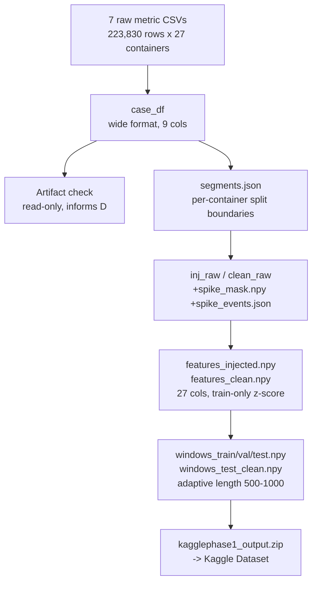

# 02 — Data Pipeline & Methodology

> Part of a 5-file documentation set. This file documents every data-stage
> methodology actually implemented, with exact source citations
> (`notebook, cell index`), inputs/outputs per module, and the module-to-module data
> chain. Source of truth: `final_notebook/final-output/phase1 final.ipynb` (executed)
> and its saved artifacts in `final_notebook/output-metrics/kagglephase1_output/`.

---

## 1. Dataset

**Source:** AIOpsArena container-telemetry benchmark (per `docs/PROPOSAL_ROADMAP.md`).
Raw layout on disk (verified from `phase1 final.ipynb` cell 2's Step-1 output and
`config/data_config.yaml`):

```text
<raw_root>/<complex|single>/<case1|case2>/<container|istio>/kpi_<metric>.csv
```

4 raw cases exist (`complex_case1`, `complex_case2`, `single_case1`, `single_case2`),
each with `container` and `istio` subfolders per case. **The current pipeline uses only
`complex_case1`'s `container` subfolder** — confirmed by `phase1 final.ipynb` cell 2's
`case1_dir = raw_path / 'complex' / 'case1' / 'container'`, and by
`manifest.json`'s `"case": "complex_case1"`. The `istio` subfolders (which would carry
network telemetry) and the other 3 cases are **not loaded anywhere in the final
pipeline** — this is the direct evidence behind the "network/disk metrics not
implemented" gap noted in `01_project_overview_and_architecture.md` §1.

**Raw metric files used** (`RAW_METRICS`, `phase1 final.ipynb` cell 4):

```text
container_cpu_usage_seconds_total, container_cpu_system_seconds_total,
container_cpu_user_seconds_total, container_memory_usage_bytes,
container_memory_working_set_bytes, container_memory_rss, container_memory_cache
```

7 raw metrics, matching `config/data_config.yaml`'s `core_metrics` list (that config
file itself is a leftover from the deprecated `preprocessing/` scripts, but the metric
list it documents matches what the current pipeline independently uses).

**Verified scale, post-load** (`phase1 final.ipynb` cell 4 output, cross-checked
against `output-metrics/kagglephase1_output/manifest.json`):

| Property | Value | Source |
|---|---|---|
| Rows | 223,830 | manifest.json `n_rows` |
| Containers | 27 | manifest.json `n_containers` |
| NaNs in metric columns | 0 | cell 4 printed output |

---

## 2. Module: Data Loading + Pivot

```text
Module: load complex_case1, pivot long -> wide
Purpose: turn per-metric long-format CSVs into one wide DataFrame, one row
         per (timestamp, container)

INPUT
- File: <raw_root>/complex/case1/container/kpi_*.csv  (7 files, one per metric)
- Format: CSV, columns [timestamp, cmdb_id, kpi_name, value]
- Required preprocessing: none (used directly)

PROCESSING
- Main steps: concat all 7 metric files (filtered to RAW_METRICS by kpi_name if that
  column exists) -> pivot_table(index=['timestamp','cmdb_id'], columns='kpi_name',
  values='value') -> assert all 7 target columns present -> cast to float64 ->
  sort by (cmdb_id, timestamp)
- Important parameters: none tunable — hard requirement is that all 7 RAW_METRICS
  columns exist post-pivot, or a ValueError is raised naming the missing column(s)

OUTPUT
- Variable: case_df (in-memory pandas DataFrame)
- Shape: (223,830, 9)  — timestamp, cmdb_id + 7 metric columns
- Used by: Step 3 (artifact check), Step 4 (split), Step 6 (normalize/engineer)
```

**Source:** `phase1 final.ipynb`, cell 4 (Step 2).

---

## 3. Module: Artifact Check on Natural "Spikes"

**What it is:** a data-quality gate that inspects the single largest observed
step-change per target *before* any downstream design decision (specifically, the
synthetic burst injection magnitudes in §4) is calibrated from "typical" data
behavior.

**Why it was added:** an earlier diagnostic across all 4 raw cases (not part of the
final pipeline — see `analysis/spike_pattern_analysis.ipynb`) found step-change
ratios (max ÷ p95) of 200×–1600× for several target/case combinations, with
suspiciously identical extreme values recurring across *unrelated* cases and
containers — the signature of a shared measurement artifact (e.g. a monitoring-agent
restart or counter reset), not genuine workload behavior.

**Mechanism** (`phase1 final.ipynb`, cell 6):
- For each target, find the single largest `|diff|` step across the whole
  `complex_case1` timeline and print the 6 rows of raw data around it.
- Compute the fraction of *negative* steps larger than 5× the p95 (a counter-reset
  signature check for cumulative metrics).

**Verified finding** (cell 6 output, `complex_case1`):

| Target | Max step | p95 step | Ratio | Values around the max step |
|---|---|---|---|---|
| cpu_usage | 1,916.11 | 1.16 | 1648× | `1921.067, 1921.067, 1921.067, 4.956, 4.956, 4.956` — a clean, near-instant drop from a monotonic counter, inconsistent with legitimate accumulation |
| mem_usage | 107,339,776.00 | 421,888.00 | 254× | `184,430,592, 184,430,592, 184,430,592, 77,090,816, ...` — same drop pattern |

**Conclusion applied downstream:** these maxima are treated as measurement artifacts,
not real bursts. The synthetic burst design in §4 explicitly anchors its magnitude to
each container's own **p95 of normal steps**, never to these observed maxima — stated
directly in the notebook's Step 5 markdown cell.

---

## 4. Module: Split — Rolling-Origin, Target-Row-Based, Embargoed

```text
Module: per-container chronological split
Purpose: assign every row to train/val/test without leaking future information
         into an earlier split, under an adaptive lookback of up to 1000 rows

INPUT
- case_df (223,830 rows, 27 containers)

PROCESSING
- Per container: compute row-index boundaries i70 (70% point) and i85 (85% point)
  within that container's own [start, end) row range
- Segment boundaries persisted to segments.json: {container: {start, end, i70, i85}}
- TRAIN_FRAC=0.70, VAL_FRAC=0.15 (test = remaining 0.15)

OUTPUT
- File: output-metrics/kagglephase1_output/segments.json
- Used by: Step 5 (burst injection region bounds), Step 7 (window split membership)
```

**Source:** `phase1 final.ipynb`, cell 8 (Step 4).

**Why rolling-origin + embargo, not a strict purge gap:** with an adaptive lookback
reaching 1000 rows, a strict purge-gap split (removing `lookback` rows at every
boundary) would leave near-zero usable windows in the 15%-sized val/test regions per
container (≈1,235 rows each). Instead, split membership is decided by **which split a
window's *target* rows fall into**, not by where its lookback starts — a window's
lookback may reach backward across a split boundary as context, but its prediction
target never does, and a fixed **10-row embargo** additionally prevents any window's
target from landing inside the gap immediately after a boundary. This is a documented,
deliberate design trade-off (`phase1 final.ipynb`, Step 4 markdown cell), not an
oversight — see `03_experiments_and_research_history.md` §5 for the diagnostic that
made a strict purge gap infeasible.

**Verified segment example** (`segments.json`, `observe.cartservice-0`):
`start=0, end=8302, i70=5811, i85=7056` — 5,811 train rows, 1,245 val rows, 1,246 test
rows for this one container.

---

## 5. Module: Synthetic Burst Injection

```text
Module: inject synthetic spike events
Purpose: give the model (and the drift-detection mechanism) genuine burst
         conditions to react to, since natural bursts in complex_case1 are
         either artifacts (see §3) or absent

INPUT
- case_df, segments.json boundaries, per-container p95 natural step (cpu),
  per-container median level (memory)

PROCESSING
- Event shape: ramp-up (20 steps) -> hold (10 steps) -> decay (20 steps), 50 rows total
- cpu_usage: additive RATE bump (peak = 4-8x the container's own p95 natural step),
  applied as a cumulative sum so the counter's permanent level shifts upward and
  stays monotonic (physically consistent with a real cumulative counter)
- memory (3 targets): BUMP-AND-RETURN, peak = 15-35% of the container's median level,
  correlated 0.8-1.0x magnitude scaling across the 3 memory targets together
- Distinct, independently-seeded event placement per split:
    train: seed=101, 8 events/container
    val:   seed=202, 3 events/container
    test:  seed=303, 4 events/container
  (>=300 rows apart within a container; some containers may realize fewer than the
  target count if spacing constraints can't be satisfied -- verified count below)
- Every modified row recorded in a boolean spike_mask; every event's exact
  start/end/container/split/magnitude recorded in spike_events.json

OUTPUT
- Variables: inj_raw (modified), clean_raw (untouched) -- both retained so a
  "clean" and "injected" variant of every downstream artifact can be produced
- File: output-metrics/kagglephase1_output/spike_mask.npy  (bool, len=223,830)
- File: output-metrics/kagglephase1_output/spike_events.json
- Used by: Step 6 (both variants normalized/feature-engineered), Step 7 (both
  variants windowed), Phase 3/4 (spike-window vs. normal-window regime split)
```

**Source:** `phase1 final.ipynb`, cell 10 (Step 5). Design rationale documented
in-notebook and cross-checked against `manifest.json`'s `burst_design` block.

**Verified actual counts** (cell 10 output, matches `manifest.json`):

| Split | Target count (events/container × 27) | Actual events injected | Rows inside burst regions |
|---|---|---|---|
| train | 216 | 216 | — |
| val | 81 | 81 | — |
| test | 108 | 92 | — |
| **Total** | — | **389** | **19,450 / 223,830 (8.69%)** |

The test split realized 92 of a nominal 108 (4×27) — some containers could not fit all
4 non-overlapping ≥300-row-spaced events within their test region. This is disclosed
directly in the cell's own output (`by_split` dict printed each run), not hidden.

**Two data variants exist from this point forward:** *clean* (untouched
`clean_raw`/`features_clean.npy`) and *injected* (`inj_raw`/`features_injected.npy`).
Both are carried through normalization, feature engineering, and windowing in parallel.
This is why Phase 3/4 report two separate test-set results — see
`04_final_model_results_and_reproducibility.md` §3.

---

## 6. Module: Normalization + Feature Engineering

```text
Module: normalize (train-only) + engineer features
Purpose: z-score all 7 raw metrics using train-split statistics only (no
         leakage), then add per-container temporal features

INPUT
- inj_raw / clean_raw (7 raw metric columns, both variants)
- train_row_mask (boolean, True for rows in any container's train region)

PROCESSING
- train_stats[col] = {mean, std} computed ONLY over train_row_mask rows, computed
  once from the INJECTED variant (see note below)
- Applied identically to both clean and injected variants (same stats for both)
- Per-container (no cross-container leakage), per raw metric: lag diffs at 1, 2, 3
  steps + rolling mean/std over a 3-step window
- 7 raw + 7*3 (=20) engineered = 27 total feature columns

OUTPUT
- File: output-metrics/kagglephase1_output/features_injected.npy   (223830, 27) float32
- File: output-metrics/kagglephase1_output/features_clean.npy      (223830, 27) float32
- File: output-metrics/kagglephase1_output/normalization_stats.json
- File: output-metrics/kagglephase1_output/feature_cols.json  (column name -> index map)
- Used by: Step 7 (windowing), all of Phase 2/3/4 (target de-normalization,
  DriftMonitor error computation, everything)
```

**Source:** `phase1 final.ipynb`, cell 12 (Step 6).

**Verified normalization stats** (`normalization_stats.json`):

| Column | mean | std |
|---|---|---|
| container_cpu_usage_seconds_total | 1,050.65 | 1,100.99 |
| container_memory_usage_bytes | 82,717,624.44 | 16,086,988.44 |
| container_memory_working_set_bytes | 81,760,289.61 | 15,399,110.83 |
| container_memory_rss | 69,604,729.21 | 10,591,065.52 |

**Target columns and their feature-array indices** (`feature_cols.json`):
`cpu_usage`→0, `mem_usage`→3, `mem_working_set`→4, `mem_rss`→5 (indices into the
27-column feature array — the same 4 columns are also raw features, at positions 0
and 3–5, since the model's residual anchor needs the *last observed* value of each
target to be directly readable from the input window).

**Important, disclosed asymmetry:** `train_stats` is computed from the **injected**
variant's train rows (`inj_raw`), not the clean variant's — the same stats are then
applied to *both* variants. Since the cpu burst injection design is a **permanent**
counter-level shift (§5), and training itself only ever sees the injected trajectory,
this creates a genuine (documented, not hidden) confound between the clean and
injected evaluation results at longer horizons — discussed with its evidence in
`03_experiments_and_research_history.md` §6 and `04_final_model_results_and_reproducibility.md` §3.

---

## 7. Module: Adaptive-Length Rolling-Origin Windowing

```text
Module: build adaptive-length window tables
Purpose: generate the [anchor, lookback_length] pairs used as model inputs,
         with lookback length driven by recent workload variability
         (the proposal's "Adaptive Sliding Window" component)

INPUT
- features_injected.npy / features_clean.npy (for length-signal computation and,
  separately, for actually slicing windows at train/eval time)
- segments.json (container row boundaries + i70/i85 split points)

PROCESSING
- Variability signal: rolling std (120-step window) of the normalized cpu_usage
  column, computed once per container
- Reference: each container's own median of that rolling-std statistic, computed
  from ONLY that container's train-period rows
- Length rule: lookback = clip(1000 - 250*(recent_std/reference_std - 1), 500, 1000)
  -- i.e. length shrinks (down to a floor of 500) when recent variability exceeds
  the container's own historical baseline, and stays near 1000 when calm
- Window anchor `end`: for each valid anchor row inside a container, lookback is
  capped so it never crosses that container's own row-range start
- Split membership: decided by whether end + MAX_HORIZON(10) - 1 falls inside the
  train / val / test row range (per segments.json), matching the embargo rule in §4

OUTPUT
- File: windows_train.npy, windows_val.npy, windows_test.npy   int32, shape (N, 2)
        each row = [anchor_end_exclusive, lookback_length]
- File: windows_test_clean.npy  (test-split windows recomputed against the CLEAN
        variability signal, for clean-data evaluation)
- Used by: Phase 2's WindowDataset (X = features[end-L:end], y(h) = features[end-1+h, target_idx])
```

**Source:** `phase1 final.ipynb`, cell 14 (Step 7).

**Verified window counts and lengths** (cell 14 output):

| Split | Windows | Length min/mean/max | % shortened below max (evidence the rule genuinely fires) |
|---|---|---|---|
| train | 142,653 | 500 / 887 / 1000 | 51.6% (73,591 windows) |
| val | 33,335 | 500 / 833 / 1000 | — |
| test (injected) | 33,343 | 500 / 809 / 1000 | — |
| test (clean) | 33,343 | (recomputed from clean signal) | — |

**A precise, load-bearing limitation, stated directly (do not soften this in
citation):** this length decision is made **once, in Phase 1, from historical
(training-period) statistics** — it is baked into the saved window tables and never
recomputed once Phase 3/4 begin evaluating. It is genuinely *variable* (the 51.6%
figure above proves the rule fires on real data), but it is **not live-adaptive at
deployment/inference time** the way `DriftMonitor` (Phase 4) is. See
`03_experiments_and_research_history.md` §8 for the fuller discussion of this gap and
what a fully live version would require.

---

## 8. Module: Save + Package (Phase 1 Output)

```text
Module: package Phase 1 outputs
Purpose: produce a self-contained, downloadable bundle so Phase 2/3/4 (separate
         Kaggle sessions) can consume Phase 1's results without re-running it

INPUT
- All artifacts produced in Steps 2-7 above

OUTPUT
- Directory: /kaggle/working/phase1_output/  (12 files, ~50.7 MB total)
- Archive: /kaggle/working/kagglephase1_output.zip  (13.6 MB)
- Used by: uploaded manually as the 'kagglephase1-output' Kaggle Dataset,
  attached to phase2/phase3/phase4 via Add Input
```

**Source:** `phase1 final.ipynb`, cell 16 (Step 8). Verified present on disk at
`final_notebook/output-metrics/kagglephase1_output/` (12 files matching the
notebook's printed manifest exactly).

---

## 9. Complete Data Flow — Module Chain Summary



---

## 10. Methodologies Explicitly Not Present

Per the documentation brief's checklist, these are marked here rather than left
ambiguous:

| Concept | Status |
|---|---|
| Dimensionality reduction (PCA etc.) | Not present |
| Autoencoder architecture | Not present |
| Reconstruction error | Not present |
| Isolation Forest | Not present |
| Hyperparameter optimization (grid/random/Bayesian search) | Not found / Not verified — `Phase3Config`/`Phase4` settings (hidden_size=128, lr=1e-3, etc.) appear to be fixed choices carried from the earlier `outputs-legacy-experiments/` iterations, not the product of a documented search in the final pipeline |
| Multi-seed evaluation | Present in `outputs-legacy-experiments/` (V1-V9 era, e.g. `v8_kaggle_final_output.ipynb`'s Step 23 multi-seed variance check) but **not present** in the final `final_notebook/final-output/` 4-notebook pipeline — see `03_experiments_and_research_history.md` §9 |
| Class imbalance handling | Not applicable — this is a regression task, no classes |
