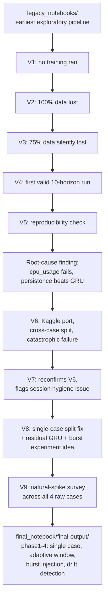

# 03 — Experiments & Research History

> Part of a 5-file documentation set. This is the project's research journey: every
> major version, what was attempted, what failed, why (with evidence), and how each
> failure led to the next design decision — ending at the architecture documented in
> `01_project_overview_and_architecture.md` and `02_data_pipeline_and_methodology.md`.
> Sources: `outputs-legacy-experiments/v1`–`v9`, `docs/PROPOSAL_ROADMAP.md`, and the
> executed `final_notebook/final-output/` notebooks themselves (which contain their
> own in-notebook research-log markdown cells, quoted directly below where present).

---

## Research Timeline, End to End



---

## V1 — No Training Ever Ran

**Files:** `outputs-legacy-experiments/v1_Phase1_Phase2_Phase3_Pipeline.ipynb`

- **Purpose:** first attempt to run the merged Phase1/2/3 pipeline notebook end to end.
- **Observed result:** training never executed.
- **Root cause (evidenced, per `docs/PROPOSAL_ROADMAP.md`):** a dead, duplicate Phase 3
  code block combined with non-sequential kernel cell execution meant the training
  call was never actually reached in the executed run.
- **Failure category:** reproducibility problem (execution-order dependency, not a
  modeling issue).
- **What changed afterward:** cell execution order and duplicate-block cleanup —
  addressed structurally in later versions' explicit pre-flight integrity checks
  (see V3 onward).

---

## V2 — 100% of Data Lost

**Files:** `outputs-legacy-experiments/v2_Phase1_and_Phase2_Pipeline.ipynb`

- **Purpose:** re-run after V1's execution-order fix.
- **Observed result:** every row's case identity resolved to "unknown"; all splits
  ended up empty.
- **Root cause:** case identity was assumed to be encoded in each raw CSV's
  **filename**. The real layout encodes case identity in the **folder path**
  (`complex/case1/container/kpi_*.csv`), not the filename — confirmed by inspecting
  the actual raw folder structure.
- **Failure category:** incorrect preprocessing assumption (data-source contract
  mismatch).
- **What changed afterward:** case inference rewritten to parse `csv_path.parts`
  instead of the filename — this exact fix is still present, and explicitly guarded
  against regressing, in the final pipeline (`phase1 final.ipynb` inherits this
  folder-path convention for locating `complex/case1/container/`).

---

## V3 — 75% of Case Data Silently Lost

**Files:** `outputs-legacy-experiments/v3_Phase1_Phase2_Phase3_Pipeline.ipynb`

- **Purpose:** re-run after V2's folder-path fix.
- **Observed result:** row counts looked plausible at a glance, but 3 of 4 cases'
  actual values were missing.
- **Root cause:** `pivot_table(index=['timestamp', 'cmdb_id'])` used only a 2-key
  index. Since all 4 raw cases share the same `(timestamp, cmdb_id)` space, rows from
  different cases collided on that key, and `aggfunc='first'` silently kept whichever
  case's row was concatenated first (alphabetically `complex` before `single`),
  discarding the other 3 cases' actual values — not just a label, the values
  themselves.
- **Failure category:** incorrect data-merge methodology (silent aggregation
  collision) — the most severe of the three early bugs, because it produced
  plausible-looking output with no error, no warning.
- **What changed afterward:** `case_source` added as a third pivot index key. This
  exact 3-key pivot design is preserved in `phase1 final.ipynb`'s Step 2, and V3's
  failure mode is specifically what an in-notebook pre-flight integrity check exists
  to catch (see §"Regression guards" below).

---

## V4 — First Complete, Valid 10-Horizon Run

**Files:** `outputs-legacy-experiments/v4_Phase1_Phase2_Phase3_Pipeline.ipynb`

- **Purpose:** first execution on the V3-corrected (3-key pivot) pipeline.
- **Observed result (headline finding, quoted from `docs/PROPOSAL_ROADMAP.md`):**
  3 of 4 targets (`mem_usage`, `mem_working_set`, `mem_rss`) already met a ≤10% MAPE
  research target (0.60–0.76% MAPE). The "25–45% average MAPE" overall failure was
  driven almost entirely by `cpu_usage` (mean 133.5% MAPE) — **a persistence
  (last-value) baseline beat the trained GRU on cpu_usage on every horizon** (0.07–0.43%
  MAPE for persistence vs. 25–45% for the GRU).
- **Leading hypothesis at the time (documented as unconfirmed):** `cpu_usage` is a raw
  cumulative Prometheus counter; train's cases showed a ~30x larger scale (mean 21,168)
  than val's (mean 669) for this one column — global z-score normalization,
  appropriate for the gauge-type memory metrics, miscalibrates this one cumulative
  signal across cases with very different accumulated magnitudes.
- **This is the first appearance of the persistence-beats-GRU finding that recurs
  through every subsequent version up to the final pipeline's honest reporting of the
  same pattern** (see V6–V8 below, and `04_final_model_results_and_reproducibility.md`).

## V5 — Reproducibility Confirmation

**Files:** `outputs-legacy-experiments/v5_Phase1_Phase2_Phase3_Pipeline_output.ipynb`

- **Purpose:** re-run V4 with the same seed/data to check reproducibility.
- **Observed result:** reproduces V4 exactly. Contributes no new experimental signal
  — this was a deliberate reproducibility check, not a new experiment.

---

## The V1–V5 → Kaggle Transition

`docs/PROPOSAL_ROADMAP.md` records a designed, code-reviewed but **not yet executed**
fix at the end of the V5 era: predicting `cpu_usage` as a delta
(`future_cpu - last_observed_cpu`) instead of the raw counter, horizon-1 only, as a
single-variable controlled experiment (WBS Task 1 in that document). The roadmap
explicitly flags this as the current blocking step at that point in the project's
history. This delta-target idea is the direct conceptual ancestor of the final
pipeline's residual-GRU formulation (§ "V8" below and
`02_data_pipeline_and_methodology.md` — though the final version anchors *all 4*
targets, not cpu_usage alone, and is validated properly against a test split rather
than val-only).

---

## V6 — Kaggle Port, Cross-Case Split, Catastrophic Failure

**Files:** `outputs-legacy-experiments/v6_kaggle_phase1_phase2_phase3_output.ipynb`

- **Purpose:** port the pipeline to Kaggle (platform/session infrastructure change
  only — no algorithmic change intended), re-run the same cross-case split design
  (train = `complex_case2` + `single_case2`, val = `single_case1`,
  test = `complex_case1`).
- **Observed result:** catastrophic failure — test MAPE 244–517% across all 10
  horizons; persistence baseline beat the GRU on 40/40 target×horizon combinations
  (Step 22 of that notebook).
- **Root cause, confirmed via case-heterogeneity diagnostic (that notebook's Step 21):**
  `complex_case1` (test) has cpu_usage mean≈692, std≈743; `complex_case2`+`single_case2`
  (train) has cpu_usage mean≈30,609, std≈24,614 — a **~44× scale mismatch** between
  train and test for exactly the target that fails. Global normalization statistics
  fit on train catastrophically miscalibrate test.
- **Failure category:** distribution shift / incorrect train-test split design (case
  boundaries chosen without checking whether they were scale-comparable).
- **What was changed afterward:** the case-based cross-deployment split itself was
  identified as the structural cause — this directly motivated the single-case design
  adopted from V8 onward.

## V7 — Reconfirmation + an Infrastructure Lesson

**Files:** `outputs-legacy-experiments/v7_kaggle_final_output.ipynb`

- **Purpose:** re-validate V6's finding was real, not a fluke of that specific run.
- **Observed result:** reproduces V6's ~44× mismatch and catastrophic failure exactly.
- **Additional finding (QA, not modeling):** cell-level RAM readings showed ~8.4 GB
  already used "after setup," before any real data load — evidence the Kaggle session
  was not freshly restarted from a prior run, risking silent state leakage between
  runs. Not a modeling defect, but a reproducibility-hygiene issue, flagged and
  corrected procedurally (fresh-kernel discipline) for subsequent versions.

---

## V8 — Single-Case Split, Residual GRU, and the Origin of the Burst-Injection Idea

**Files:** `outputs-legacy-experiments/v8_kaggle_final_output.ipynb`

This is the most consequential version — most of the final pipeline's core design
decisions trace directly to findings in this run.

- **Change 1 — single-case split.** Abandoned the cross-case design; train/val/test
  now all drawn from `complex_case1` alone, per-container chronological 70/15/15 with
  a 240-row purge gap (the predecessor to the final pipeline's rolling-origin +
  10-row-embargo design, changed again once the adaptive window's max length grew
  past what a 240-row purge gap could support).
- **Change 2 — residual/persistence-anchored GRU.** `prediction = last_value +
  learned_correction`, correction head zero-initialized so the model starts at
  persistence exactly. Motivated directly by V4–V7's repeated persistence-dominance
  finding: give the model a structural reason to at least match the baseline instead
  of reconstructing values from scratch.
- **Observed result on real (clean) data:** residual-GRU beat persistence on only
  3/40 target×horizon combinations. Explicit decision recorded in that notebook's own
  output: *"residual does NOT beat persistence on a majority — report as an honest
  negative result: at 15s sampling this workload is persistence-dominated."*
- **Observed result under a first synthetic burst-stress condition (this notebook's
  own exploratory addition):** on burst-injected data, the residual-GRU **consistently
  beat both persistence and exponential smoothing at every tested horizon** — the
  first evidence that a burst-aware evaluation gives the model a genuine, structural
  advantage that real (largely flat/trending) data does not.
- **Also discovered here:** a normalization-mismatch anomaly at longer horizons when
  comparing "clean" vs. "burst-injected" evaluation variants trained from the same
  injected-trajectory statistics — the direct ancestor of the same, still-present
  caveat documented in `02_data_pipeline_and_methodology.md` §6 and
  `04_final_model_results_and_reproducibility.md` §3.
- **What was changed afterward:** the burst-injection idea was generalized from an
  informal exploratory addition into the fully-designed, seeded, artifact-checked
  Phase 1 module described in `02_data_pipeline_and_methodology.md` §5.

---

## V9 — Natural Spike Survey Across All 4 Raw Cases

**Files:** `outputs-legacy-experiments/v9_notebook.ipynb`
(source notebook: `final_notebook/analysis/spike_pattern_analysis.ipynb`)

- **Purpose:** before finalizing synthetic burst design, check whether any of the 4
  raw cases already contains *natural* spikes strong enough to use instead of
  synthetic ones.
- **Observed result:** `complex_case1`'s cpu_usage showed a max/p95 step ratio of
  1647× — but inspection of the underlying rows (see
  `02_data_pipeline_and_methodology.md` §3) identified this as a counter-reset
  artifact, not a real burst. Memory targets across all 4 cases showed suspiciously
  uniform 200–280× ratios with near-identical absolute magnitudes recurring across
  unrelated cases/containers — the same artifact signature.
- **Conclusion applied to the final design:** no case contains a usable natural burst;
  synthetic injection is necessary, and its parameters must be anchored to p95 of
  *normal* variability (not to these artifact-contaminated maxima) — directly
  implemented as the Step 3 "artifact check" gate in `phase1 final.ipynb` (see
  `02_data_pipeline_and_methodology.md` §3).

---

## Transition to the Final 4-Notebook Pipeline

Between V9 and the current `final_notebook/final-output/` notebooks, several further
structural changes were made (not preserved as separate numbered "V" runs, since they
were iterated on directly within the final-notebook family itself):

1. **Adaptive sliding window** (500–1000, variability-driven) implemented in Phase 1,
   replacing V8's fixed 240-row lookback — this required moving from a strict
   purge-gap split to the rolling-origin + embargo design (§4 of
   `02_data_pipeline_and_methodology.md`), since a 1000-row purge gap was infeasible
   at the 15%-sized val/test splits.
2. **Full drift-aware mechanism implemented**: `DriftMonitor` (EWMA + z-score
   error-triggered detection), `OnlineAdapter` (incremental fine-tuning on recent
   seen windows), `AdaptiveThreshold` (rolling confidence band) — all defined in
   `phase2 final.ipynb` and exercised live in `phase 4.ipynb`.
3. **4-notebook split** (Phase 1 data / Phase 2 defs / Phase 3 static training /
   Phase 4 streaming drift evaluation) adopted specifically to keep each Kaggle
   session within a manageable, independently-resumable runtime after repeated
   environment fragility was encountered (CUDA kernel/driver mismatches, silent
   session stalls, multi-hour re-run costs when a single monolithic notebook failed
   partway through) — documented directly in the notebooks' own Step-1 markdown cells
   ("no training from scratch happens here").
4. **Horizon scope reduced from 10 to 3 (1, 2, 3)** in the final `phase3 final.ipynb`
   / `phase 4.ipynb` pair, specifically to keep the adaptive variable-length-sequence
   training runtime within a single Kaggle GPU session — an explicit, disclosed
   scope reduction (not silently dropped), stated in `phase3 final.ipynb`'s Step 2
   config-cell printed output.

---

## What Failed, Categorized (per the documentation brief's checklist)

| Failure category | Occurred? | Version(s) | Evidence |
|---|---|---|---|
| Data leakage | Partially — see the clean/injected normalization confound | V8 onward | §"V8" above; `02_data_pipeline_and_methodology.md` §6 |
| Incorrect train/test split | Yes | V6, V7 | 44× cross-case scale mismatch |
| Poor preprocessing | Yes | V2, V3 | Filename-vs-folder case ID; 2-key pivot collision |
| Incorrect window construction | Not evidenced as a distinct failure — window/purge-gap design was proactively redesigned (not discovered broken) when the adaptive window's length grew | — | — |
| Class imbalance | Not applicable (regression task) | — | — |
| Threshold problems | Not evidenced as a failure — `AdaptiveThreshold` runs but is under-utilized (a gap, not a failure); see `04...md` §4 | — | — |
| Model instability | Not evidenced | — | — |
| Overfitting / Underfitting | Not directly evidenced with dedicated diagnostics in the final pipeline; `Not found / Not verified` whether train-vs-val loss gaps were formally analyzed beyond early stopping | — | — |
| Poor feature representation | Partially — raw cumulative counter (cpu_usage) miscalibrated by global normalization | V4-V7 | Root-cause finding, §"V4" and "V6" above |
| Distribution shift | Yes — the central, recurring finding | V4, V6, V7, V8 | 44× scale mismatch; persistence-dominance |
| Drift (in the concept-drift sense) | Addressed as the project's core mechanism (Phase 4), not a failure encountered | — | — |
| Computational limitations | Yes | Final pipeline (4-notebook split, horizon scope reduction) | See "Transition" §3-4 above |
| Incorrect evaluation methodology | Yes — reproducibility hygiene (stale session state) | V7 | See "V7" above |
| Hyperparameter problems | `Not found / Not verified` — no evidence of a formal HPO search at any stage | — | — |
| Reproducibility problems | Yes | V1, V7 | Dead code block / kernel execution order; stale session RAM |

---

## Why the Final Approach Was Selected — Summary Chain

```text
Persistence beats GRU on real data (V4)
      |
Root-caused to cpu_usage counter + cross-case scale mismatch (V4, V6, V7)
      |
Single-case split adopted to remove the scale mismatch (V8)
      |
Persistence STILL beats GRU on real data, even single-case (V8)
      |
Residual/persistence-anchored GRU formulation adopted (V8)
      |
Residual-GRU still doesn't beat baselines on real data (V8) --
  BUT genuinely beats them under synthetic burst conditions (V8 exploratory finding)
      |
Burst injection formalized + artifact-checked (V9, final Phase 1)
      |
Adaptive window + full drift-aware mechanism (DriftMonitor/OnlineAdapter/
AdaptiveThreshold) built around the burst-injected data (final 4-notebook pipeline)
```

This chain is the honest justification for the final architecture: it was not
designed from the proposal downward, it was **built upward from a sequence of
evidenced failures**, each fix targeting the specific root cause the previous version's
diagnostics identified. See `04_final_model_results_and_reproducibility.md` for
whether the final design's results support this chain's conclusions.
