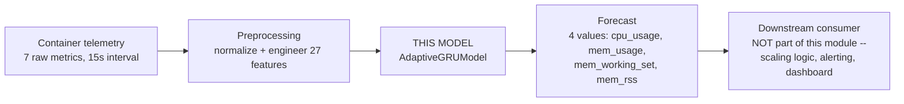
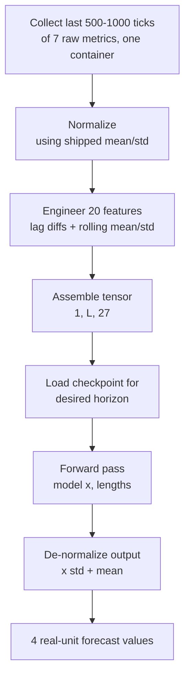
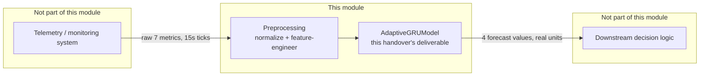

# Technical Handover Document — Module 2: Drift-Aware Container Resource Prediction Model

**Audience:** a developer/teammate who has not worked on this module before and needs
to run, use, and integrate it independently.

**Model:** `AdaptiveGRUModel` — a residual/persistence-anchored GRU forecaster for
short-term container CPU/memory prediction.

---

## 1. Model Overview

**What it is:** a PyTorch GRU-based time-series model that forecasts a container's
near-future CPU and memory usage from its recent history. It is not an anomaly
detector and does not produce a classification or alert — it produces continuous
numeric forecasts (CPU-seconds, bytes) that a downstream component would need to
interpret.

**Architecture in one line:** a 2-layer GRU (hidden size 128) reads a window of recent
per-timestep telemetry and outputs `last_observed_value + learned_correction` for each
of 4 target metrics — the model is *anchored* to the last real observation rather than
predicting from scratch, which is a deliberate design choice (see §7).

**Purpose:** enable proactive scaling / resource-management decisions by forecasting
resource demand 15–45 seconds ahead, before it happens, rather than reacting after the
fact.

**Where it fits in the pipeline:**



This model is the **prediction stage only**. It does not collect telemetry, does not
make scaling decisions, and does not raise alerts — those are the responsibility of
whatever system integrates it (§6).

---

## 2. Model Input

### Raw data required

A contiguous, chronologically-ordered time series **per container**, sampled at
**15-second intervals**, containing these 7 raw metrics:

```text
container_cpu_usage_seconds_total
container_cpu_system_seconds_total
container_cpu_user_seconds_total
container_memory_usage_bytes
container_memory_working_set_bytes
container_memory_rss
container_memory_cache
```

These names follow Prometheus/cAdvisor-style container metric conventions.

### Required file format (raw)

CSV or equivalent tabular source with, at minimum, a timestamp and a value per metric,
per container, per 15-second tick. No specific file format is enforced by the model
itself — what matters is that you can assemble the 27-feature tensor described below
from your data source.

### Preprocessing required before the model sees anything

This is **mandatory** — the model was never trained on raw values and will produce
meaningless output if fed them directly.

1. **Normalize** each of the 7 raw columns: `z = (raw - mean) / std`, using the
   **frozen training-set statistics** shipped with the model (never recompute
   mean/std from new data — see §7).
2. **Engineer 20 additional features** from the 4 target columns (see below): lag
   differences at 1, 2, and 3 steps, plus rolling mean and rolling std over a
   3-step window — all computed **per container**, never mixing rows across
   containers.
3. **Assemble** into a tensor of shape `(1, L, 27)`, `L` between 500 and 1000
   timesteps (most recent history first-to-last, chronological order).

### Input shape and exact 27-feature order

```text
(batch=1, seq_len ∈ [500, 1000], 27)   dtype=float32
```

| # | Feature |
|---|---|
| 0 | container_cpu_usage_seconds_total (normalized) |
| 1 | container_cpu_system_seconds_total (normalized) |
| 2 | container_cpu_user_seconds_total (normalized) |
| 3 | container_memory_usage_bytes (normalized) |
| 4 | container_memory_working_set_bytes (normalized) |
| 5 | container_memory_rss (normalized) |
| 6 | container_memory_cache (normalized) |
| 7–11 | cpu_usage: DIFF_1, DIFF_2, DIFF_3, ROLLING_MEAN_3, ROLLING_STD_3 |
| 12–16 | mem_usage: DIFF_1, DIFF_2, DIFF_3, ROLLING_MEAN_3, ROLLING_STD_3 |
| 17–21 | mem_working_set: DIFF_1, DIFF_2, DIFF_3, ROLLING_MEAN_3, ROLLING_STD_3 |
| 22–26 | mem_rss: DIFF_1, DIFF_2, DIFF_3, ROLLING_MEAN_3, ROLLING_STD_3 |

The exact order is also machine-readable in `feature_cols.json`'s `feature_cols` list
(or in the bundled `production_model.pt`'s `feature_cols` field — §4).

**Window length:** must be between 500 and 1000 timesteps. Feeding fewer than 500 is
unsupported (the model was never trained on shorter sequences and behavior is
undefined). A fixed length of 1000 is the safest default if you don't want to
implement the variability-adaptive length logic yourself.

### Example input

```text
Raw (before preprocessing), one container, 3 consecutive 15s ticks:
  timestamp    cpu_usage_seconds_total   memory_usage_bytes   ...
  1719212790   1921.07                   83,412,000           ...
  1719212805   1921.09                   83,415,500           ...
  1719212820   1921.11                   83,417,200           ...

After preprocessing (conceptually, real numbers will differ):
  X.shape == (1, 1000, 27)   # 1000 most recent ticks, 27 engineered features, normalized
```

---

## 3. Model Output

### What it produces

A single forward pass returns **4 continuous values**, one per target metric, for the
one specific forecast horizon that checkpoint was trained for.

### Output format and dimensions

```text
raw model output:  (batch=1, 4)  float32, NORMALIZED (z-score) space
after de-normalization: (batch=1, 4)  float32, REAL units
```

### Meaning of each output value, in order

| Index | Name | Real unit | Meaning |
|---|---|---|---|
| 0 | cpu_usage | CPU-seconds (cumulative counter value) | forecasted `container_cpu_usage_seconds_total` at the target horizon |
| 1 | mem_usage | bytes | forecasted `container_memory_usage_bytes` |
| 2 | mem_working_set | bytes | forecasted `container_memory_working_set_bytes` |
| 3 | mem_rss | bytes | forecasted `container_memory_rss` |

### How to interpret it

- These are **point forecasts**, not probabilities, not anomaly scores, not
  classifications. There is no built-in "is this bad?" signal — your integration
  must define what threshold or comparison makes a forecast actionable.
- `cpu_usage` is a **cumulative counter** (monotonically non-decreasing in the
  training data) — a forecast lower than the current observed value is not
  physically meaningful and should be treated as a modeling artifact if it occurs.
- Which time horizon a value represents depends on **which checkpoint produced it**
  — see the horizon table in §4. The model does not output multiple horizons at
  once; each trained checkpoint is horizon-specific.

### Example output

```python
# raw model output (normalized space)
pred_norm = [0.014, -0.203, -0.198, -0.187]

# de-normalized (real units) -- see §4 for the exact formula
result = {
    "cpu_usage": 1252.4,          # CPU-seconds
    "mem_usage": 83_512_000.0,    # bytes
    "mem_working_set": 82_611_500.0,
    "mem_rss": 69_820_100.0,
}
```

---

## 4. How to Run the Model

### Software and library requirements

| Requirement | Notes |
|---|---|
| Python | ≥3.8 |
| PyTorch | model was trained/verified against `2.10.0+cu128`; a different build is not guaranteed to reproduce identical numeric output, and this project's own history includes a real CUDA-kernel-mismatch failure from environment drift of exactly this kind (see §7) |
| NumPy | any recent version |
| pandas | needed only if you replicate the feature-engineering step yourself rather than receiving pre-engineered input |
| GPU | optional for inference — a single forward pass is cheap enough for CPU. Not benchmarked in this project; exact CPU latency is not measured |

No `requirements.txt` is currently shipped with this project — pin these yourself in
your integration environment.

### Required files and folders

**Recommended path — the self-contained bundle (simplest, one file):**

```text
production_model.pt      <- everything needed in one file (see structure below)
model_defs.py             <- source for the AdaptiveGRUModel class definition
```

**Alternative path — original per-horizon artifacts (more files, same information):**

```text
checkpoints/
  gru_h1_static.pt         <- horizon 1 (15s ahead) weights
  gru_h2_static.pt         <- horizon 2 (30s ahead) weights
  gru_h3_static.pt         <- horizon 3 (45s ahead) weights
feature_cols.json          <- 27-feature order + target column mapping
normalization_stats.json   <- mean/std per raw metric column
model_defs.py               <- AdaptiveGRUModel class source
```

**Use the bundle path if at all possible** — it removes an entire class of integration
error (see §7, "residual_indices mismatch").

### `production_model.pt` structure

```python
{
  'format_version': 1,
  'framework': 'pytorch',
  'torch_version': '2.10.0+cu128',
  'architecture': {
      'class': 'AdaptiveGRUModel',
      'input_size': 27, 'hidden_size': 128, 'num_layers': 2, 'dropout': 0.2,
      'residual_indices': [0, 3, 4, 5],
  },
  'targets': {
      'target_names': ['cpu_usage', 'mem_usage', 'mem_working_set', 'mem_rss'],
      'target_columns': [...],   # raw column names, same order
      'target_idx': [0, 3, 4, 5],
      'target_mean': [...], 'target_std': [...],
  },
  'feature_cols': [...],   # the 27-column order from §2
  'window_bounds': {'min_lookback': 500, 'max_lookback': 1000},
  'horizons': {
      1: {'model_state_dict': ..., 'epoch': 6,  'val_loss': 0.000329, 'horizon_seconds': 15},
      2: {'model_state_dict': ..., 'epoch': 7,  'val_loss': 0.000631, 'horizon_seconds': 30},
      3: {'model_state_dict': ..., 'epoch': 21, 'val_loss': 0.001012, 'horizon_seconds': 45},
  },
}
```

### Step-by-step: run on a new machine

```bash
# 1. Set up environment
pip install torch numpy pandas

# 2. Place files
#    production_model.pt and model_defs.py in your working directory
#    (or update the paths in the snippet below)

# 3. Minimal load-and-predict script
python3 - <<'EOF'
import torch, numpy as np, sys
sys.path.insert(0, ".")
from model_defs import AdaptiveGRUModel

bundle = torch.load("production_model.pt", map_location="cpu")
arch = bundle["architecture"]
model = AdaptiveGRUModel(input_size=arch["input_size"], hidden_size=arch["hidden_size"],
                         num_layers=arch["num_layers"], dropout=arch["dropout"],
                         residual_indices=arch["residual_indices"])
HORIZON = 1   # 1, 2, or 3 -- pick the forecast distance you need
model.load_state_dict(bundle["horizons"][HORIZON]["model_state_dict"])
model.eval()

target_mean = np.array(bundle["targets"]["target_mean"])
target_std = np.array(bundle["targets"]["target_std"])

# X: your (1, L, 27) preprocessed input tensor, L in [500,1000] -- see Section 2
X = torch.zeros(1, 1000, 27)          # <-- replace with real preprocessed data
lengths = torch.tensor([X.shape[1]])

with torch.no_grad():
    pred_norm = model(X, lengths).numpy()[0]

pred_real = pred_norm * target_std + target_mean
print(dict(zip(bundle["targets"]["target_names"], pred_real.tolist())))
EOF
```

### Configuration / parameters to review before running

| Parameter | Where | What to check |
|---|---|---|
| `HORIZON` | your calling code | 1 (15s), 2 (30s), or 3 (45s) ahead — pick based on what your downstream consumer needs |
| device | `map_location` in `torch.load`, `.to(device)` on the model | `"cpu"` or `"cuda"` depending on your target environment |
| window length `L` | your preprocessing code | must stay in [500, 1000]; longer is not supported, shorter is unsupported |

### Common setup issues and resolutions

| Symptom | Cause | Fix |
|---|---|---|
| Model loads with no error, but predictions are obviously wrong/garbage | Rebuilt the model without `residual_indices` matching training exactly | Always construct `AdaptiveGRUModel` with `residual_indices=bundle["architecture"]["residual_indices"]` — there is no runtime check that catches a mismatch |
| `RuntimeError: size mismatch` on `load_state_dict` | `hidden_size`/`num_layers`/`dropout` don't match what's in `bundle["architecture"]` | Always read these from the bundle, never hardcode |
| `CUDA error: no kernel image is available for execution on the device` | Installed PyTorch build's compiled CUDA kernels don't match your GPU driver | Use a PyTorch build matching your CUDA driver version, or run on CPU (`map_location="cpu"`) |
| Predictions look plausible but are systematically off by a large, consistent amount | Normalization stats not applied, or applied inconsistently between training and your new input | Use `bundle["targets"]["target_mean"]`/`target_std"]` exactly as-is; never recompute stats from your own data |
| `ModuleNotFoundError: No module named 'model_defs'` | `model_defs.py` not on your Python path | `sys.path.insert(0, "<directory containing model_defs.py>")` before importing |

---

## 5. How to Use the Model

### Complete execution workflow, input to output



### If you only need to USE the trained model (integration case — most teammates)

You do **not** need to re-run any of the training notebooks. You only need:
1. `production_model.pt` (or the equivalent per-horizon artifacts)
2. `model_defs.py`
3. Your own code implementing the preprocessing in §2 and the load/predict snippet in §4

### If you need to reproduce or retrain the model from scratch

The 4 source notebooks must run **in this exact order**, each in its own session,
with the manual dataset handoff between them (each step's output must be uploaded and
attached as an input to the next step):

```text
1. phase1 final.ipynb   -- data prep, burst injection, windowing        (~5 min)
2. phase2 final.ipynb   -- model/component definitions, smoke test       (~2 min)
3. phase3 final.ipynb   -- static training (3 horizons) + baselines      (~40-70 min, GPU)
4. phase4 final.ipynb   -- streaming drift-aware evaluation              (~5-10 min, GPU)
```

This is a separate concern from integration — most teammates consuming the trained
model should not need to do this.

### Expected intermediate outputs (only relevant if retraining)

Feature arrays (`.npy`), window tables (`.npy`), normalization stats and manifest
(`.json`) from Phase 1; `model_defs.py` from Phase 2; per-horizon checkpoints
(`.pt`) and metrics (`.json`/`.csv`) from Phase 3; streaming results and a diagnosis
plot from Phase 4.

### Final outputs generated by the model (the integration-relevant output)

Per prediction call: **4 de-normalized forecast values** (cpu_usage, mem_usage,
mem_working_set, mem_rss) for one container, at one specific horizon. Nothing more —
no derived alerts, no confidence score exposed by default (see §7 on
`AdaptiveThreshold`).

---

## 6. Model Integration Guide

### What provides input to this model

Whatever telemetry/monitoring system your team uses to collect per-container
resource metrics at (or resampled to) **15-second granularity**, exposing the 7 raw
metrics named in §2. This project used AIOpsArena-style container KPIs; a
Prometheus/cAdvisor-based collector producing the same metric names is a natural fit,
but any source producing equivalent data works as long as the preprocessing in §2 is
applied identically.

### What consumes this model's output

**Nothing yet — this is the integration point your team needs to build.** The model
stops at a de-normalized forecast. A downstream component (autoscaler, alerting
system, dashboard) must decide what to do with `{cpu_usage, mem_usage,
mem_working_set, mem_rss}` — e.g. compare against a capacity threshold, feed into a
scaling policy, or display directly.

### Required input/output interfaces

| Direction | Shape | Type | Notes |
|---|---|---|---|
| In | `(1, L, 27)`, L∈[500,1000] | float32 tensor | see §2 for exact feature order |
| In | `(1,)` | int64 tensor `lengths` | equals L; required by the packed-sequence forward pass |
| Out | `(1, 4)` | float32 tensor, normalized | de-normalize before handing to any consumer |

### Data flow across the system



### Assumptions and dependencies that must be preserved during integration

- **15-second sampling interval.** The model was trained exclusively on this
  granularity. Feeding data at a different interval without retraining is
  unsupported and will not produce meaningful forecasts.
- **Exact feature engineering replication.** The 20 engineered features (lag
  diffs, rolling mean/std) must be computed identically to §2 — a different rolling
  window size or a different lag set will silently produce out-of-distribution
  input.
- **Frozen normalization statistics.** Always reuse `target_mean`/`target_std`
  (and the raw-metric stats) shipped with the model. Never recompute them from new
  deployment data — the model's residual anchor and learned corrections are
  calibrated to this specific scale.
- **Per-container isolation.** Never mix rows from different containers into one
  window — every preprocessing step (normalization aside, which is global) in this
  project is strictly per-container.
- **Single-deployment training scope.** The model was trained and evaluated on one
  case/deployment topology only (see §7). Its behavior on a genuinely different
  deployment (different services, different scale) has not been validated.

---

## 7. Important Notes

### Key assumptions

- Input is a genuine, chronologically ordered, gap-free (or gap-handled) time series
  per container at 15-second intervals.
- `cpu_usage` behaves as a monotonically non-decreasing cumulative counter, as it did
  in training data.
- The consumer of this model's output is responsible for all downstream
  decision-making — this model does not decide anything by itself.

### Limitations — read this before presenting model accuracy to anyone

- **On real, unmodified data, this model does not reliably outperform a trivial
  "predict no change" baseline** for several targets/horizons. This is a
  documented, honestly-reported finding from this project's own evaluation, not a
  bug to hide. Do not present this model's forecasts as more accurate than a naive
  persistence baseline without checking the actual comparison numbers for your
  specific use case first.
- Only CPU and memory metrics are supported — **network and disk metrics are not
  implemented anywhere in this model**, despite being part of the original project
  scope.
- No confidence interval or uncertainty estimate is exposed by default. A
  live-updating confidence band mechanism (`AdaptiveThreshold`) exists in
  `model_defs.py` and runs internally during evaluation, but its output is not
  wired into the standard prediction path described in §4 — it would need
  additional integration work to expose.
- No formal hyperparameter search or multi-seed statistical validation exists for
  the final trained model — reported metrics are single-run point estimates.
- Validated only on a single deployment/case; generalization to a materially
  different container topology is unverified.

### Best practices

- Load via the self-contained `production_model.pt` bundle whenever possible —
  it eliminates the architecture-mismatch failure mode entirely.
- Validate incoming data for NaNs/gaps before preprocessing — the model has no
  built-in handling for missing values.
- Log which horizon (1/2/3) produced each prediction — mixing them up downstream
  is a likely and hard-to-detect source of confusion, since all 3 checkpoints have
  identical input/output shapes.
- Keep a copy of the exact `model_defs.py` used to train whichever checkpoint you
  deploy — the class definition and the weights must always be paired.

### Things to avoid

- Do not feed windows shorter than 500 timesteps.
- Do not recompute normalization statistics from new/live data.
- Do not reconstruct the model architecture from memory/guesswork — always read
  `hidden_size`/`num_layers`/`dropout`/`residual_indices` from the bundle or from
  `feature_cols.json`/checkpoint metadata.
- Do not assume a single checkpoint can serve multiple horizons — each is trained
  and valid for exactly one forecast distance.
- Do not silently swap in a different feature-engineering implementation — even
  small differences (e.g. a 5-step rolling window instead of 3-step) will degrade
  accuracy without raising any error.

### Troubleshooting tips

- If predictions seem plausible but shifted by a roughly constant offset, suspect a
  normalization mismatch first.
- If predictions are wildly unstable/nonsensical, suspect an architecture
  (`residual_indices`) mismatch first — this fails silently, with no exception.
- If you see a CUDA-related error on model load, try `map_location="cpu"` first
  to isolate whether it's a GPU/driver issue rather than a model issue.
- If integrating into a service with concurrent requests, note that `model.eval()`
  must be called once after loading (already done in the §4 snippet) and the model
  should be reused across requests rather than reloaded per call — reloading is
  wasteful but not incorrect.