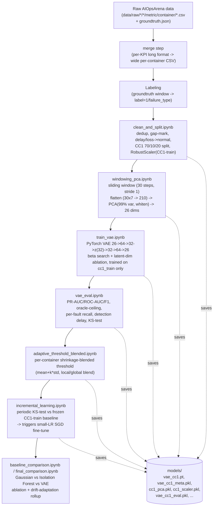
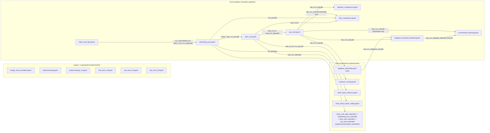

# 01 — Project Overview & Architecture

> **Scope of this file**: what the project is for, what the system actually does end-to-end, how the codebase is organized, and the technology stack. Data-level detail lives in `02_data_pipeline_and_methodology.md`; the experiment-by-experiment research trail lives in `03_experiments_and_research_history.md`; final numbers and reproduction steps live in `04_final_model_results_and_reproducibility.md`; integration/deployment guidance lives in `05_model_integration_and_developer_guide.md`.

---

## 1. Research objective and problem statement

This is **Module 3: System Anomaly Detector — Drift-Aware Approach**, one module of a larger BSc final-year project ("DracaSys Group 24 — Intelligent Deployment Helper for Containerized Applications", University of Moratuwa; source proposal: `Updated Proposal (1).pdf` at the project root).

**Stated objective** (from the proposal): detect real-time *performance* anomalies — CPU saturation, memory leaks, and (per the proposal text) network bottlenecks — in a containerized microservice deployment, using a Variational Autoencoder (VAE) trained only on normal behavior, combined with PCA for multi-metric correlation and reconstruction error as the anomaly signal. The system is additionally required to be **drift-aware**: able to keep functioning as the deployment's "normal" behavior shifts over time, via adaptive thresholding, drift detection, and incremental (online) learning — explicitly *without* full retraining or heavy ensembles.

**What was actually built and verified** (this document's claims are all traceable to the notebooks and saved artifacts under `module3_pipeline/`, cross-checked cell-by-cell — see `03_experiments_and_research_history.md` for the gap-analysis against the proposal):

- A PyTorch VAE trained exclusively on normal windows from one dataset (`complex_case1`), scoring anomalies via reconstruction error, on PCA-whitened features.
- A validated **blended (shrinkage) adaptive threshold** — the literal proposal spec ("mean + α×std", using *recent* error statistics) implemented and empirically shown to beat a static threshold.
- A **KS-test-based drift detector** wired to trigger **actual SGD fine-tuning** of the VAE (not just re-thresholding) — closing what was, for a period of this project's history, an unimplemented gap between the proposal's stated design and the code.
- Full leak-free evaluation discipline: every threshold is calibrated from a validation set that contains **zero anomalies**, never from the test or drift-evaluation sets.

**One explicit, documented scope reduction**: `container_cpu`, `container_memory` metrics are the only inputs. Network-layer faults (`delay`, `loss` in the AIOpsArena ground truth) are structurally invisible to this feature set and are excluded from the detectable scope by design (see `clean_and_split.ipynb`, Step 3) — this means the proposal's third named anomaly category, "network bottlenecks", is **not** covered by the current implementation. This is stated plainly here and revisited in `03_experiments_and_research_history.md`.

---

## 2. Dataset

**Source**: AIOpsArena benchmark (`AIOpsArena.pdf` at project root) — a Kubernetes/microservice testbed (Sock-Shop-style, ~27 containers/services: `frontend`, `cartservice`, `paymentservice`, `currencyservice`, `shippingservice`, `recommendationservice`, `redis-cart`, etc.) with Chaos-Mesh-style fault injection, recorded at **15-second** sampling intervals. Verified directly from `data/raw/*/*/metric/container/*.csv` (columns: `timestamp, cmdb_id, kpi_name, value`) and `data/raw/*/*/groundtruth/groundtruth.json` (columns: `timestamp, service, cmdb_id, failure_type, duration`).

**Four cases** (verified row counts from the raw, deduplicated data — see `02_data_pipeline_and_methodology.md` for the exact cleaning steps):

| Case | Role in this project | Raw duration | Anomaly types present |
|---|---|---|---|
| `complex_case1` (CC1) | **Sole training/validation/test source** | ~35 hours (longest run) | cpu, memory, pod-failure, delay, loss |
| `complex_case2` (CC2) | Sole drift-evaluation set used in final metrics | shorter | cpu, memory, pod-failure, delay, loss |
| `single_case1` (SC1) | Windowed and scored in `module3_pipeline`'s upstream data, but **excluded from the final reported drift metrics** by explicit project decision | ~9h | cpu, memory, delay, loss |
| `single_case2` (SC2) | Same as SC1 | ~6h | pod-failure, delay, loss |

> **Important, verified nuance**: a KS-test comparison (`vae_eval.ipynb`, historical run before CC2-only rescoping — see `03_experiments_and_research_history.md`) found SC1 and SC2 show **more** statistical distributional shift from CC1 than CC2 does (KS=0.55/0.57 vs 0.41). The project's working assumption had been the opposite ("SC1/SC2 are simpler versions of the same system, not truly drifted"). The decision to report only CC2 as "the drift set" was an explicit user instruction, not a finding that SC1/SC2 are less driftful — this trade-off is recorded here for transparency, not resolved.

---

## 3. Derived system architecture

This is reconstructed directly from the notebooks' actual `BASE`/`DATA_DIR` wiring and file outputs — not assumed.



**How this differs from the proposal's idealized 7-step loop** (System Metrics → Sliding Window → PCA → VAE Reconstruction Error → Adaptive Threshold → Drift Detection → Incremental Learning → Updated VAE): the built system implements all seven steps, but **not all as a uniform per-window loop**. Sliding window, PCA, VAE scoring, and adaptive thresholding run **every window**. Drift detection (KS-test) and incremental learning run **periodically** (every 5,000 windows — `REFIT_INTERVAL` in `incremental_learning.ipynb`), not per-window — a deliberate design choice (re-testing distributional shift on every single window would be both statistically meaningless for a KS-test and computationally wasteful for a fine-tune trigger), not an oversight. This is verified directly in `incremental_learning.ipynb`'s `run_stream()` function.

---

## 4. Module relationships and dependency graph

Every arrow below is a **verified file dependency** (one notebook's saved output is read by the next), not an assumed one:



---

## 5. Technology stack (verified from imports actually used)

| Layer | Tool | Version (as recorded in notebook output) | Where |
|---|---|---|---|
| Language / runtime | Python 3.9 | — | Jupyter kernel `python39-pytorch` (required — the default `python3` kernel resolves to a broken Python 3.11 that crashes on `import torch` with `WinError 1114` on this machine) |
| Deep learning | PyTorch | `2.8.0+cpu` | `train_vae.ipynb` and every downstream notebook that loads the VAE |
| Classical ML | scikit-learn | not pinned in any notebook output (`Not found / Not verified` — no notebook prints `sklearn.__version__`) | `PCA`, `RobustScaler`, `StandardScaler`, `IsolationForest`, all `sklearn.metrics` |
| Data handling | pandas, numpy | not pinned in outputs | throughout |
| Persistence | `torch.save`/`torch.load` (model weights), `pickle` (metadata/eval dicts), `joblib` (PCA/scaler bundles — **must** use `joblib.load`, not `pickle.load`, or it raises `UnpicklingError`) | — | `models/` |
| Plotting | matplotlib | not pinned | every `*_eval*` and `*_training_curves*` notebook |
| Execution | Jupyter notebooks via `nbconvert --execute` (headless) | — | all `.ipynb` files in this project |

**Hardware**: all training/evaluation observed to run on **CPU** (`torch.cuda.is_available()` evaluates False in every recorded run — `Device: cpu` printed in `train_vae.ipynb`, `multi_seed_oracle_ceiling.ipynb`, etc.). The model is small enough (10,778 parameters, see `05_model_integration_and_developer_guide.md`) that this is not a practical bottleneck.

---

## 6. Project structure (as of this documentation's writing)

```text
module3/                                   <- project root (BASE in every notebook)
├── AIOpsArena.pdf                         <- benchmark dataset paper
├── Updated Proposal (1).pdf               <- Module 3 proposal document
├── data/
│   ├── raw/                               <- AIOpsArena original per-KPI CSVs + groundtruth.json, 4 cases
│   ├── merged/                            <- per-case wide-format CSV (7 base features), pre-labeling
│   ├── labeled/                           <- per-case wide-format CSV + label/failure_type (StandardScaler-normalized; superseded input)
│   └── processed/                         <- ACTIVE: clean_and_split.ipynb's outputs
│       ├── all_cases_cleaned.csv          <- all 4 cases, deduped/gap-marked/rescoped, UNSCALED (reference only)
│       ├── cc1_train.csv / cc1_val.csv / cc1_test.csv
│       ├── drift_single_case1.csv / drift_single_case2.csv / drift_complex_case2.csv
│       └── windows_cc1/                   <- windowing_pca.ipynb's PCA-transformed .npy arrays
├── models/                                <- ACTIVE: every saved model/scaler/PCA/eval artifact (see 04, 05 for full inventory)
├── module3_pipeline/                      <- ACTIVE, FINAL pipeline (9 files — see below)
│   ├── clean_and_split.ipynb
│   ├── windowing_pca.ipynb
│   ├── train_vae.ipynb
│   ├── vae_eval.ipynb
│   ├── adaptive_threshold_blended.ipynb
│   ├── incremental_learning.ipynb
│   ├── baseline_comparison.ipynb
│   ├── final_comparison.ipynb
│   └── results_baseline_discussion.md
├── experiments/                           <- HISTORICAL / SIDE EXPERIMENTS (see 03 for full detail)
│   ├── adaptive_threshold.ipynb           <- naive adaptive threshold (superseded by the blended version)
│   ├── maxpool_scoring.ipynb              <- negative result (max/percentile-pooled scoring)
│   ├── multi_seed_variance.ipynb          <- 3-seed variance check
│   ├── multi_seed_oracle_ceiling.ipynb    <- 5-seed oracle-ceiling check
│   ├── merge_and_normalize.ipynb          <- legacy (pre-CC1-only) merge/normalize step
│   ├── preprocessing.ipynb                <- legacy (pre-CC1-only) windowing/PCA (95% variance, single_case1-only training)
│   ├── preprocessing_v4.ipynb             <- legacy intermediate revision
│   ├── vae_train_v4.ipynb / vae_train_v5.ipynb   <- legacy VAE training (superseded architecture/split)
│   ├── vae_eval_v5.ipynb                  <- legacy evaluation (F1=0.528/0.152 — see 03)
│   └── models_extended/                   <- SELF-CONTAINED extended-feature (11-metric) experiment
│       ├── merge_extended.ipynb / clean_and_split_extended.ipynb
│       ├── windowing_pca_extended.ipynb / train_vae_extended.ipynb / vae_eval_extended.ipynb
│       ├── model/                         <- extended model's own artifacts
│       └── data/merged_extended/, data/processed_extended/
├── EDA/                                   <- exploratory notebooks (not part of the modeling pipeline)
│   ├── analysis.ipynb                     <- basic per-case shape/column/container exploration
│   └── preprocessing.ipynb                <- origin of the groundtruth-labeling logic reused later
└── docs/                                  <- this documentation set
```

**Current vs. historical, at a glance**:

| Status | What |
|---|---|
| **Current / final** | Everything in `module3_pipeline/` (9 files) |
| **Historical — negative/inconclusive result, kept for the record** | `experiments/adaptive_threshold.ipynb`, `experiments/maxpool_scoring.ipynb`, `experiments/models_extended/*` (5 notebooks) |
| **Historical — diagnostic, informs current model-selection reasoning but isn't itself "the model"** | `experiments/multi_seed_variance.ipynb`, `experiments/multi_seed_oracle_ceiling.ipynb` |
| **Historical — superseded pipeline iteration, predates the CC1-only redesign** | `experiments/merge_and_normalize.ipynb`, `experiments/preprocessing.ipynb`, `experiments/preprocessing_v4.ipynb`, `experiments/vae_train_v4.ipynb`, `experiments/vae_train_v5.ipynb`, `experiments/vae_eval_v5.ipynb` |
| **Exploratory, not modeling** | `EDA/analysis.ipynb`, `EDA/preprocessing.ipynb` |

---

## 7. High-level execution flow (summary — full step-by-step in `04_final_model_results_and_reproducibility.md`)

1. `clean_and_split.ipynb` — clean and split the labeled dataset.
2. `windowing_pca.ipynb` — build sliding windows, fit/apply PCA.
3. `train_vae.ipynb` — train the VAE on `cc1_train` only.
4. `vae_eval.ipynb` — compute the full metrics suite on `cc1_test` and `drift_cc2`.
5. `adaptive_threshold_blended.ipynb` — validate the blended adaptive threshold.
6. `incremental_learning.ipynb` — validate drift-triggered fine-tuning.
7. `baseline_comparison.ipynb` and `final_comparison.ipynb` — consolidate everything against classical baselines and across ablation stages.

A documented, **verified-current** cross-notebook inconsistency exists in this chain and is detailed in `03_experiments_and_research_history.md` and `04_final_model_results_and_reproducibility.md`: `adaptive_threshold_blended.ipynb` and `baseline_comparison.ipynb` were last executed *before* `vae_eval.ipynb` was rescoped to CC2-only, and would raise a `KeyError` if re-run today without modification. `final_comparison.ipynb` is unaffected (it recomputes everything from raw data rather than depending on `vae_eval.ipynb`'s per-set breakdown).
