# 02 — Data Pipeline & Methodology

> **Scope**: everything from raw AIOpsArena files to the PCA-transformed windows the VAE actually trains on. Model architecture/training is in `04`; this file stops at the model's input boundary.

---

## 1. Dataset details (verified against files on disk)

**Raw structure** (`data/raw/{Complex Case-1,Complex Case-2,Single Case-1,Single Case-2}/Case-N/`):
- `metric/container/kpi_<name>.csv` — one file per KPI, columns `timestamp, cmdb_id, kpi_name, value`. `cmdb_id` values are prefixed `observe.<service>-<index>` (e.g. `observe.cartservice-2`).
- `metric/istio/` — service-mesh metrics, **not used** by this module.
- `log/log.csv`, `trace/trace.csv` — **not used** by this module (would be needed for genuine network-fault detection — see the "network bottlenecks" scope gap noted in `01`).
- `groundtruth/groundtruth.json` — parallel arrays: `timestamp` (fault onset, unix seconds), `service`, `cmdb_id` (**no** `observe.` prefix here — a real format mismatch that every labeling step must handle explicitly), `duration` (seconds; not always present in every case's JSON).

**A verified, real data-quality issue used throughout this project**: raw per-KPI files contain a periodic duplication artifact — approximately every 2 hours, all containers simultaneously emit 64–2187 duplicate rows at the same timestamp. This was confirmed to affect ~25% of raw rows and is a collection artifact, not fault-related (bursts are not aligned with any `groundtruth.json` event window). Every notebook that ingests raw or merged data deduplicates on `(cmdb_id, timestamp)` before doing anything else with it.

---

## 2. Data flow — full chain with verified row/window counts

```mermaid
flowchart TD
    A["Raw per-KPI CSVs\n4 cases x ~15-25 KPI files"] -->|merge, pivot long->wide| B["data/merged/*_merged.csv\n7 base features + new_container_id"]
    B -->|apply_labels vs groundtruth.json| C["data/labeled/*_labeled.csv\n+ label, failure_type\n(StandardScaler-normalized here — superseded input)"]
    C -->|clean_and_split.ipynb Step 0: undo the scaler, recover raw units| D["all_cases_labeled.csv\n533,230 rows, 12 cols, 4 cases"]
    D -->|dedup on case,cmdb_id,timestamp: -132,334 rows| E["dedup'd: 400,896 rows"]
    E -->|mark is_gap, relabel delay/loss -> normal| F["all_cases_cleaned.csv\n400,896 rows, 760 anomalies (0.19%)"]
    F -->|CC1 time-split 70/10/20; RobustScaler fit on cc1_train| G["cc1_train.csv 156,479 rows (0 anom)\ncc1_val.csv 22,356 rows (0 anom)\ncc1_test.csv 44,968 rows (256 anom)\ndrift_single_case1.csv 60,480 rows (76 anom)\ndrift_single_case2.csv 38,853 rows (56 anom)\ndrift_complex_case2.csv 77,760 rows (372 anom)"]
    G -->|sliding window size=30 stride=1, gap-aware, flatten 30x7->210| H["windowed, per split\ncc1_train: 154,198 windows (0 anom)\ncc1_test: 44,185 windows (256 anom, 0.58%)\ndrift_cc2: 76,977 windows (720 anom, 0.94%)"]
    H -->|PCA fit on cc1_train, 99% variance + whiten| I["X_*.npy: (N, 26) whitened PCA windows\ny_*.npy: labels, ft_*.npy: fault types"]
    I --> J["train_vae.ipynb (see 04)"]
```



Every row-count and window-count figure above was independently re-derived from the raw/saved files during this documentation's audit (re-running the loading and windowing logic against the saved CSVs/`.npy` arrays and comparing) — not copied from a single notebook's printed claim.

---

## 3. Methodologies

### 3.1 Labeling (origin: `EDA/preprocessing.ipynb`, reused in `clean_and_split.ipynb`)
- **What**: for each `groundtruth.json` event `(timestamp, cmdb_id, duration, failure_type)`, mark rows where `merged_cmdb_id == "observe." + gt_cmdb_id` and `timestamp` falls in `[gt_timestamp, gt_timestamp + duration)` as `label=1`, `failure_type=<name>`.
- **Why this mechanism**: the two ID formats (`observe.X` vs `X`) and the half-open time window are exact requirements of the AIOpsArena ground-truth format; verified directly against `groundtruth.json` samples.
- **Limitation**: `duration` is trusted as given in the ground truth; no independent verification that the fault's *effect* on metrics lasted exactly that long (a fault could have lingering downstream effects past its nominal duration — not something this project checked).
- **Belongs to**: final pipeline (via `clean_and_split.ipynb`, which inherits this exact logic).

### 3.2 De-duplication
- **What**: `sort_values([...]).drop_duplicates(subset=['case','cmdb_id','timestamp'], keep='first')`.
- **Why**: the verified periodic duplication artifact (Section 1). `keep='first'` is arbitrary among duplicates that are (verified) near-identical.
- **Belongs to**: final pipeline.

### 3.3 Gap marking (not gap-filling)
- **What**: per-container `time_diff = timestamp.diff()`; `is_gap = time_diff > 30s` (2x the nominal 15s cadence). Gaps are **flagged, not interpolated or dropped** — the flag is consumed downstream by the windowing step, which skips any window that spans a flagged gap.
- **Why 30s**: exactly 2x the sampling interval — any larger a gap than one missed reading is treated as a real discontinuity, not sensor jitter.
- **Belongs to**: final pipeline.

### 3.4 Fault-type rescoping (delay/loss → normal)
- **What**: `failure_type in ['delay','loss']` rows have `label` reset to 0 and `failure_type` to `None`. Rows are **not deleted** (would fabricate an artificial time gap in otherwise-real data).
- **Why**: this module's only features are CPU/memory container metrics; `delay` (network latency) and `loss` (packet loss) faults are injected at the network layer and are not expected to leave a CPU/memory signature. Verified empirically as consistent with the choice (not proven — no experiment specifically confirmed CPU/memory metrics are blind to these faults; the decision is a scope judgment stated as such).
- **Effect on next stage**: shrinks the "detectable" label space to `{cpu, memory, pod-failure}` for every downstream metric.
- **Belongs to**: final pipeline. This is the single largest scope-defining decision in the data pipeline.

### 3.5 Feature recovery from a legacy scaling bug
- **What**: the input `all_cases_labeled.csv` had already been passed through a `StandardScaler` fit on `single_case1`'s normal rows (by the now-legacy `merge_and_normalize.ipynb`). `clean_and_split.ipynb` Step 0 re-fits that **exact** scaler from the untouched `single_case1_labeled.csv` and inverts it (`x_orig = x_scaled * scale_ + mean_`), recovering raw units before applying its own, CC1-train-only scaling.
- **Why this was necessary**: a design built around "train exclusively on `complex_case1`" cannot have `complex_case1`'s notion of "normal" already contaminated by `single_case1`'s scale.
- **Verified**: recovered `single_case1` normal rows matched the original `single_case1_labeled.csv` values to within 2.22e-16 (floating-point exact).
- **Belongs to**: final pipeline (one-time correction step).

### 3.6 Scaling — RobustScaler, fit on `cc1_train` only
- **What**: `RobustScaler` (median/IQR) fit exclusively on `cc1_train` (post-split), applied to every split including the drift sets, then clipped to `±20`.
- **Why RobustScaler, not StandardScaler**: not explicitly justified in-notebook beyond continuing an established convention; a real data quirk was found and handled correctly regardless — the 3 CPU-rate features have IQR=0 in `cc1_train` (containers idle most 15-second windows), which `RobustScaler` handles safely (`scale_=1` fallback) without manual intervention.
- **Why fit only on `cc1_train`**: avoids leaking val/test/drift statistics into the scaling used for "what normal looks like" — the same discipline applied to every other calibration step in this pipeline.
- **The ±20 clip**: a defensive margin, verified to affect a negligible fraction of values; motivated by a **prior**, separate runaway-scale bug earlier in this project's history (in PCA-space, not this raw-feature scaling — a preventative measure, not evidence this specific step needed it).
- **Belongs to**: final pipeline.

### 3.7 Train/val/test split — CC1-only, time-based
- **What**: within `complex_case1` only, normal-labeled rows are split by **global timestamp** quantile (70th/80th percentile) into train/val/test; **all** CC1 anomalies are routed to `test` regardless of when they occurred (verified: zero anomalies fall at/after the val→test time cutoff anyway, so this never double-counts). `single_case1`, `single_case2`, `complex_case2` are held out **in their entirety** as separate evaluation sets, never merged into training.
- **Why time-based, not random**: prevents any container's data from straddling two splits at the same moment (which a random row-level split would risk), and gives a train set that is causally "the past" relative to test — closer to real deployment.
- **Why CC1-only** (as opposed to the legacy pipeline's pooled-cases approach — see `03`): a deliberate redesign so that "normal" is defined by one coherent, long-running deployment (CC1, ~35h, the longest case) rather than a blend of shorter, differently-scoped runs.
- **Belongs to**: final pipeline. This is the headline redesign relative to every notebook in `experiments/`'s legacy chain.

### 3.8 Sliding window construction
- **What**: `WINDOW_SIZE=30` (30 × 15s = 7.5 minutes), `STRIDE=1` (dense, one window per timestep), **gap-aware** (a window is skipped entirely if any row inside it starts a flagged gap). Label = 1 if **any** timestep inside the window is anomalous; `failure_type` records all fault types present in the window (comma-joined), for diagnostic use only, never fed into training.
- **Why 30, not up to 60**: the proposal allows 30–60 timesteps; only the lower bound (30) was ever implemented and evaluated. **No window-size ablation exists in this project** — this is an explicitly unexplored parameter, flagged as a candidate future experiment in `03`.
- **Why dense stride (1) not sparse**: maximizes the number of training windows from a fixed amount of raw data — appropriate given the training set is a single deployment run, not multiple.
- **Belongs to**: final pipeline.

### 3.9 Flattening
- **What**: `(N, 30, 7) → (N, 210)`, a straight reshape, so PCA can treat each window as one vector.
- **Belongs to**: final pipeline (necessary bridge to PCA, not a modeling choice in itself).

### 3.10 Dimensionality reduction — PCA, 99% variance + whitening
- **What**: `sklearn.decomposition.PCA(n_components=0.99, svd_solver='full', whiten=True)`, fit exclusively on `cc1_train`'s flattened windows (154,198 samples, 100% normal by construction — zero leakage risk). Retains **26** components from 210 input dims.
- **Why 99%, not the more conventional 95%**: checked empirically first. At 95% variance, only **5** components survive, and the CPU-carrying components contribute a combined ~2% of variance — right at the cutoff edge. Since `cpu` is one of only 3 detectable fault types, this would risk discarding exactly the signal needed. Verified: PC1/PC2 alone (memory-dominated) already capture 75.1%/17.6% ≈ 92.7% of variance in the 7-feature case.
- **Why whitening**: without it, a plain MSE-reconstruction VAE naturally weights loss by each component's raw variance — it would optimize almost entirely for the large-variance memory-dominated components and barely notice deviations in the small-variance CPU-carrying ones. Whitening rescales every retained component to unit variance so the VAE's reconstruction loss treats them comparably. Verified post-fit: every component's mean ≈ 0, std ≈ 1 on `cc1_train`.
- **Limitation, evidenced (see `03`)**: when the same 99%-variance methodology was reapplied to an 11-feature extended set, a *new*, uninformative-but-high-variance feature (`container_threads`) dominated 88.65% of total variance (PC1: 72.97%, PC2: 15.68%) — PCA's variance criterion is blind to label-informativeness, and this is a demonstrated, not hypothetical, failure mode of the same method under a different feature set.
- **Belongs to**: final pipeline (7-feature version). The 11-feature "extended" variant is a documented negative-result experiment (`03`).

---

## 4. Module inputs/outputs (complete interface, for every stage up to the VAE's input)

### Module: `clean_and_split.ipynb`

```text
Purpose: Clean, relabel, and split the merged/labeled dataset into CC1-only
         train/val/test plus 3 separate drift-evaluation sets.

INPUT
  - File: data/processed/all_cases_labeled.csv
  - Format: CSV
  - Shape: 533,230 rows x 12 columns
  - Columns: timestamp, cmdb_id, case, container_cpu_usage_seconds_rate,
             container_cpu_system_seconds_rate, container_cpu_user_seconds_rate,
             container_memory_usage_bytes, container_memory_working_set_bytes,
             container_memory_rss, container_memory_cache, label, failure_type
  - Required preprocessing: none upstream except the merge+label step already applied
  - Expected data type: float64 features, int label, object failure_type (nullable)
  - Also reads: data/labeled/single_case1_labeled.csv (to recover the legacy scaler)

PROCESSING
  - Main steps: undo legacy StandardScaler -> dedup -> mark is_gap -> relabel
    delay/loss to normal -> save all_cases_cleaned.csv -> CC1 time-split
    (70/10/20) -> hold out SC1/SC2/CC2 whole -> fit RobustScaler on cc1_train
    -> transform + clip(+-20) every split -> save
  - Important parameters: GAP_THRESH_SEC=30, TRAIN_FRAC=0.70, VAL_FRAC=0.80, CLIP=20.0
  - Model/method used: sklearn RobustScaler, StandardScaler (inversion only)

OUTPUT
  - Files: data/processed/{all_cases_cleaned, cc1_train, cc1_val, cc1_test,
           drift_single_case1, drift_single_case2, drift_complex_case2}.csv
  - Format: CSV
  - Shape: see Section 2's data-flow diagram for exact row counts
  - Columns: timestamp, cmdb_id, case*, <7 feature cols>, label, failure_type,
             time_diff, is_gap  (*all_cases_cleaned.csv only)
  - Meaning: cc1_train/val are 100% normal; cc1_test and drift_* contain both
  - Also saves: models/cc1_scaler.pkl (joblib bundle: scaler, feature_cols, clip)
  - Used by: windowing_pca.ipynb (all 6 split CSVs); vae_eval.ipynb / final_comparison.ipynb
             (re-read the raw split CSVs directly for detection-delay / streaming replay)
```

### Module: `windowing_pca.ipynb`

```text
Purpose: Build gap-aware sliding windows from the cleaned/split CSVs, flatten,
         and fit/apply PCA (whitened) to produce the VAE's actual input space.

INPUT
  - Files: data/processed/{cc1_train,cc1_val,cc1_test,drift_single_case1,
           drift_single_case2,drift_complex_case2}.csv
  - Format: CSV (output of clean_and_split.ipynb)
  - Required preprocessing: already scaled/clipped by clean_and_split.ipynb
  - Expected data type: float64 features, bool is_gap

PROCESSING
  - Main steps: per-container gap-aware windowing (size=30, stride=1) -> flatten
    (30x7 -> 210) -> fit PCA(n_components=0.99, whiten=True) on cc1_train's
    flattened windows only -> transform every split
  - Important parameters: WINDOW_SIZE=30, STRIDE=1, PCA_VARIANCE=0.99
  - Model/method used: sklearn PCA (svd_solver='full', random_state=42)

OUTPUT
  - Files: data/processed/windows_cc1/{X,y,ft}_<split>.npy for split in
           {cc1_train, cc1_val, cc1_test, drift_sc1, drift_sc2, drift_cc2}
  - Format: NumPy .npy
  - Shape: X_*.npy = (N, 26) float32; y_*.npy = (N,) int64; ft_*.npy = (N,) object
  - Columns/meaning: X = whitened PCA-space window vector; y = window-level
    label (1 if any timestep in the window is anomalous); ft = comma-joined
    fault type(s) present in the window, or None
  - Also saves: models/cc1_pca.pkl (joblib bundle: pca, feature_cols, window_size,
    stride, n_components) — MUST be loaded with joblib.load, not pickle.load
  - Used by: train_vae.ipynb, vae_eval.ipynb, and every downstream evaluation/
    experiment notebook that scores the VAE (all load X_*.npy directly rather
    than re-deriving windows, except incremental_learning.ipynb and
    final_comparison.ipynb, which rebuild windows from raw CSVs and verify the
    rebuild matches the saved .npy arrays exactly before trusting it)
```

---

## 5. Data-flow explanation: how each module's output becomes the next module's input

- `clean_and_split.ipynb`'s six CSVs are **row-level, tabular, per-timestep** data — every row is still one container at one 15-second timestamp. Nothing here is yet in "window" or "model input" shape.
- `windowing_pca.ipynb` is the sole place where the representation changes shape twice: row-level → window-level (grouping 30 consecutive rows per container into one sample) → PCA-space (compressing that window's 210 raw values into 26 whitened components). This is also the **only** place `.npy` arrays are produced from the pipeline's CSV-based data; everything downstream reads `.npy`, never re-reads the raw CSVs for the actual feature vectors (two exceptions — `incremental_learning.ipynb` and `final_comparison.ipynb` — deliberately rebuild from CSV to recover per-window `cmdb_id`/timestamp metadata not stored in the `.npy` files, and explicitly verify the rebuild is byte-identical to the saved arrays before using it).
- The **only** two artifacts every downstream modeling notebook needs from this stage are `X_<split>.npy` (model input) and `models/cc1_pca.pkl` (needed if a downstream notebook must transform *new* raw windows through the same fitted PCA rather than reading a pre-transformed array — used by `incremental_learning.ipynb`, `final_comparison.ipynb`, and `maxpool_scoring.ipynb`).

---

## 6. Known limitations of the data pipeline (stated, not hidden)

- **No window-size ablation.** Only `WINDOW_SIZE=30` was ever tested, despite the proposal permitting up to 60. Whether a longer window changes detection of slower-onset faults (e.g. gradual memory leaks) is untested.
- **Per-container min-max normalization** (used in the *extended*-feature experiment's predecessor stage and the legacy pipeline) vs. **global RobustScaler on `cc1_train`** (the final pipeline): these are genuinely different normalization philosophies used at different points in this project's history — see `03` for which experiments used which.
- **`all_cases_cleaned.csv`** (all 4 cases, unscaled) is saved but not directly consumed by any downstream modeling notebook — it exists as a debugging/reference artifact only.
- **SC1/SC2 windows are still generated** by `windowing_pca.ipynb` (`X_drift_sc1.npy`, `X_drift_sc2.npy` exist on disk) even though the final `vae_eval.ipynb` no longer reports metrics for them — the upstream data pipeline was never narrowed to match the CC2-only evaluation-scope decision; only the reporting layer was.
