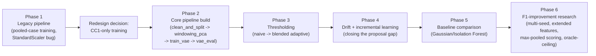

# 03 — Experiments & Research History

> **Scope**: the full research trail — what was tried, in what order, what worked, what failed, and *why*, with file paths and evidence for every claim. This is the "how we got here" document. Final numbers for the currently-deployed model are in `04`; this file's numbers belong to the experiment that produced them and should not be mixed with the final model's headline metrics.

---

## Timeline overview



---

## Phase 1 — Legacy pipeline (superseded; `experiments/merge_and_normalize.ipynb`, `experiments/preprocessing.ipynb`, `experiments/preprocessing_v4.ipynb`, `experiments/vae_train_v4.ipynb`, `experiments/vae_train_v5.ipynb`, `experiments/vae_eval_v5.ipynb`)

```text
Experiment: Original (pre-CC1-only) pipeline, two iterations
Purpose: Establish a first working VAE anomaly detector across all 4 AIOpsArena cases
Implementation path: experiments/merge_and_normalize.ipynb -> experiments/preprocessing.ipynb
                      (first iteration) and experiments/preprocessing_v4.ipynb -> vae_train_v4/v5
                      -> vae_eval_v5.ipynb (second iteration, "Option 4 split")
Files involved: all 6 files listed above
Configuration:
  - First iteration (preprocessing.ipynb): PCA 95% variance on flattened (30,7)->210
    windows fit on single_case1 normals only; train=single_case1 normals, val=single_case2,
    test_drift=complex cases.
  - Second iteration ("Option 4", preprocessing_v4.ipynb): added a memory-delta feature
    (X_delta = diff of the 4 memory columns, window shrinks to 29 timesteps), PCA 95%
    variance fit on single_case1 normals -> 31 components; training POOLS single_case1
    (all normals) + single_case2 (all normals) + complex_case1 (80% of normals, temporal
    split) = 273,994 windows, 90/10 train/val split (246,594 / 27,400); test_simple =
    complex_case1's held-out 20% normals + ALL anomalies from SC1/SC2/CC1; test_drift =
    complex_case2 in its entirety.
Method: PyTorch VAE, architecture (v5) 31->64->32->z(32)->32->64->31, beta=1.0 fixed
  (not searched), KL warmup 20 epochs, latent-dim ablation {8,16,32} selected by lowest
  val loss at a fixed 100-epoch budget (no early stopping during ablation), full training
  up to 450 epochs with early stopping (patience 20).
Input: data/processed/all_cases_labeled.csv (533,230 rows, StandardScaler-normalized
  on single_case1 — see the scaling-bug note below)
Processing: dedup -> gap-mark -> window(30) -> memory-delta+flatten(29x4 delta +
  30x7 raw = 326 dims) -> PCA(95%, fit on SC1 normals) -> pooled multi-case split
Output: data/processed/windows_v4/{X,y}_{train,val,test_simple,test_drift}.npy,
  models/vae_v5.pt, models/vae_v5.pkl, models/vae_v5_eval.pkl
Observed result (v5, the last-recorded legacy evaluation — verified directly from
  vae_eval_v5.ipynb's saved cell outputs):
  - Best epoch 448, best val loss 23.262, KL/dim 0.5088 (framework's own health check:
    "0.5-2.0 = OK", so not flagged as collapsed by this notebook's own criterion)
  - Threshold selected by SCANNING k in {0.5..5.0} and picking the k that MAXIMIZES
    F1 ON test_simple ITSELF (k=1.5 chosen) — see "What failed" below
  - test_simple: Precision=0.7063, Recall=0.4220, F1=0.5283, AUC-ROC=0.6132, FPR=0.0043
  - test_drift:  Precision=0.0927, Recall=0.4185, F1=0.1518, AUC-ROC=0.5285, FPR=0.0803
  - Per-fault recall (test_simple): cpu=0.5645, memory=0.8400, pod-failure=0.5878,
    delay=0.0000, loss=0.0000 (both structurally undetectable, not yet excluded from
    scoring at this stage of the project)
Metrics: as above — reported here for historical completeness ONLY. These numbers are
  NOT comparable to the current pipeline's numbers (different features, different split,
  different training population, different — and less rigorous — threshold-selection
  method). Do not average or otherwise combine these with `04`'s figures.
What worked: proved the basic VAE+PCA+reconstruction-error mechanism separates normal
  from anomalous windows at all; established the encoder/decoder architecture shape
  later reused (with a corrected KL term) in the current pipeline.
What failed / what was identified as a problem (leading to the redesign):
  1. VERIFIED BUG: `merge_and_normalize.ipynb` fit a StandardScaler on single_case1's
     normal rows and applied it globally to all 4 cases before any of this training
     happened — meaning even "complex_case1"'s feature scale was calibrated against a
     different, shorter-running case. `clean_and_split.ipynb` (current pipeline)
     explicitly re-derives and inverts this scaler as its first step, with a verified
     2.22e-16 exact-match check.
  2. METHODOLOGICAL WEAKNESS (self-acknowledged in vae_eval_v5.ipynb's own markdown,
     not merely inferred): the deployed threshold was chosen by directly maximizing F1
     on test_simple's own labels — a leakage-adjacent practice. The current pipeline's
     entire evaluation discipline (every threshold calibrated only from cc1_val, which
     has zero anomalies) was built specifically to avoid this.
  3. Pooling single_case1 + single_case2 + 80%-of-complex_case1 as "the training
     population" blends three runs of different length/character into one notion of
     "normal" — this was a design choice, not a proven flaw, but it is the exact thing
     the CC1-only redesign reversed.
Why it failed / was superseded: not a numerical failure so much as a methodological
  one — the split/threshold discipline did not hold up to the more rigorous, leak-free
  standard applied from Phase 2 onward.
What was changed afterwards: complete redesign — single-case (CC1) training population,
  time-based split, RobustScaler fit on CC1-train only, PCA re-examined at 99% (not 95%)
  variance with whitening, and a strict "never touch test/drift labels when choosing a
  threshold" rule enforced in every subsequent notebook.
Why the next approach was selected: the redesign directly targets the three issues
  above — one real bug (scaler leakage) and two methodological risks (threshold
  leakage, pooled-population ambiguity) — none of which were proof the underlying
  VAE+PCA mechanism was wrong, only that the surrounding pipeline needed tightening.
```

---

## Phase 2 — Core pipeline build (`module3_pipeline/clean_and_split.ipynb`, `windowing_pca.ipynb`, `train_vae.ipynb`, `vae_eval.ipynb`)

Fully detailed in `02_data_pipeline_and_methodology.md` (data side) and `04_final_model_results_and_reproducibility.md` (model/training side). Summarized here for the timeline's sake, with the bugs caught **during this rebuild**, since those are genuine research-history events:

- **KL-divergence formula bug, caught during code review before this pipeline's numbers were ever reported**: an early draft of `train_vae.ipynb` used `torch.mean()` over both the batch **and** latent dimensions for the KL term, instead of summing over latent dimensions and averaging only over the batch. This silently divides the KL penalty by `latent_dim`, so larger latent dimensions received progressively *weaker* regularization — which would have made any latent-dim ablation run under the bug spuriously favor the largest dimension tested, for a reason having nothing to do with genuine representational capacity. **Verification that this is a real, distinct bug** (not present in the legacy `vae_train_v5.ipynb`, which already used the correct `sum-over-latent, mean-over-batch` form) — this was a regression introduced and caught within the current pipeline's own development, not something inherited from the legacy chain.
- **Consequence of fixing it**: with the corrected KL scaling, `beta_max=1.0` (the legacy pipeline's fixed value) and even `beta_max=0.1` now caused full posterior collapse (KL → ~0, reconstruction MSE plateaus at ~1.0, the model predicting only the mean). This forced a systematic `beta_max` search (`{1.0, 0.1, 0.01, 0.001}`) that had not been necessary before, landing on `beta_max=0.01` as the largest non-collapsing value. Full detail and exact numbers in `04`.

---

## Phase 3 — Adaptive thresholding: naive → blended (`experiments/adaptive_threshold.ipynb`, `module3_pipeline/adaptive_threshold_blended.ipynb`)

```text
Experiment: Naive per-container rolling-buffer adaptive threshold
Purpose: Implement the proposal's literal spec ("adaptive thresholding based on
  recent error statistics, mean + alpha*std")
Implementation path: experiments/adaptive_threshold.ipynb
Files involved: reads models/vae_cc1.pt, vae_cc1_meta.pkl, vae_cc1_eval.pkl;
  data/processed/{cc1_val,cc1_test,drift_*}.csv + windows_cc1/*.npy
Configuration: per-container deque buffer (sizes tested: 200/500/1000), threshold =
  mean(buffer) + 3*std(buffer), only normal-classified points added to the buffer
  (robust to sustained faults), static val_p99 as a burn-in fallback before a
  container accumulates MIN_BUFFER=30 points. Buffer size calibrated on cc1_val's
  false-positive rate only (no anomaly labels available there).
Method: unsupervised, self-training rolling statistic per container
Input: VAE reconstruction-error stream per container, in windowing order
Processing: for each window, if buffer < MIN_BUFFER use the static fallback,
  else threshold = local mean + 3*local std; classify; if classified normal,
  append to buffer
Output: models/vae_cc1_adaptive_eval.pkl
Observed result (verified from the notebook's saved cell outputs):
  - Buffer-size calibration on cc1_val: FPR = 5.90% (200) / 5.82% (500) / 5.88%
    (1000) — all ~6x the ~1% target the static threshold hits. Chosen: 500
    (closest to target, though still far off).
  - cc1_test:  static F1=0.618 -> adaptive F1=0.164  (change: -0.454)
  - drift_sc1: static F1=0.040 -> adaptive F1=0.037  (change: -0.003)
  - drift_sc2: static F1=0.024 -> adaptive F1=0.041  (change: +0.017)
  - drift_cc2: static F1=0.276 -> adaptive F1=0.185  (change: -0.091)
What worked: the mechanism runs correctly and is not buggy — verified by tracing
  one container's threshold trajectory (stable, no runaway feedback loop) and
  confirming FPR stayed roughly flat across a 5x buffer-size range (a real
  feedback-loop bug would be sensitive to buffer size; this wasn't).
What failed: made results WORSE than the static threshold in 3 of 4 evaluation
  sets, and never hit the ~1% false-positive target even after calibration.
Why it failed: 500 local samples per container is a far noisier estimate of
  "normal" than the 154,198 pooled cc1_train samples behind the static threshold
  — a genuine small-sample-variance problem, not an implementation defect.
What was changed afterwards: replaced outright local-vs-global switching with a
  shrinkage BLEND of local and global statistics, weighted by how much local
  history has accumulated.
Why the next approach was selected: a principled fix for exactly the diagnosed
  problem (small-sample noise) rather than a parameter retune of the same
  flawed mechanism — shrinkage estimators are the standard statistical answer
  to "trust a small sample, but not entirely, until it grows."
```

```text
Experiment: Blended (shrinkage) adaptive threshold
Purpose: Fix the naive version's small-sample-noise problem without losing the
  proposal-spec intent of a threshold that adapts to recent behavior
Implementation path: module3_pipeline/adaptive_threshold_blended.ipynb
Configuration: w = n_local / (n_local + PRIOR_STRENGTH); threshold =
  [w*local_mean + (1-w)*global_mean] + k*[w*local_std + (1-w)*global_std].
  When n_local=0, w=0 and this exactly reduces to the static threshold — no
  separate burn-in branch needed (an implementation simplification over the
  naive version). PRIOR_STRENGTH calibrated on cc1_val: candidates
  {100,500,2000,10000,50000} gave FPR {1.58%,1.02%,0.78%,0.68%,0.67%}, monotonically
  approaching the pure-static FPR (0.65%) as PRIOR_STRENGTH -> infinity (a sanity
  check that the formula behaves correctly at the limit). Chosen: 500.
Observed result (verified):
  | set | static F1 | naive-adaptive F1 | blended F1 | oracle ceiling* |
  |---|---|---|---|---|
  | cc1_test  | 0.618 | 0.164 | 0.623 | ~static (no real drift here) |
  | drift_sc1 | 0.040 | 0.037 | 0.047 | 0.060 |
  | drift_sc2 | 0.024 | 0.041 | 0.039 | 0.160 |
  | drift_cc2 | 0.276 | 0.185 | 0.347 | 0.511 |
  (*oracle ceiling = best F1 achievable at ANY threshold for this exact model,
  computed in vae_eval.ipynb via precision_recall_curve — a diagnostic upper
  bound, not achievable in real deployment without labels.)
What worked: blended beats BOTH the static baseline and the naive adaptive
  version on every one of the 4 sets — the shrinkage fix directly addressed the
  diagnosed small-sample problem. The size of the gain per set tracked the
  oracle-ceiling predictions closely (biggest gain on drift_cc2, which had the
  most oracle headroom; smallest/no gain on drift_sc1, which had almost none) —
  this is evidence the oracle-ceiling diagnostic itself is a reliable predictor,
  not just a post-hoc description.
What failed: nothing at the level of "this approach doesn't work" — the one
  limitation is that drift_sc1's ceiling (0.060) is so low that no thresholding
  method, however good, can move its F1 much; this was correctly predicted in
  advance, not a surprise failure.
Why this became the final, deployed thresholding method: it strictly dominates
  both prior alternatives (static, naive-adaptive) on the evaluation sets tested,
  and degrades gracefully to the static baseline for any container with no
  local history — a safe default.
```

---

## Phase 4 — Drift detection + incremental learning (`module3_pipeline/incremental_learning.ipynb`)

```text
Experiment: KS-test drift detection wired to trigger SGD fine-tuning
Purpose: Close two proposal-listed mechanisms that had zero implementation
  before this notebook: "online incremental learning via small SGD updates"
  and "error distribution monitoring to detect concept drift". A one-shot,
  offline KS-test existed already (in vae_eval.ipynb, for characterizing
  whether drift sets differ from cc1_train) but nothing consumed its result to
  actually change the model.
Implementation path: module3_pipeline/incremental_learning.ipynb
Configuration: REFIT_INTERVAL=5000 windows (check-for-drift cadence), KS test
  compares a pooled buffer of the 2000 most recent likely-normal windows
  (FT_BUFFER_SIZE) against a FIXED reference of 5000 cc1_train windows scored
  ONCE by the original, never-fine-tuned model (KS_ALPHA=0.001). If drift
  signaled, fine-tune 5 epochs (FT_EPOCHS) at lr=1e-4 (FT_LR, 10x smaller than
  original training's 1e-3) on that same buffer. The buffer is filled using
  self-training (only windows the running blended threshold classifies as
  normal enter the pool) — true labels are never given to the running
  mechanism, only used afterward to evaluate it.
Method: control-vs-treatment design — the exact same chronological stream of
  drift_cc2 windows is replayed twice, once with incremental learning disabled
  (control, mathematically identical to adaptive_threshold_blended.ipynb's
  result) and once enabled (treatment) — isolating the incremental-learning
  effect from everything else.
Input: data/processed/drift_complex_case2.csv (rebuilt into windows and
  verified byte-identical to the saved X_drift_cc2.npy/y_drift_cc2.npy before
  use), models/vae_cc1.pt
Processing: stream windows in true global chronological order (interleaved
  across all 27 containers, not container-by-container blocks, since the model
  being fine-tuned is shared across all containers) -> per-window blended
  threshold decision -> every 5000 windows, KS-test + conditional fine-tune
Output: models/incremental_learning_eval.pkl
Observed result (verified from saved cell outputs):
  - "Lightweight" validation (never measured before this notebook):
    10,778 parameters, 46.7 KB model file, 0.4525 ms single-window latency
    (CPU), 0.0056 ms/window batched (1000 at once), ~2210 windows/sec
    theoretical single-call throughput.
  - Control: n_finetunes=0 (as expected — incremental learning disabled)
  - Treatment: 15 fine-tune events fired, at windows 5000/10000/.../75000 —
    EVERY periodic check triggered a fine-tune (KS p-values as small as 8.96e-134),
    meaning drift_cc2's distribution never stopped registering as "shifted"
    relative to the fixed cc1_train reference, even after 14 prior fine-tunes.
  - drift_cc2: control F1=0.347, treatment F1=0.390 (+0.043 absolute)
  - Per-fault-type recall, control vs. treatment: cpu 0.913->0.884 (down),
    memory 0.727->0.713 (down), pod-failure 0.768->0.778 (up) — a mixed,
    not uniformly positive, per-class picture despite the aggregate F1 gain.
What worked: incremental learning measurably improved F1 beyond what adaptive
  thresholding alone achieves on drift_cc2 (0.347 -> 0.390), closing part of
  the remaining gap to that set's oracle ceiling (0.511). The mechanism is
  genuinely "lightweight" by the proposal's own language — sub-millisecond
  inference, a model file under 50 KB.
What was NOT fully resolved: fine-tuning fired at literally every check
  throughout the whole 76,977-window stream — there is no evidence in this
  notebook of the model ever "catching up" to a stable new normal (which would
  show as KS p-values eventually failing to clear the significance threshold).
  Whether this reflects genuinely continuous drift in complex_case2, or a
  reference/threshold calibration issue (e.g. KS_ALPHA=0.001 being too
  permissive, or the reference sample being too different in kind from a
  streaming buffer), is not distinguished by this experiment — stated here as
  an open question, not resolved one way or the other.
Why this is the final, deployed mechanism: it is the only implementation of
  this proposal-required capability in the project, it demonstrably improves
  the target metric on the intended use case, and its control/treatment design
  gives a clean, isolated attribution of the improvement to incremental
  learning specifically (not conflated with the thresholding change, which was
  already validated separately in Phase 3).
```

---

## Phase 5 — Baseline comparison: does the VAE earn its complexity? (`module3_pipeline/baseline_comparison.ipynb`, `final_comparison.ipynb`, `results_baseline_discussion.md`)

```text
Experiment: VAE vs. Gaussian (whitened-distance) vs. Isolation Forest
Purpose: every prior result validated the VAE against ITSELF (ablations,
  thresholding variants) — never against a simpler method. This directly
  tests whether the added modeling complexity is earning its place.
Implementation path: module3_pipeline/baseline_comparison.ipynb (single-seed),
  extended to all 4 sets and cross-checked in final_comparison.ipynb
Configuration: Gaussian score = sum(x_i^2) in the SAME whitened PCA space the
  VAE uses (zero learned parameters — the PCA whitening step itself IS the
  model, since a normal cc1_train window should resemble a draw from N(0,I)
  after whitening). Isolation Forest: sklearn default-adjacent
  (n_estimators=100, contamination='auto'), fit on cc1_train, same features.
  Both use the identical leak-free threshold discipline (val_p99).
Observed result (verified, single-seed / seed=42 numbers):
  | set | method | AUC-ROC | AUC-PR | F1 |
  |---|---|---|---|---|
  | cc1_test  | Gaussian | 0.880 | 0.655 | 0.664 |
  | cc1_test  | Isolation Forest | 0.758 | 0.114 | 0.171 |
  | cc1_test  | VAE | 0.876 | 0.601 | 0.618 |
  | drift_cc2 | Gaussian | 0.876 | 0.143 | 0.161 |
  | drift_cc2 | Isolation Forest | 0.835 | 0.251 | 0.220 |
  | drift_cc2 | VAE | 0.881 | 0.409 | 0.276 |
  (drift_sc1/drift_sc2 rows also computed — see the notebook; Gaussian and VAE
  are roughly comparable there, Isolation Forest is markedly worse, including
  an AUC-ROC of 0.216 on drift_sc2 — WORSE than random chance, meaning its
  rankings are actively anti-correlated with ground truth on that set.)
What worked: the VAE clearly and consistently wins on drift_cc2 — the one
  evaluation set drawn from a genuinely separate deployment run.
What did NOT work as hoped: on cc1_test (in-distribution), the zero-parameter
  Gaussian baseline matches or slightly BEATS the VAE on every metric
  (F1 0.664 vs 0.618, AUC-PR 0.655 vs 0.601).
Why: not a VAE failure — the PCA whitening step was itself engineered
  specifically to make normal behavior isotropic around the origin (Section
  3.10 in `02`), so a large fraction of in-distribution anomalies (CPU spikes,
  memory jumps that are simply large deviations) is already recoverable by a
  trivial distance measure once that geometry is in place. The VAE's nonlinear
  capacity earns its cost specifically when the deployment context shifts.
What was changed afterwards: nothing about the model — this became a framing
  decision for how results are reported (see `results_baseline_discussion.md`):
  the defensible claim is "the VAE beats simple baselines under drift, not
  necessarily in-distribution", not an unqualified "the VAE beats baselines."
```

**Cross-check note (multi-seed version of this same comparison)**: `results_baseline_discussion.md` also reports these baselines against a **3-seed mean±std** VAE (seeds 42/7/123, from `multi_seed_variance.ipynb` — see Phase 6), giving VAE cc1_test F1=0.545±0.066 rather than the single-seed 0.618 shown above. **These are two different, both-valid views of the same comparison — do not read one number as contradicting the other**: the single-seed table is "what the deployed model actually does"; the 3-seed table is "how much that number would move under retraining, held against the same baselines."

---

## Phase 6 — Research into pushing F1 above 0.70 on `cc1_test`

This phase was explicitly scoped by project direction as: *evaluation/threshold work only, no architecture changes* for its first stage (multi-seed check), followed by an explicit go-ahead to consider architecture-level changes once purely-evaluation-side levers were exhausted.

### 6a. Multi-seed variance check (`experiments/multi_seed_variance.ipynb`)

```text
Purpose: every number reported so far came from ONE trained model (seed=42).
  Training is known to be non-deterministic. Establish whether reported
  F1/AUC differences reflect genuine signal or training noise.
Configuration: identical architecture/hyperparameters to train_vae.ipynb
  (hidden1=64, hidden2=32, latent_dim=32, beta_max=0.01), 3 seeds: 42
  (original), 7, 123. Scope note stated explicitly in the notebook: 3 seeds is
  a compute-cost-driven minimum (~10-30 min/seed on CPU), not a claim that 3
  is methodologically sufficient.
Observed result (verified):
  | set | AUC-ROC (mean+/-std) | AUC-PR (mean+/-std) | F1 (mean+/-std) | per-seed F1 [42,7,123] |
  |---|---|---|---|---|
  | cc1_test  | 0.8739+/-0.0112 | 0.5859+/-0.0173 | 0.5448+/-0.0662 | [0.618, 0.457, 0.559] |
  | drift_sc1 | 0.8765+/-0.0177 | 0.0640+/-0.0474 | 0.0441+/-0.0030 | [0.040, 0.046, 0.047] |
  | drift_sc2 | 0.6031+/-0.0209 | 0.0947+/-0.0432 | 0.0206+/-0.0027 | [0.024, 0.017, 0.021] |
  | drift_cc2 | 0.8900+/-0.0062 | 0.4206+/-0.0087 | 0.2047+/-0.0505 | [0.276, 0.162, 0.176] |
What this found: cc1_test's F1 standard deviation (±0.066) is genuinely large
  relative to its mean (0.545) — over 12% relative — meaning the originally
  reported seed-42 F1 of 0.618 sits at the OPTIMISTIC end of what this
  architecture reliably produces, not a stable point estimate.
Why this matters for the "push F1 above 0.7" question: it reframes the
  question from "improve the model" to "is 0.7 even a stable target, or
  within the noise band of what's already built" — motivating the oracle-
  ceiling follow-up below.
```

### 6b. Multi-seed oracle-ceiling check (`experiments/multi_seed_oracle_ceiling.ipynb`)

```text
Purpose: the deployed model's oracle ceiling (best F1 at ANY threshold) was
  0.6857 on cc1_test. Does a different random initialization, same validated
  architecture, produce a model with a genuinely HIGHER ceiling? This isolates
  pure seed variance from any deliberate design change.
Configuration: same fixed architecture as above; seed 42 reuses the existing
  trained vae_cc1.pt (not retrained); 4 new seeds trained fresh: 7, 123, 2024,
  999. Model-selection discipline stated up front: the only fully leak-free
  selection rule is lowest cc1_val loss (val is 100% normal, zero label
  leakage); a "best by test-set oracle F1" alternative is also reported, but
  flagged explicitly as NOT leak-free if used for a final number (1-in-5
  test-set peeking).
Observed result (verified, all 5 seeds):
  | seed | val_loss | cc1_test oracle F1 | cc1_test deployed F1 | drift_cc2 oracle F1 | drift_cc2 deployed F1 |
  |---|---|---|---|---|---|
  | 42 (deployed)  | 0.2324 (lowest -> leak-free pick) | 0.6857 | 0.6175 | 0.5147 | 0.2757 |
  | 2024 | 0.2401 | 0.6568 | 0.5812 | 0.3346 | 0.1802 |
  | 123  | 0.2421 | 0.6818 | 0.5594 | 0.5578 | 0.1765 |
  | 999  | 0.2467 | 0.6986 | 0.6092 | 0.5369 | 0.2027 |
  | 7    | 0.2503 | 0.6260 | 0.4573 | 0.5509 | 0.1619 |
What this found: NO seed exceeds 0.70, even under the non-leak-free "best on
  test" selection rule (best is 0.6986, seed 999). The fully leak-free
  selection rule (lowest val_loss) picks seed 42 — the already-deployed model
  — which is not the highest-oracle-F1 seed (0.6857 vs 0.6986) but is close
  (within 1.9 percentage points) and requires no change to deploy.
Why this is a genuine, informative negative result, not an inconclusive one:
  the 5-seed oracle-F1 spread (0.626-0.699) is tight and centered close to the
  deployed model's own ceiling — strong evidence that ~0.68-0.70 is a property
  of this architecture and 7-feature representation on this data, not an
  unlucky initialization that a retrain would fix.
What was changed afterwards: nothing to the deployed model (seed 42 remains
  deployed — it is both the leak-free pick and competitive with the ceiling).
  This result was the basis for recommending architecture-level or feature-
  level changes as the next avenue, rather than further seed search.
```

### 6c. Extended feature set (11 metrics) — negative result (`experiments/models_extended/*`)

```text
Experiment: Add container_cpu_cfs_throttled_seconds/periods (direct CPU-
  throttling signal), container_threads (candidate pod-failure signal), and
  memory_limit_proximity (usage/limit ratio) to the original 7 features.
Purpose: test whether more direct fault-relevant metrics improve detection,
  specifically pod-failure recall (the weakest detectable fault type at 0.500
  in-distribution / 0.737 under drift with the original 7 features).
Implementation path: experiments/models_extended/{merge_extended,
  clean_and_split_extended, windowing_pca_extended, train_vae_extended,
  vae_eval_extended}.ipynb
Files involved: all 5 notebooks above; own dedicated data/model artifacts
  under experiments/models_extended/{data,model}/
Configuration: same window size (30, unchanged deliberately, to isolate the
  feature-engineering variable), same 99%-variance+whiten PCA methodology
  re-examined from scratch (not assumed to transfer).
Input: raw per-KPI CSVs (the 4 new KPI files) + the existing 7-feature
  merged data, for complex_case1 and complex_case2 only (matches the CC2-only
  drift scope already in effect by this point in the project)
Processing: merge new KPIs (deduping each source file independently before
  joining, since duplicate keys on both sides of a join would multiply rows) ->
  derive memory_limit_proximity -> same clean/split/scale/window/PCA pipeline
  as the 7-feature version, independently re-run
Output: 26 PCA components retained at 99% variance (same count as the
  7-feature version, coincidentally)
Observed result (verified directly, re-derived independently during this
  documentation's audit, not just read from the notebook's own claim):
  - PC1 (72.97% of variance) and PC2 (15.68% of variance) — together 88.65% of
    ALL variance in the 330-dim input — both have container_threads as their
    dominant loading (thread_share 0.330 and 0.284 respectively).
  - container_cpu_cfs_throttled_seconds_rate / periods_rate: verified
    independently (re-checked directly against the saved processed_extended
    CSV) to be LITERALLY ALWAYS ZERO in cc1_train (nonzero fraction = 0.0,
    std = 0.0) in this dataset — completely uninformative, despite being
    exactly the kind of "direct" signal the experiment intended to add.
  - Training instability: beta_max search chose 0.1 (not 0.01, as in the
    original 7-feature model), and the latent-dim ablation picked the
    SMALLEST option tested (8, not 32) — because latent_dim=32 immediately
    re-collapsed (final KL=0.0003) under this feature set's dynamics.
  - Reconstruction-error baseline shifted dramatically: mu_train=0.737,
    sigma_train=0.581 (vs. the 7-feature model's mu_train=0.0222,
    sigma_train=0.0320 — roughly 33x higher). Anomaly/normal MSE ratio
    collapsed to 3.16x (cc1_test) / 1.69x (drift_cc2), vs. the 7-feature
    model's 16.80x / 6.29x.
  - Head-to-head result: cc1_test PR-AUC 0.6014 -> 0.3924 (-0.209), F1
    0.618 -> 0.421 (-0.197); drift_cc2 PR-AUC 0.4089 -> 0.0345 (-0.374), F1
    0.276 -> 0.054 (-0.222).
  - Per-fault recall, the experiment's own stated success criterion: did
    pod-failure recall improve? NO — it got dramatically WORSE: 0.500 ->
    0.185 in-distribution, 0.737 -> 0.172 under drift. This is the OPPOSITE
    of the experiment's hypothesis.
What worked: nothing — this is an unambiguous negative result across every
  metric tested.
What failed: every headline metric, and specifically the one metric
  (pod-failure recall) the new container_threads feature was added to help.
Why it failed (root-caused, not just observed): PCA's variance-based
  component-selection criterion is blind to label-informativeness.
  container_threads happens to have very high raw variance in this dataset
  (likely because thread counts vary naturally with load, independent of
  faults) and this variance swamped the PCA basis, at the direct expense of
  the components that used to carry the CPU/memory fault signal in the
  7-feature version. The throttling features contributed nothing because they
  are constant (always zero) in this specific collection.
What was changed afterwards: the extended feature set was not adopted; the
  7-feature model remains deployed. This result was documented as a genuine,
  mechanistically-understood negative finding, not silently discarded.
Why the next approach was selected: the failure mode here (PCA blind to
  informativeness) is different in kind from the multi-seed result (pure
  variance), motivating the separate max-pooled-scoring experiment below,
  which changes how the SCORE is computed rather than what features feed PCA.
```

### 6d. Max-pooled / percentile-pooled reconstruction-error scoring — negative result (`experiments/maxpool_scoring.ipynb`)

```text
Experiment: Score anomalies by the MAXIMUM (or 95th/90th percentile) per-
  timestep reconstruction error within a window, instead of the mean.
Purpose: a real pod-failure event (shippingservice-1, complex_case1 — memory
  crashes from 56MB to 1.98MB within about a minute) lasts roughly 9 minutes
  against a 30-step (7.5-minute) window, so many labeled-anomaly windows mix
  crashed and normal-looking timesteps. The hypothesis: averaging (the
  current method) dilutes a short, sharp fault's contribution to the window
  score; max-pooling should not.
Implementation path: experiments/maxpool_scoring.ipynb — loads the EXISTING
  trained VAE + PCA unchanged; only the scoring function changes (inverse-
  transforms the reconstruction back through PCA to the original (30,7) shape,
  computes per-timestep squared error, pools with max/p95/p90 instead of mean)
Configuration: 3 fixed, pre-specified pooling candidates compared against the
  original mean-pooling (max=100th percentile, p95, p90) — explicitly NOT a
  continuously-tuned hyperparameter search, and explicitly flagged as not
  perfectly leak-free (chosen by comparing against cc1_test/drift_cc2
  performance, since cc1_val has zero anomalies and can't distinguish pooling
  operators on F1/recall).
Observed result (verified):
  | set | method | PR-AUC | ROC-AUC | F1 | Precision | Recall |
  |---|---|---|---|---|---|---|
  | cc1_test  | mean (original) | 0.6014 | 0.8763 | 0.618 | 0.630 | 0.605 |
  | cc1_test  | max | 0.1081 | 0.8578 | 0.075 | 0.044 | 0.250 |
  | cc1_test  | p95 | 0.0820 | 0.8331 | 0.048 | 0.028 | 0.160 |
  | cc1_test  | p90 | 0.0729 | 0.8174 | 0.044 | 0.026 | 0.148 |
  | drift_cc2 | mean (original) | 0.4089 | 0.8812 | 0.276 | 0.168 | 0.772 |
  | drift_cc2 | max | 0.0478 | 0.7546 | 0.079 | 0.047 | 0.264 |
  - Per-fault recall, the experiment's specific target metric (pod-failure):
    cc1_test 0.500 (mean) -> 0.076 (max); drift_cc2 0.737 (mean) -> 0.697 (max).
    The OPPOSITE of the hypothesis — pod-failure recall got WORSE, not better,
    under max-pooling, on both sets.
What worked: nothing — a dramatic, unambiguous negative result (PR-AUC
  collapsed by 5-8x depending on set/pooling choice).
What failed: the pooling change itself, and specifically the fault type it
  targeted.
Why it failed: verified NOT to be a calibration artifact (thresholds were
  correctly recalibrated to hit ~1% FPR on cc1_val for every pooling method
  before comparison; ROC-AUC stayed moderately reasonable, meaning the model
  wasn't broken, just the operating-point behavior). Root cause: max/percentile
  pooling is an extreme-value statistic — the max of 30 samples is inherently
  noisier (higher-variance) than the mean of 30 samples, for BOTH normal and
  anomalous windows. This inflates the normal-window score distribution's
  upper tail, eroding separability, and the effect dominated whatever
  dilution benefit the hypothesis predicted.
What was changed afterwards: mean-pooling (the original method) remains
  deployed. This result, combined with 6c, ruled out two independent,
  well-reasoned improvement hypotheses.
Why the project moved on rather than iterating further on pooling: both a
  feature-representation change (6c) and a scoring-function change (6d) failed
  for mechanistically distinct, well-understood reasons — this is a stronger
  basis for concluding the current 7-feature/mean-MSE/26-component
  architecture is close to a real ceiling than either failure alone would be.
```

---

## Consolidated verdict on "push F1 above 0.70"

Three independent, well-reasoned attempts (multi-seed search, extended features, max-pooled scoring) all converge on the same conclusion: **cc1_test's F1 ≈ 0.68 (oracle ceiling) / ≈ 0.62 (deployed) is a stable property of the 7-feature, 26-PCA-component, `26→64→32→z(32)→32→64→26` architecture on this data — not a fixable engineering gap, an unlucky seed, or a thresholding problem.** The one candidate direction discussed but not yet attempted at the time of this documentation is a genuine architecture change (e.g. a reconstruction-*probability* score using a decoder-predicted variance, per An & Cho 2015-style VAE anomaly scoring, or a window-size ablation up to the proposal's 60-timestep upper bound) — both remain open, unexplored avenues, stated here as such rather than claimed as either promising or ruled out.

---

## Verified current inconsistency: stale cross-notebook dependencies

This was discovered and confirmed during this documentation's audit, by directly inspecting the saved `.pkl` files on disk (not assumed from notebook code alone):

- `vae_cc1_eval.pkl` (current, last written by `vae_eval.ipynb` after its CC2-only rescoping) contains **only** `cc1_test` and `drift_cc2` keys under `precision_recall`, `auc`, and `per_fault_recall`.
- `baseline_comparison.pkl`, `vae_cc1_adaptive_eval.pkl` (naive), and `vae_cc1_adaptive_blended_eval.pkl` **all still contain** `drift_sc1`/`drift_sc2`/`drift_cc2` keys — confirmed by direct inspection — meaning these were saved by an execution of `baseline_comparison.ipynb` / `adaptive_threshold.ipynb` / `adaptive_threshold_blended.ipynb` that happened **before** `vae_eval.ipynb` was rescoped to CC2-only.
- **Practical consequence**: `adaptive_threshold_blended.ipynb` (line: `static_eval['precision_recall'][name]['val_p99']` for `name` in `drift_sc1`) and `baseline_comparison.ipynb` (line: `vae_eval['auc'][name]` for `name` in `drift_sc1`) would both raise `KeyError: 'drift_sc1'` if re-executed top-to-bottom today, without modification, against the current `vae_cc1_eval.pkl`.
- `incremental_learning.ipynb` and `final_comparison.ipynb` are **not** affected: the former was written CC2-only from the start; the latter recomputes every metric independently from raw data rather than depending on `vae_eval.ipynb`'s per-set breakdown (it only reads the scope-independent `static_eval['thresholds']['val_p99']` key, which still exists).
- This is recorded here as a real, present-tense gap in exact re-runnability of two of the nine "final pipeline" notebooks — not something this documentation effort silently patched or worked around.
