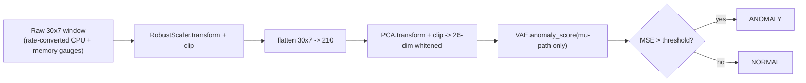
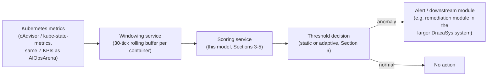

# 05 — Model Integration & Developer Guide

> **Scope**: how to load and run the trained model outside the research notebooks. All code below is written to match the actual saved artifacts and preprocessing steps verified in `02` and `04` — not a generic VAE-serving template. If you haven't read `04`'s Section 5 (artifact inventory) yet, do that first; this file assumes it.

---

## 1. Required components (must all be present)

| Artifact | Path | Why it's required |
|---|---|---|
| Scaler | `models/cc1_scaler.pkl` | Raw feature values must be RobustScaler-transformed exactly as `cc1_train` was, before windowing |
| PCA | `models/cc1_pca.pkl` | Converts a flattened (30×7=210) window into the 26-dim whitened space the VAE was trained on |
| Model weights | `models/vae_cc1.pt` | Trained VAE `state_dict` |
| Model metadata | `models/vae_cc1_meta.pkl` | Architecture dims (`input_dim, hidden1, hidden2, latent_dim`), `clip`, and the threshold-reference statistics `mu_train`/`sigma_train` |
| Evaluation thresholds (optional but recommended) | `models/vae_cc1_eval.pkl` | The deployed `val_p99` operating threshold, if you want the exact one used in `04`'s reported metrics rather than recomputing your own |

**Runtime dependencies**: Python 3.9, `torch` (CPU build is sufficient — the model is 10,778 parameters and was never run on GPU in this project), `scikit-learn` (needed to unpickle the `RobustScaler`/`PCA` objects — the *installed* sklearn version should match what created them closely enough to deserialize; **not pinned** anywhere in this project's notebooks, so pin it explicitly in any deployment), `joblib`, `numpy`, `pandas` (only if you're doing your own windowing from raw per-timestep data).

**Load `cc1_pca.pkl` and `cc1_scaler.pkl` with `joblib.load`, not `pickle.load`** — they were saved with `joblib.dump` (verified: a downstream notebook in this project hit `UnpicklingError: invalid load key` from using plain `pickle.load` on `cc1_pca.pkl`; `joblib.load` is required).

---

## 2. Input schema

**Raw input, per container, per 15-second tick** — 7 features, in this exact order (order matters — the scaler and PCA were fit on this column order):

```python
FEATURE_COLS = [
    'container_cpu_usage_seconds_rate',
    'container_cpu_system_seconds_rate',
    'container_cpu_user_seconds_rate',
    'container_memory_usage_bytes',
    'container_memory_working_set_bytes',
    'container_memory_rss',
    'container_memory_cache',
]
```

The three CPU features are **rates**, not cumulative counters — if your metrics source gives cumulative `_total` counters (as the raw AIOpsArena `container_cpu_usage_seconds_total` does), you must convert with `rate = max(0, diff(value) / diff(timestamp))` per container before anything else (see `02`, Section 3 — this is exactly what `clean_and_split.ipynb`'s upstream labeling step does). The four memory features are already gauges (gauges are used as-is).

**Model input** = one window of **30 consecutive ticks** (7.5 minutes at 15s/tick) for **one container**, shape `(30, 7)`.

---

## 3. Preprocessing pipeline (must match training exactly)

```python
import joblib
import numpy as np

scaler_bundle = joblib.load('models/cc1_scaler.pkl')   # {'scaler', 'feature_cols', 'clip'}
pca_bundle    = joblib.load('models/cc1_pca.pkl')      # {'pca', 'feature_cols', 'window_size', 'stride', 'n_components'}
scaler, pca = scaler_bundle['scaler'], pca_bundle['pca']
CLIP = scaler_bundle['clip']   # 20.0

def preprocess_window(raw_window_30x7: np.ndarray) -> np.ndarray:
    """raw_window_30x7: shape (30, 7), raw feature values (CPU already rate-converted)."""
    scaled = np.clip(scaler.transform(raw_window_30x7), -CLIP, CLIP)   # RobustScaler, per-timestep
    flat = scaled.reshape(1, -1)                                       # (1, 210)
    pca_space = np.clip(pca.transform(flat), -CLIP, CLIP).astype(np.float32)  # (1, 26), clip AGAIN post-PCA
    return pca_space
```

**Two clip steps, not one** — verified from `windowing_pca.ipynb`/`train_vae.ipynb`: the `±20` clip is applied both after scaling (raw-feature space, guards the scaler's occasional wide range) and again after the PCA transform (whitened-PCA space, guards against any window with extreme values before it reaches the VAE). Skipping either one is a deviation from how the model was trained and evaluated.

**No windowing helper is currently packaged as a standalone function** — every notebook in this project builds windows via its own local `build_windows`/`window_split`/`window_meta_with_features` implementation, always the same gap-aware logic: skip a window if any of its 30 rows started a time gap (`> 30s` since the previous reading for that container). A production integration should either port this exact function or accept that gap-adjacent windows may be scored on data with an internal discontinuity.

---

## 4. Model class (exact copy — must match for `state_dict` to load)

```python
import torch
import torch.nn as nn

class VAE(nn.Module):
    def __init__(self, input_dim, hidden1, hidden2, latent_dim):
        super().__init__()
        self.encoder = nn.Sequential(
            nn.Linear(input_dim, hidden1), nn.ReLU(),
            nn.Linear(hidden1, hidden2), nn.ReLU(),
        )
        self.fc_mu = nn.Linear(hidden2, latent_dim)
        self.fc_lv = nn.Linear(hidden2, latent_dim)
        self.decoder = nn.Sequential(
            nn.Linear(latent_dim, hidden2), nn.ReLU(),
            nn.Linear(hidden2, hidden1), nn.ReLU(),
            nn.Linear(hidden1, input_dim),
        )

    def encode(self, x):
        h = self.encoder(x)
        return self.fc_mu(h), torch.clamp(self.fc_lv(h), -10, 10)

    def decode(self, z):
        return self.decoder(z)

    @torch.no_grad()
    def anomaly_score(self, x):
        """Deterministic — uses mu directly, no sampling. This is what every
        evaluation and comparison notebook in this project actually calls."""
        self.eval()
        mu, _ = self.encode(x)
        return ((self.decode(mu) - x) ** 2).mean(dim=1)
```

---

## 5. Loading the model and generating a prediction

```python
import pickle

meta = pickle.load(open('models/vae_cc1_meta.pkl', 'rb'))
model = VAE(meta['input_dim'], meta['hidden1'], meta['hidden2'], meta['latent_dim'])
model.load_state_dict(torch.load('models/vae_cc1.pt', map_location='cpu'))
model.eval()

# Deployed threshold — reuse the exact one from vae_eval.ipynb rather than recomputing,
# unless you have your own fresh, leak-free validation set to calibrate against.
eval_results = pickle.load(open('models/vae_cc1_eval.pkl', 'rb'))
THRESHOLD = eval_results['thresholds']['val_p99']   # 0.09799, as reported in `04`

def score_and_classify(raw_window_30x7: np.ndarray) -> dict:
    x = torch.from_numpy(preprocess_window(raw_window_30x7))
    with torch.no_grad():
        mse = model.anomaly_score(x).item()
    return {
        'reconstruction_mse': mse,
        'is_anomaly': mse > THRESHOLD,
        'threshold_used': THRESHOLD,
    }
```

**Full pipeline, end to end**:



---

## 6. Reproducing the deployed adaptive threshold (optional, for a closer match to `04`'s "Full Model" numbers)

The static `val_p99` threshold above is what produces `04`'s "VAE alone" row. To reproduce the better-performing, deployed **blended adaptive threshold** (`04`, Section 4.4), you need **per-container state** — a rolling buffer of that container's own recent normal-classified reconstruction errors:

```python
from collections import deque

PRIOR_STRENGTH = 500     # shrinkage weight — see 03, Phase 3 for how this was calibrated
BUFFER_SIZE = 500
K_ADAPTIVE = 3.0
GLOBAL_MEAN, GLOBAL_STD = meta['mu_train'], meta['sigma_train']

class PerContainerThreshold:
    def __init__(self):
        self.buffers = {}   # cmdb_id -> deque of recent NORMAL reconstruction errors

    def classify(self, cmdb_id: str, mse: float) -> bool:
        buf = self.buffers.setdefault(cmdb_id, deque(maxlen=BUFFER_SIZE))
        n_local = len(buf)
        w = n_local / (n_local + PRIOR_STRENGTH)
        if n_local == 0:
            local_mean, local_std = GLOBAL_MEAN, GLOBAL_STD
        else:
            arr = np.fromiter(buf, dtype=np.float64)
            local_mean, local_std = arr.mean(), arr.std()
        threshold = (w * local_mean + (1 - w) * GLOBAL_MEAN) + K_ADAPTIVE * (w * local_std + (1 - w) * GLOBAL_STD)
        is_anomaly = mse > threshold
        if not is_anomaly:
            buf.append(mse)   # only normal-classified points feed the rolling baseline
        return is_anomaly
```

This is **per-deployment, in-memory state** — if you restart the service, every container's buffer resets to `w=0` (pure static threshold) until it re-accumulates history. This project never tested persisting these buffers across restarts.

**Incremental learning (drift-triggered fine-tuning)** is the one remaining piece from `04`'s "Full Model" row — it requires a periodic (every 5,000 windows, in this project's validated configuration) KS-test against a **fixed** reference sample of `cc1_train` scored once by the original model, and a conditional 5-epoch SGD fine-tune at `lr=1e-4` on a pooled buffer of recent likely-normal windows. This is meaningfully more operational complexity (a background job, a fixed reference array shipped alongside the model, in-place model mutation with the attendant need for versioning/rollback) than the scoring-only path above — porting it is a deliberate architectural decision, not a drop-in addition. See `module3_pipeline/incremental_learning.ipynb`'s `run_stream()` function for the exact, validated implementation to port.

---

## 7. Output schema

| Field | Type | Meaning |
|---|---|---|
| `reconstruction_mse` | float | Raw anomaly score — higher means less like trained "normal" behavior. Not bounded; typical `cc1_train` values center around 0.022 ± 0.032 (mean ± std, whitened PCA space) |
| `is_anomaly` | bool | `reconstruction_mse > threshold` |
| `threshold_used` | float | Whichever threshold was applied (static `val_p99` = 0.09799, or a per-container adaptive value if using Section 6) |

**Not currently produced by any notebook, but derivable if needed**: a per-fault-type label — the model is unsupervised and only ever outputs a binary normal/anomaly decision plus a continuous score. `failure_type` in this project's data is groundtruth metadata used only for *evaluation*, never predicted by the model itself.

---

## 8. External integration patterns

### 8.1 Plain Python application
The code in Sections 3–5 is already a complete, synchronous, in-process integration — call `score_and_classify()` per window as your monitoring loop produces one.

### 8.2 REST API (FastAPI) — illustrative sketch, not present in this project

```python
from fastapi import FastAPI
from pydantic import BaseModel
import numpy as np

app = FastAPI()
# Load scaler, pca, meta, model, THRESHOLD once at startup (Sections 3, 5) — not per-request.

class WindowRequest(BaseModel):
    cmdb_id: str
    # 30 timesteps x 7 features, already rate-converted for the 3 CPU columns
    window: list[list[float]]

@app.post('/score')
def score(req: WindowRequest):
    arr = np.array(req.window, dtype=np.float64)
    if arr.shape != (30, 7):
        return {'error': f'expected shape (30, 7), got {arr.shape}'}
    result = score_and_classify(arr)
    result['cmdb_id'] = req.cmdb_id
    return result
```

If reproducing the adaptive threshold (Section 6), the `PerContainerThreshold` instance must be created **once**, outside the request handler, and shared across requests — it is deployment-lifetime state, not per-request state.

### 8.3 Containerized / monitoring-pipeline integration



The model's measured latency (0.45ms/window single-call, `04` Section 4.6) means the scoring step is not the bottleneck in any realistic per-container-every-15-seconds monitoring pipeline; the windowing/buffering layer and whatever metrics-collection agent feeds it will dominate end-to-end latency.

---

## 9. Troubleshooting / common mistakes

| Symptom | Cause | Fix |
|---|---|---|
| `UnpicklingError: invalid load key` loading `cc1_pca.pkl` or `cc1_scaler.pkl` | Used `pickle.load` instead of `joblib.load` | Use `joblib.load` — verified, real bug hit during this project's own development |
| `import torch` crashes with `WinError 1114` (Windows) | Wrong Python interpreter/kernel (this project's default `python3` Jupyter kernel resolves to a broken Python 3.11 on the development machine) | Use the `python39-pytorch` kernel/environment, or whatever Python 3.9 + PyTorch environment is correct for your deployment host |
| Reconstruction MSE values look ~30x larger than expected (`mu_train` looks like ~0.7 instead of ~0.02) | Accidentally using the **extended-feature (11-metric) experimental model** (`experiments/models_extended/model/vae_cc1_extended.pt`) instead of the deployed 7-feature model (`models/vae_cc1.pt`) | Confirm you're loading from `models/`, not `experiments/models_extended/model/` — the extended model is a documented negative-result experiment, not the deployed model (see `03`, Phase 6c) |
| Precision/recall look drastically different from `04`'s reported numbers even with the right model | Feature order mismatch, missing the CPU rate-conversion step, skipping one of the two `±20` clips, or window misalignment (stride/gap-handling not matching `windowing_pca.ipynb`'s logic) | Re-check Sections 2–3 against `02`'s Section 3.8–3.10 exactly; these are the most detail-sensitive steps in the whole pipeline |
| Model scores everything as normal, or everything as anomalous | Threshold mismatch — e.g. using `mu_train + k*sigma_train` in **raw** units against a score computed correctly, or vice-versa; or loading `vae_cc1_meta.pkl` from a different training run than `vae_cc1.pt` | Always load `meta` and the `.pt` weights from the same directory/run together; use `eval_results['thresholds']['val_p99']` directly rather than recomputing from `mu_train`/`sigma_train` unless you intend the `k`-based alternative deliberately |
| `KeyError: 'drift_sc1'` when re-running `adaptive_threshold_blended.ipynb` or `baseline_comparison.ipynb` | These notebooks depend on `vae_cc1_eval.pkl` containing `drift_sc1`/`drift_sc2` keys, which the *current* CC2-only-scoped `vae_eval.ipynb` no longer produces | See `04`, Section 6, for the two documented workarounds — this is a known, real, unresolved gap in this project, not something specific to your integration |

---

## 10. What is explicitly NOT provided by this project (state clearly to avoid over-promising in an integration)

- No packaged Python module/CLI/API — every capability described above is assembled from notebook code, not a `pip`-installable library.
- No persisted per-container adaptive-threshold state across restarts (Section 6) — never tested in this project.
- No network-fault (`delay`/`loss`) detection capability, by design (`01`, `02`).
- No multi-model ensembling — the proposal explicitly excludes this as a "novelty" and the project has not built one.
- No confirmed sklearn/pandas/numpy version pins — `Not found / Not verified` in every notebook's output; pin these explicitly before deploying.

---

## Documentation coverage matrix

| Topic | 01 | 02 | 03 | 04 | 05 |
|---|:-:|:-:|:-:|:-:|:-:|
| Research objective / problem statement | ✅ | | | | |
| System architecture / pipeline diagram | ✅ | | | | |
| Project folder/file structure | ✅ | | | | |
| Technology stack | ✅ | | | | |
| Module relationships / dependency graph | ✅ | | | | |
| Dataset details | ✅ | ✅ | | | |
| Data cleaning / labeling / dedup / gap-marking | | ✅ | | | |
| Scaling / normalization | | ✅ | | | |
| Train/val/test split design | | ✅ | | | |
| Sliding window construction | | ✅ | | | |
| PCA / dimensionality reduction | | ✅ | | ✅ | |
| Module inputs/outputs (data stages) | | ✅ | | | |
| Historical experiments (chronological) | | | ✅ | | |
| Failed experiments + technical root cause | | | ✅ | | |
| Multi-seed / HPO experiments | | | ✅ | ✅ | |
| Baseline comparison (Gaussian, Isolation Forest) | | | ✅ | ✅ | |
| Final VAE architecture | | | | ✅ | ✅ |
| Training process | | | | ✅ | |
| Final metrics (default config) | | | | ✅ | |
| Ablation study / drift-adaptation analysis | | | | ✅ | |
| Model saving / artifact inventory | | | | ✅ | ✅ |
| Reproducibility / exact execution steps | | | | ✅ | |
| Known limitations | ✅ | ✅ | ✅ | ✅ | ✅ |
| Model loading / inference code | | | | | ✅ |
| Input/output schema | | | | | ✅ |
| Anomaly scoring / thresholding | | | ✅ | ✅ | ✅ |
| External integration (API/container) | | | | | ✅ |
| Troubleshooting / common mistakes | | | | | ✅ |
| Verified cross-notebook inconsistencies | | | ✅ | ✅ | ✅ |
