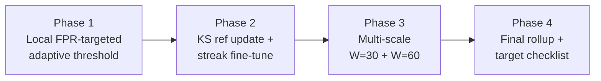

# 06 — Pipeline v2 Phase 1–4 Improvements

> **Scope of this file**: documents the evidence-based improvement work added under `module3_pipeline_v2/` after the v1 (`WINDOW_SIZE=30`) and initial v2 (`WINDOW_SIZE=60`) pipelines. Motivation and root-cause analysis live here; v1 baseline numbers remain in `04_final_model_results_and_reproducibility.md`; experiment history that *led* to window=60 lives in `03_experiments_and_research_history.md` and the `experiments/window_size_*` notebooks.

---

## 1. Why this work exists

### 1.1 Starting point (problem)

| Set | PR-AUC | ROC-AUC | F1 | Precision | Recall | FPR |
|---|---|---|---|---|---|---|
| **cc1_test** (v1, W=30, VAE alone) | 0.601 | 0.876 | 0.618 | 0.630 | 0.605 | 0.002 |
| **drift_cc2** (v1, W=30, VAE alone) | 0.409 | 0.881 | 0.276 | 0.168 | 0.772 | 0.036 |
| **drift_cc2** (v1 Full Model) | 0.422 | 0.902 | **0.391** | 0.262 | 0.768 | — |

In-distribution PR-AUC ≈ 0.60 was judged too low for final evaluation. Drift looked worse on PR-AUC / F1 / Precision / FPR even though ROC-AUC and Recall stayed strong.

### 1.2 Confirmed root causes (from prior experiments)

| Finding | Evidence | Implication |
|---|---|---|
| **ID ceiling is representation-limited at W=30** | 5-seed oracle F1 ≤ 0.70; HPO / extended features / recon-prob / max-pool all failed or hurt | Retuning the same W=30 VAE cannot push PR-AUC to ~0.90 |
| **W=60 solves ID** | `experiments/window_size_ablation.ipynb`: cc1_test PR-AUC **0.918**, F1 **0.912** | Adopt window=60 as the ID path (`module3_pipeline_v2`) |
| **W=60 hurts drift** | Same ablation: drift PR-AUC **0.331**, F1 **0.155**, FPR **0.123** | Do not treat W=60 as a drop-in “better everywhere” model |
| **Drift failure mode is FPR inflation** | High ROC/Recall + collapsed Precision; KS=0.41 on normal MSE | Fix local false-positive control and adaptation, not “detect harder” |
| **Frozen KS reference never settles** | Incremental learning fired **15/15** checks on drift_cc2 | Update reference after fine-tune; require consecutive drift signals |

### 1.3 Design response (four phases)



All phases stay **leak-free**: thresholds and rule selection use `cc1_val` (100% normal) only. Test / drift labels are used only for reporting.

---

## 2. Pipeline layout

### 2.1 Folder roles

| Folder | Role |
|---|---|
| `module3_pipeline/` | **v1 final** — `WINDOW_SIZE=30`. Best documented drift Full Model (F1 ≈ 0.391). Do not edit for this improvement track. |
| `module3_pipeline_v2/` | **v2 + Phase 1–4** — `WINDOW_SIZE=60` core pipeline, plus FPR-targeted threshold, reference-updating incremental learning, multi-scale ensemble, and rollup. |
| `experiments/` | Historical ablations (window size, HPO, etc.). **Not modified** by Phase 1–4. |
| `models_v2/` | Artifacts produced by v2 / Phase 1–4 notebooks. |
| `models/` | v1 artifacts (needed by Phase 3 for the W=30 scorer). |

### 2.2 Notebooks in `module3_pipeline_v2/`

| Notebook | Status | Purpose |
|---|---|---|
| `clean_and_split.ipynb` | Unchanged core | Same CC1 split / RobustScaler as v1 |
| `windowing_pca.ipynb` | Unchanged core | `WINDOW_SIZE=60`, PCA 99% + whiten → `windows_cc1_v2/` |
| `train_vae.ipynb` | Unchanged core | Train W=60 VAE → `models_v2/vae_cc1.pt` |
| `vae_eval.ipynb` | Unchanged core | Leak-free eval, `val_p99`, PR-AUC primary |
| `baseline_comparison.ipynb` | Unchanged core | Gaussian / Isolation Forest / VAE |
| `adaptive_threshold_blended.ipynb` | **Phase 1 rewritten** | Local FPR-targeted blend (+ mean+k·std comparison) |
| `incremental_learning.ipynb` | **Phase 2 rewritten** | KS streak + reference refresh; uses Phase-1 threshold |
| `multiscale_comparison.ipynb` | **Phase 3 new** | Align W=30 + W=60 scores; select ensemble rule under ID gate |
| `final_comparison.ipynb` | **Phase 4 rewritten** | Ablation + multi-scale + target PASS/FAIL checklist |

---

## 3. Phase 1 — Local FPR-targeted adaptive threshold

**File:** `module3_pipeline_v2/adaptive_threshold_blended.ipynb`

### 3.1 Problem addressed

Under drift, a static `val_p99` calibrated on CC1-val produces too many false positives (v2 static FPR on drift_cc2 ≈ **0.123**). Mean+k·std blending helps when `k` is corrected to match `val_p99`, but still targets a parametric form rather than an explicit local FPR operating point.

### 3.2 Method

Per container, maintain a rolling buffer of recent **normal-classified** reconstruction MSEs (size 500).

**FPR-targeted threshold** (primary):

```text
w = n_local / (n_local + PRIOR_STRENGTH)
local_t = percentile(buffer, (1 - TARGET_FPR) * 100)   # if n_local >= 30
        = val_p99                                      # else (burn-in)
threshold = w * local_t + (1 - w) * val_p99
TARGET_FPR = 0.01
```

**Mean+k·std blend** (comparison baseline, corrected k):

```text
k = (val_p99 - mu_train) / sigma_train
threshold = blended_mean + k * blended_std
```

`PRIOR_STRENGTH` is chosen on `cc1_val` only to hit ≈ 1% FPR.

### 3.3 Outputs

| Artifact | Contents |
|---|---|
| `models_v2/vae_cc1_adaptive_blended_eval.pkl` | Primary Phase-1 results (`threshold_mode='fpr_targeted'`, `prior_strength`, per-set P/R/F1/FPR) |
| `models_v2/phase1_fpr_targeted_eval.pkl` | Same payload (explicit Phase-1 copy) |

### 3.4 Metrics to compare after Phase 1

| Set | Watch | Gate / target |
|---|---|---|
| cc1_test | F1, Precision, Recall, FPR | F1 ≥ **0.88**; ranking PR-AUC unchanged (≥ **0.90** from `vae_eval`) |
| drift_cc2 | **FPR**, Precision, F1 | FPR ≤ **0.03** preferred; Precision / F1 should rise vs static |

---

## 4. Phase 2 — Incremental learning with adaptive KS reference

**File:** `module3_pipeline_v2/incremental_learning.ipynb`

### 4.1 Problem addressed

On drift_cc2, every 5 000-window KS check against a **frozen** CC1-train reference triggered fine-tuning (15/15). The model never left “drifted” mode. Tweaking LR / epochs / refit interval alone only moved F1 by ~0.02.

### 4.2 Method

Streaming uses the **Phase-1 FPR-targeted** threshold (`threshold_mode` from the Phase-1 pickle).

When incremental learning is ON:

1. Every `REFIT_INTERVAL=5000` windows, KS-test recent self-normal MSE buffer vs current reference (`KS_ALPHA=0.001`).
2. Fine-tune only if drift is significant for **`KS_STREAK_REQUIRED=2` consecutive** checks.
3. After a successful fine-tune, **refresh the KS reference** from the fine-tune buffer (`REF_UPDATE_MODE='replace'`, optional EMA).

**Comparisons run in-notebook:**

| Config | Meaning |
|---|---|
| Control | Phase-1 threshold, IL OFF |
| Treatment (Phase 2) | Phase-1 threshold + streak + reference update |
| Legacy ablation | IL ON, frozen reference, streak=1 (old behaviour) |

### 4.3 Outputs

| Artifact | Contents |
|---|---|
| `models_v2/incremental_learning_eval.pkl` | Control / treatment / legacy metrics, `n_finetunes`, events |
| `models_v2/phase2_incremental_ref_update_eval.pkl` | Same payload (explicit Phase-2 copy) |

### 4.4 Metrics to compare after Phase 2

| Quantity | Expectation |
|---|---|
| `n_finetunes` | **&lt; 15** (should drop vs legacy) |
| drift F1 / Precision / FPR | F1 ≥ **0.28**, Precision ≥ **0.18**, FPR ≤ **0.025** as interim gates |
| cc1_test | Unchanged vs Phase 1 (IL is a no-op in-distribution by design) |

---

## 5. Phase 3 — Multi-scale ensemble (W=30 + W=60)

**File:** `module3_pipeline_v2/multiscale_comparison.ipynb` *(new)*

### 5.1 Problem addressed

Window size is a **Pareto tradeoff**: W=60 wins ID; W=30 wins drift. No single window maximizes both. Phase 3 tests whether combining both scorers can keep ID strength while recovering drift robustness.

### 5.2 Method

1. Load **v1** (`models/`, W=30) and **v2** (`models_v2/`, W=60) models.
2. Rebuild windows from the same CSVs at both sizes; **inner-join** on `(cmdb_id, end_timestamp)`.
3. Evaluate combination rules (leak-free calibration on `cc1_val`):

| Rule | Decision |
|---|---|
| `and_gate` | Both MSE &gt; their own `val_p99` |
| `or_gate` | Either MSE &gt; its `val_p99` |
| `max_z` | `max(z30, z60) >` val-calibrated z-threshold |
| `mean_z` | `mean(z30, z60) >` val-calibrated z-threshold |

`z = (mse - mu_train) / sigma_train` using each model’s own train stats.

4. **ID gate**: discard any rule with cc1_test PR-AUC &lt; 0.90 or F1 &lt; 0.88.
5. Among remaining rules, maximize drift F1, then Precision, then minimize FPR.

### 5.3 Outputs

| Artifact | Contents |
|---|---|
| `models_v2/phase3_multiscale_eval.pkl` | All rule metrics, `best_rule`, `id_gate_passed` |

### 5.4 Metrics to compare after Phase 3

| Set | Target for selected rule |
|---|---|
| cc1_test | PR-AUC ≥ **0.90**, F1 ≥ **0.88** (hard gate) |
| drift_cc2 | Aim for F1 ≥ **0.40**, Precision ≥ **0.30**, FPR ≤ **0.02**, PR-AUC ≥ **0.42** (stretch) |

---

## 6. Phase 4 — Final rollup and target checklist

**File:** `module3_pipeline_v2/final_comparison.ipynb`

### 6.1 What it consolidates

1. Classical baselines (from `baseline_comparison.pkl`, if present).
2. Ablation: **VAE alone → Phase-1 adaptive → Phase-2 full**.
3. Phase-3 multi-scale vs v1-alone / v2-alone.
4. Pre-registered **PASS/FAIL** against success targets.
5. Side-by-side vs v1 Full Model (`models/final_comparison_results.pkl`), when available.

### 6.2 Success targets (pre-registered)

| Metric | ID (cc1_test) | Drift good | Drift stretch |
|---|---|---|---|
| PR-AUC | ≥ 0.90 | ≥ 0.35 | ≥ 0.42 |
| F1 | ≥ 0.90 | ≥ 0.28 | ≥ 0.40 |
| Precision | ≥ 0.95 | ≥ 0.20 | ≥ 0.30 |
| Recall | ≥ 0.85 | ≥ 0.65 | ≥ 0.70 |
| FPR | ≤ 0.001 | ≤ 0.03 | ≤ 0.02 |

**Chosen configuration rule:** use Phase-3 `best_rule` if `id_gate_passed`; otherwise fall back to Phase-2 full model. Quote only that chosen operating point as the “final” number in the thesis.

### 6.3 Outputs

| Artifact | Contents |
|---|---|
| `models_v2/final_comparison_results.pkl` | Full rollup |
| `models_v2/phase4_final_rollup.pkl` | Same payload |
| `models_v2/phase4_ablation_f1_fpr.png` | Ablation F1/FPR bars |
| `models_v2/phase4_multiscale_f1.png` | Multi-scale F1 bars (if Phase 3 ran) |

---

## 7. How to run (reproduction)

### 7.1 Prerequisites

- Jupyter kernel **`python39-pytorch`** (Python 3.9 + PyTorch CPU).
- Processed data present under `module3/data/processed/`:
  - Split CSVs: `cc1_val.csv`, `cc1_test.csv`, `drift_complex_case2.csv`, …
  - `windows_cc1/` (v1, for Phase 3)
  - `windows_cc1_v2/` (v2)
- Trained artifacts:
  - `models/vae_cc1.pt`, `vae_cc1_meta.pkl`, `vae_cc1_eval.pkl`, `cc1_pca.pkl` (v1)
  - `models_v2/vae_cc1.pt`, `vae_cc1_meta.pkl`, `vae_cc1_eval.pkl`, `cc1_pca.pkl` (v2)

Paths auto-resolve via `resolve_base()` inside each Phase notebook (looks for a directory containing `models_v2/`).

### 7.2 Core v2 train/eval (if not already done)

```text
module3_pipeline_v2/clean_and_split.ipynb
module3_pipeline_v2/windowing_pca.ipynb
module3_pipeline_v2/train_vae.ipynb
module3_pipeline_v2/vae_eval.ipynb
module3_pipeline_v2/baseline_comparison.ipynb   # optional but used by Phase 4
```

### 7.3 Phase 1–4 (strict order)

```text
1. module3_pipeline_v2/adaptive_threshold_blended.ipynb
2. module3_pipeline_v2/incremental_learning.ipynb
3. module3_pipeline_v2/multiscale_comparison.ipynb
4. module3_pipeline_v2/final_comparison.ipynb
```

Headless pattern:

```bash
jupyter nbconvert --to notebook --execute --inplace \
  --ExecutePreprocessor.kernel_name=python39-pytorch \
  module3_pipeline_v2/adaptive_threshold_blended.ipynb
```

---

## 8. What was deliberately not changed

- **`module3_pipeline/` (v1)** — left as the documented W=30 reference.
- **`experiments/`** — historical notebooks unchanged; Phase 1–4 only *consume* their conclusions.
- **VAE architecture / beta / latent dim** — already shown not to fix the ID ceiling or the drift FPR problem.
- **Network delay/loss detection** — still out of scope (CPU/memory features only).

---

## 9. Thesis / reporting guidance

**Defensible claim after a successful Phase 1–4 run:**

> Extending the temporal window to 60 steps raises in-distribution PR-AUC into the 0.90+ regime. Remaining drift degradation is dominated by elevated false-positive rate under normal-score shift; local FPR-targeted thresholding, reference-updating incremental learning, and (if the ID gate passes) multi-scale fusion with the shorter-window model are the mechanisms used to recover drift Precision/F1 without giving back the in-distribution gain.

**Do not claim:**

- Unconditional superiority of W=60 over W=30 on every set.
- That hyperparameter retuning alone would have reached ID PR-AUC ≈ 0.90.
- Final numbers from a phase that was not selected by the Phase-4 `chosen_configuration` rule.

---

## 10. Documentation map (updated)

| Topic | Doc |
|---|---|
| Project overview / v1 architecture | `01_project_overview_and_architecture.md` |
| Data pipeline | `02_data_pipeline_and_methodology.md` |
| Experiment history (incl. window ablations) | `03_experiments_and_research_history.md` |
| v1 final metrics / reproducibility | `04_final_model_results_and_reproducibility.md` |
| Integration / loader | `05_model_integration_and_developer_guide.md` |
| **v2 Phase 1–4 improvements (this file)** | **`06_pipeline_v2_phase14_improvements.md`** |

Once Phase 1–4 have been executed on a machine with full `data/processed/`, paste the resulting tables from `final_comparison.ipynb` / `phase4_final_rollup.pkl` into a short “Observed results” subsection here (or into an updated `04`) so the docs carry measured numbers, not only targets.
