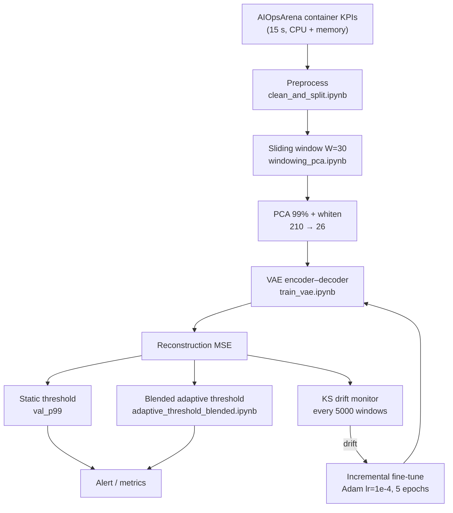
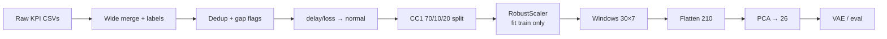
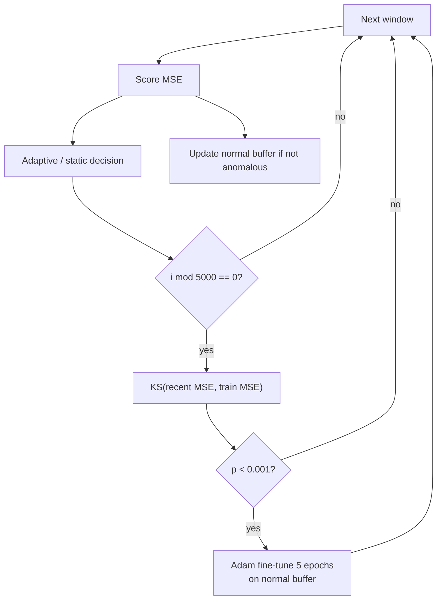

# Chapter 4 — Approach, Analysis and Design

**Module:** Module 3 — System Anomaly Detector (Drift-Aware Approach)  
**Evidence basis:** `module3/module3_pipeline/` (canonical final pipeline)  
**Companion chapters:** Technologies (Ch. 3); Implementation & Evaluation (Ch. 5)

---

## Part A — Your Approach

## 4.1 Overall Approach

Module 3 solves container **performance anomaly detection** as an unsupervised reconstruction problem with an optional drift-aware monitoring layer. The approach is:

1. Learn a model of *normal* CPU/memory window behaviour from leakage-safe PCA features.
2. Score every window by VAE reconstruction MSE.
3. Convert scores to alerts using a validation-tuned static threshold and/or a blended adaptive threshold.
4. Under simulated chronological stream replay, monitor score-distribution drift with a KS test and apply incremental fine-tuning when drift is detected.

This matches the implemented `module3_pipeline/`. It does **not** detect network bottlenecks—the feature set and label rescoping exclude that class.

### Proposed versus implemented (core technique)

| Aspect | Proposed | Implemented evidence |
|--------|----------|----------------------|
| VAE on benign data | Yes | `train_vae.ipynb`; train labels asserted 100% normal |
| PCA for multi-metric correlation | Yes | `windowing_pca.ipynb`; 210→26 whitened |
| Reconstruction error signal | Yes | Deterministic-μ MSE |
| Sliding window 30–60 | Yes (range) | Canonical **30** |
| Adaptive threshold | mean+α·std | Blended shrinkage + \(k=6.2\) |
| Incremental learning | “SGD” | Adam fine-tune, lr \(10^{-4}\), 5 epochs |
| Network bottlenecks | Named in proposal | **Not delivered** |

**Verdict:** The proposed core technique is **implemented** for CPU/memory performance anomalies. Drift-aware components are implemented in the research pipeline; the integration handoff is VAE-alone.

---

## 4.2 Users, Inputs, and Outputs

### Users

- **Researcher:** runs `module3_pipeline/` notebooks in order and inspects `models/` artefacts.
- **Integrator:** loads `final-model/vae_cc1_final_model.pt` with `VAEAloneDetector`.
- **Operator (intended):** consumes scores/alerts via the larger DracaSys integration UI.

### Inputs

| Stage | Input | Shape / format |
|-------|-------|----------------|
| Preprocess | AIOpsArena container KPI CSVs + groundtruth | Long/wide tables @ 15 s |
| Window / PCA | Scaled row streams | Windows `(N,30,7)` → PCA `(N,26)` |
| VAE | Whitened PCA vectors | `(B,26)` |
| Drift stream | Chronological window MSE + metadata | Replay over splits |

### Outputs

| Stage | Output | Consumer |
|-------|--------|----------|
| Score | `reconstruction_mse` | Threshold / dashboard |
| Decision | `is_anomaly` | Alerting |
| Adaptive | Per-window blended threshold / relative score | Ablation studies |
| Incremental | Updated VAE weights after KS trigger | Research evaluation |
| Handoff | Standalone `.pt` package | Integration demo |

---

## 4.3 Processing Workflow

```text
[1] Load / merge AIOpsArena KPIs
[2] Label from groundtruth; deduplicate; mark gaps
[3] Relabel delay/loss → normal (scope cut)
[4] CC1 time-split 70/10/20; RobustScaler fit on cc1_train
[5] Sliding windows W=30, stride=1 (gap-aware)
[6] Flatten → PCA(99%, whiten) → 26 dims
[7] Train VAE on benign X_train only
[8] Score val/test/drift with recon MSE
[9] Calibrate static threshold on cc1_val (val_p99)
[10] Optional: blended adaptive threshold stream
[11] Optional: KS every 5000 windows → Adam fine-tune
[12] Compare AE / Isolation Forest / ablation configs
```

Steps 1–9 are the deployable VAE-alone path. Steps 10–11 form the research drift-aware layer. Step 12 is comparative evaluation.

---

## 4.4 Input Metrics and Feature Preparation

### Raw features (exact order)

| # | Column | Type |
|---|--------|------|
| 1 | `container_cpu_usage_seconds_rate` | rate |
| 2 | `container_cpu_system_seconds_rate` | rate |
| 3 | `container_cpu_user_seconds_rate` | rate |
| 4 | `container_memory_usage_bytes` | gauge |
| 5 | `container_memory_working_set_bytes` | gauge |
| 6 | `container_memory_rss` | gauge |
| 7 | `container_memory_cache` | gauge |

CPU rates are derived from cumulative counters before modelling. Memory gauges are used as raw bytes then scaled.

### Detectable versus excluded faults

| Fault class | Status |
|-------------|--------|
| `cpu` | In scope |
| `memory` | In scope |
| `pod-failure` | In scope |
| `delay`, `loss` (network) | **Out of scope — not delivered** |

---

## 4.5 Dataset Split Design

| Split | Role | Approx. rows (cleaned) | Anomalies |
|-------|------|------------------------:|----------:|
| `cc1_train` | Fit scaler/PCA/VAE | 156,479 | 0 |
| `cc1_val` | Threshold calibration only | 22,356 | 0 |
| `cc1_test` | In-distribution eval | 44,968 | 256 |
| `drift_cc2` | Sole reported drift set | 77,760 | 372 |
| `drift_sc1` / `drift_sc2` | Windowed upstream; **excluded from final drift reporting** | 60,480 / 38,853 | 76 / 56 |

Split rule: within CC1, normals by global time quantiles 70/10/20; all CC1 anomalies routed to test. Other cases held out entirely.

---

## 4.6 PCA Processing Design

**Figure 4.2** (see Part B) summarises:

1. Build gap-aware windows `(30,7)`.
2. Flatten to 210.
3. Fit `PCA(n_components=0.99, whiten=True)` on train only → 26 dims.
4. Transform all evaluation sets with the frozen PCA.

Whitening is required so reconstruction MSE treats CPU-carrying low-variance components fairly relative to memory-dominated high-variance components.

---

## 4.7 VAE Architecture and Training Process

Training uses only normal `cc1_train` windows. Loss = reconstruction MSE + \(\beta(t)\cdot\mathrm{KL}\), with \(\beta\) warmed to `beta_max=0.01`. Hyperparameters were selected by:

1. Beta search over `{1.0, 0.1, 0.01, 0.001}` rejecting collapsed KL.
2. Latent-dim ablation over `{8, 16, 32}` by validation loss.

Inference score uses \(\mu\) (no sampling). Train-set MSE statistics (`mu_train`, `sigma_train`) support secondary \(k\)-thresholds; primary static operating point is **`val_p99 ≈ 0.09799`**.

---

## 4.8 Anomaly Decision Logic

### Static (VAE-alone / integration)

```text
is_anomaly = (reconstruction_mse > val_p99)
```

### Blended adaptive (research)

Per container, maintain a rolling buffer of recent scores presumed normal under the current threshold. Update:

```text
threshold_t = blended_mean_t + k · blended_std_t
```

with shrinkage weight \(w\) toward the per-container train anchor (Section 3.6). Relative scoring supports ranking metrics under adaptation.

---

## 4.9 Drift Detection and Incremental Learning Design

Drift detection and fine-tuning are **periodic**, not per-window:

| Cadence | Action |
|---------|--------|
| Every window | Score + (optional) adaptive threshold |
| Every 5,000 windows | KS-test recent normal MSE vs frozen train MSE |
| If \(p < 0.001\) | Adam fine-tune 5 epochs on normal buffer (≤2000) |

This design avoids statistically meaningless KS tests on tiny samples and limits fine-tune cost.

---

## 4.10 Real-Time Detection Workflow (Conceptual)

For one container at inference time:

```text
collect last 30 ticks (15 s) of 7 features
  → rate-convert CPU if needed
  → RobustScaler + PCA (frozen)
  → VAE score
  → compare to static or adaptive threshold
  → emit {mse, is_anomaly}
```

The integration path implements the static branch only. Adaptive/IL require the streaming research loop.

---

## Part B — Analysis and Design

## 4.11 Top-Level Architecture

**Figure 4.1: Module 3 Drift-Aware System Anomaly Detection Architecture**



Figure 4.1 shows that scoring is shared, while adaptive thresholding and fine-tuning are optional research-layer components around the core VAE.

---

## 4.12 Data-Flow Design

**Figure 4.2: Preprocessing and Representation Data Flow**



Figure 4.2 emphasises leak-free fitting: scaler and PCA see **train normals only**.

---

## 4.13 VAE Internal Design

**Figure 4.3: VAE Architecture Used in Module 3**

```text
x ∈ R^26
  → Hidden 64 → Hidden 32
  → μ, log σ²  (latent dim 32)
  → z = μ          (inference)
  → Hidden 32 → Hidden 64 → x̂ ∈ R^26
  → MSE(x, x̂)
```

Training additionally samples \(z=\mu+\sigma\odot\epsilon\) and adds a warmed KL term. Figure 4.3 is the concrete realisation of the proposal’s “single VAE” novelty element.

---

## 4.14 Drift-Aware Control Flow

**Figure 4.4: Drift Detection and Incremental Learning Workflow**



Figure 4.4 matches `run_stream()` in `incremental_learning.ipynb`.

---

## 4.15 Component Interaction Table

| Component | Responsibility | Writes | Reads |
|-----------|----------------|--------|-------|
| `clean_and_split` | Labels, splits, scaler | `data/processed/*.csv`, scaler | Raw / labeled |
| `windowing_pca` | Windows + PCA | `windows_cc1/*.npy`, `cc1_pca.pkl` | Processed CSVs |
| `train_vae` | Fit VAE | `vae_cc1.pt`, `vae_cc1_meta.pkl` | Train/val windows |
| `vae_eval` | Static metrics, KS offline | `vae_cc1_eval.pkl` | Model + windows |
| `adaptive_threshold_blended` | Blended thr eval | `vae_cc1_adaptive_blended_eval.pkl` | Eval artefacts |
| `incremental_learning` | Stream IL study | `incremental_learning_eval.pkl` | Model + blended config |
| `final_comparison` | Baselines + ablation | `final_comparison_results.pkl` | Model + data |
| `final-model` | Integration package | `vae_cc1_final_model.pt` | Frozen preprocess + VAE |

---

## 4.16 Design Alternatives Considered

| Alternative | Outcome |
|-------------|---------|
| Naive recent mean+3·std threshold | Rejected — harmed F1 (`experiments/adaptive_threshold.ipynb`) |
| Window size 60 as default | Stronger ID PR-AUC in ablations; weaker / unstable drift story — **not** selected as canonical |
| Extended 11-feature set | Rejected — ID and drift F1 collapsed |
| Max-pool scoring | Rejected — PR-AUC collapse |
| Multi-case pooled training (legacy) | Superseded by CC1-only redesign |

---

## 4.17 Package Boundary: Research Full Stack vs Integration

| Capability | `module3_pipeline/` | `final-model/` (integration) |
|------------|:-------------------:|:----------------------------:|
| PCA + VAE score | ✅ | ✅ |
| Static `val_p99` | ✅ | ✅ |
| Blended adaptive threshold | ✅ | ❌ |
| KS + fine-tune | ✅ | ❌ |

This boundary is intentional: integration prioritises a **stateless, reproducible** scorer; drift-aware mechanisms remain validated in notebooks.

---

## 4.18 Summary of Design Decisions

1. **CC1-only training** defines a coherent normal baseline.
2. **PCA whitening + VAE** jointly model CPU/memory windows.
3. **PR-AUC-primary evaluation** under severe imbalance.
4. **Blended adaptive threshold** replaces failed naive adaptive rules.
5. **Periodic KS + small-LR fine-tune** implements drift adaptation without full retrain.
6. **Network faults excluded** rather than silently claimed.
