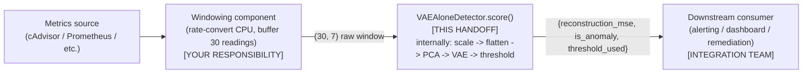

# VAE Anomaly Detector — Technical Handover Document

**Module**: Module 3 — System Anomaly Detector (VAE-alone configuration)
**Handoff artifacts**: `vae_cc1_final_model.pt`, `vae_alone_loader.py`
**Audience**: any developer integrating this model who has not worked on Module 3 before

---

## 1. Model Overview

This is a **Variational Autoencoder (VAE)** trained exclusively on *normal* container behavior. It has never seen an anomaly during training — instead, it learns to compress and reconstruct normal Kubernetes container metrics extremely well. When it is shown something abnormal, its reconstruction is noticeably worse. That reconstruction error (a single number) is the anomaly signal.

**Purpose**: detect real-time performance anomalies in containerized microservices — specifically CPU saturation, memory leaks/jumps, and pod failures — from routine container-level CPU and memory metrics, without requiring any labeled anomaly data to operate.

**Where it fits in the overall project**: this is Module 3 of a larger system ("Intelligent Deployment Helper for Containerized Applications"). Within Module 3's own pipeline, this package represents the **base scoring model only**:

```
Container metrics (raw)
        |
  Feature preparation (rate conversion, windowing)   <-- integration team's responsibility
        |
  Preprocessing (scaling + PCA)                      <-- INCLUDED in this handoff
        |
  VAE reconstruction-error scoring                    <-- INCLUDED in this handoff
        |
  Threshold decision (anomaly / normal)                <-- INCLUDED in this handoff
        |
  Alerting / downstream module                        <-- integration team's responsibility
```

**Important scope note**: this is the **"VAE-alone"** configuration — it does *not* include the project's adaptive thresholding or drift-detection/incremental-learning mechanisms (those exist as a separate, more advanced package). This package is a straightforward, stateless scorer: same input always produces the same output, nothing changes over time. This is the right choice for a first integration; the more advanced package is described in Section 7 if it's needed later.

---

## 2. Model Input

**What the model requires**: one **window** of metrics for **one container** at a time — 30 consecutive readings, 15 seconds apart (7.5 minutes total), across 7 specific metrics.

**File format**: no file format — the input is a Python object (`numpy.ndarray`) passed directly in-memory to the model's `.score()` method. Nothing is read from disk at inference time.

**Input shape**: `(30, 7)` — 30 rows (timesteps), 7 columns (features), `dtype` float.

**Required features, in this exact column order** (order is not negotiable — the model was trained on this order and will silently produce meaningless results if it's changed):

| # | Column name | Type | Notes |
|---|---|---|---|
| 1 | `container_cpu_usage_seconds_rate` | rate | **must be pre-converted** from a cumulative counter — see below |
| 2 | `container_cpu_system_seconds_rate` | rate | same |
| 3 | `container_cpu_user_seconds_rate` | rate | same |
| 4 | `container_memory_usage_bytes` | gauge | raw value, no conversion |
| 5 | `container_memory_working_set_bytes` | gauge | raw value |
| 6 | `container_memory_rss` | gauge | raw value |
| 7 | `container_memory_cache` | gauge | raw value |

**Required preprocessing the caller (your teammate) must do before calling the model**:

1. **CPU rate conversion.** Most Kubernetes metrics sources (cAdvisor, kube-state-metrics) expose CPU as a cumulative counter (`container_cpu_usage_seconds_total`), not a rate. Convert with:
   ```
   rate = max(0, (value_now - value_previous) / (timestamp_now - timestamp_previous))
   ```
   Memory columns need **no** conversion — they are already gauges, used as-is (raw bytes).

2. **Windowing.** Collect exactly 30 consecutive readings for one container into a `(30, 7)` array. If your metrics source samples at a different interval than 15 seconds, the window no longer represents "7.5 minutes of behavior" the way the model was trained on — this is a real assumption baked into the model (see Section 7).

Everything else — scaling, PCA compression, clipping — happens **automatically inside the model loader**. Your teammate does not write any of that logic themselves; it's already implemented in `vae_alone_loader.py` and the fitted scaler/PCA objects are already bundled inside `vae_cc1_final_model.pt`.

**Example input**:

```python
import numpy as np

# 30 timesteps x 7 features, for one container (values illustrative, not real data)
raw_window = np.array([
    [0.42, 0.41, 0.40, 5.2e8, 5.1e8, 4.8e8, 3.1e8],
    [0.38, 0.37, 0.36, 5.2e8, 5.1e8, 4.8e8, 3.1e8],
    # ... 28 more rows ...
    [0.45, 0.44, 0.43, 5.3e8, 5.2e8, 4.9e8, 3.2e8],
])
assert raw_window.shape == (30, 7)
```

---

## 3. Model Output

**What the model produces**: a single Python `dict` per call — one prediction per (container, window) pair, not a batch or array.

**Output format**:

```python
{
    'reconstruction_mse': 0.0873,        # float
    'is_anomaly': False,                 # bool
    'threshold_used': 0.09799141436815262   # float
}
```

**Meaning of each field**:

| Field | Meaning |
|---|---|
| `reconstruction_mse` | The raw, continuous anomaly score. Higher = more different from trained "normal" behavior. Not bounded above. For reference, typical normal windows score around 0.02 (the training-set mean); this is the number to log for trend-monitoring or to re-rank multiple simultaneous flags by severity. |
| `is_anomaly` | The final binary decision: `reconstruction_mse > threshold_used`. This is the field most downstream consumers will act on directly. |
| `threshold_used` | The exact threshold applied (0.09799, calibrated during training — see Section 7 for how). Echoed back for logging/audit trails, not something you need to compute yourself. |

**How to interpret it**:
- `is_anomaly == True` → flag/alert. This is a genuine detection at the model's calibrated operating point.
- `is_anomaly == False` → no action. Note `reconstruction_mse` is still returned even when normal — useful for dashboards/trend lines even without an active alert.
- If you need to compare severity across multiple simultaneous alerts, rank by `reconstruction_mse` (higher = more severe), not by re-deriving your own threshold.

**Example output — normal window**:
```python
{'reconstruction_mse': 0.0198, 'is_anomaly': False, 'threshold_used': 0.09799141436815262}
```

**Example output — anomalous window** (e.g. during a memory leak):
```python
{'reconstruction_mse': 0.412, 'is_anomaly': True, 'threshold_used': 0.09799141436815262}
```

---

## 4. How to Run the Model

### Software and library requirements

| Requirement | Version used in development | Notes |
|---|---|---|
| Python | 3.9 | Developed and tested on 3.9; should work on newer 3.x, not verified |
| PyTorch | 2.8.0 (CPU build) | GPU is not required — the model is small (10,778 parameters) and runs in well under 1ms per window on CPU |
| scikit-learn | not pinned during development | Required only to *unpickle* the bundled `RobustScaler`/`PCA` objects — see troubleshooting below if this causes a load error |
| numpy | any recent version | — |

Install with:
```bash
pip install torch scikit-learn numpy
```

### Project structure required

Nothing elaborate — these two files, together, anywhere in your project:

```
your_project/
├── vae_cc1_final_model.pt      <- the trained model + all preprocessing objects (one file)
├── vae_alone_loader.py          <- the code that loads and runs it
└── your_own_integration_code.py
```

No other files, folders, notebooks, or the rest of the Module 3 research project are required to *run* this model.

### Step-by-step instructions (fresh machine)

1. Install Python 3.9+ if not already present.
2. `pip install torch scikit-learn numpy`
3. Copy both `vae_cc1_final_model.pt` and `vae_alone_loader.py` into your project directory (same folder, or anywhere on your Python path together).
4. In your code:
   ```python
   from vae_alone_loader import VAEAloneDetector
   detector = VAEAloneDetector.load("vae_cc1_final_model.pt")
   ```
5. Verify it loaded correctly by running the file directly as a smoke test:
   ```bash
   python vae_alone_loader.py vae_cc1_final_model.pt
   ```
   Expected output includes the threshold value and a smoke-test score on random data — if this runs without error, the setup is correct.

### Configuration / parameters

**Nothing needs to be edited or configured.** The threshold, architecture dimensions, and all preprocessing objects are already embedded inside `vae_cc1_final_model.pt`. There is no separate config file.

The one optional override: if your deployment needs a different sensitivity trade-off (e.g. fewer false positives at the cost of missing some anomalies), you may set `detector.threshold = <your_value>` manually after loading — but do this deliberately and document why, since 0.098 is the value the reported metrics in Section 3/7 are actually calibrated against.

### Common setup issues and resolutions

| Symptom | Cause | Resolution |
|---|---|---|
| `UnpicklingError` or similar when loading | scikit-learn version installed differs significantly from the one used to save the PCA/scaler objects | Install a recent scikit-learn release; if it still fails, ask for the exact scikit-learn version used during training |
| `UserWarning: X does not have valid feature names, but RobustScaler was fitted with feature names` | Harmless — you're passing a plain NumPy array where the scaler was originally fit on a pandas DataFrame with column names | Safe to ignore; does not affect correctness |
| `ValueError: expected shape (30, 7), got (...)` | Input window is the wrong shape | Check you're passing exactly 30 timesteps and exactly 7 columns, in the order in Section 2 |
| Scores look wildly different from the reported ranges (Section 3) | Feature columns are in the wrong order, or CPU columns were not rate-converted | Re-check Section 2's column order and preprocessing steps carefully — this is the single most common integration mistake |
| Torch/CUDA errors | Not applicable — this model only needs the CPU build of PyTorch | Install `torch` (CPU) normally; no GPU setup needed |

---

## 5. How to Use the Model

### Complete execution workflow, input to output

```
1. Collect raw container metrics (external to this handoff — your metrics pipeline)
        |
2. Convert the 3 CPU columns from cumulative counters to rates
        |
3. Assemble the last 30 readings for one container into a (30, 7) array
        |
4. detector = VAEAloneDetector.load("vae_cc1_final_model.pt")   [ONCE, at startup]
        |
5. result = detector.score(raw_window)                          [PER window, PER container]
        |
6. Act on result['is_anomaly'] / log result['reconstruction_mse']
```

### Order of execution

There is only **one** script involved in actually *running* the model: `vae_alone_loader.py`. There are no notebooks to run and no multi-step pipeline to execute for inference — the notebooks that *produced* this model (training, evaluation) are part of the separate research project and are not needed to use this handoff package.

### Expected intermediate outputs

None. This is a single-call, synchronous scoring function — no intermediate files are written to disk, no multi-stage pipeline runs. Given an input array, you get a result dict back immediately (typically well under 1ms).

### Final output

The dict described in Section 3, once per `.score()` call. There is no batch-output file format defined by this package — if you need to score many windows in bulk, call `.score()` in a loop (or extend `VAEAloneDetector` to accept batches — not provided out of the box).

### Minimal worked example (start to finish)

```python
import numpy as np
from vae_alone_loader import VAEAloneDetector

# Step 4 — load once
detector = VAEAloneDetector.load("vae_cc1_final_model.pt")

# Steps 1-3 — your own metrics pipeline builds this array
raw_window = build_window_for_container("cartservice-2")   # shape (30, 7), your own function

# Step 5 — score
result = detector.score(raw_window)

# Step 6 — act on it
if result["is_anomaly"]:
    trigger_alert(container="cartservice-2", score=result["reconstruction_mse"])
```

---

## 6. Model Integration Guide

### What feeds this model (upstream)

A metrics-windowing component that **you (the integrating developer) must build or already have**:
- Pulls the 7 required metrics per container from your metrics source (e.g. cAdvisor / kube-state-metrics / Prometheus).
- Converts the 3 CPU metrics from cumulative counters to rates.
- Maintains a rolling 30-reading window per container.

This component is **not included** in this handoff — only the scoring model itself is.

### What consumes this model's output (downstream)

Any component that acts on anomaly detections — e.g. an alerting/notification service, a dashboard, or a remediation/auto-scaling module elsewhere in the larger project. This handoff makes no assumption about what that consumer is; it only defines the output contract (Section 3).

### Required interfaces

| Direction | Interface |
|---|---|
| Input (into this model) | `numpy.ndarray`, shape `(30, 7)`, columns per Section 2, in-memory (no file I/O) |
| Output (out of this model) | `dict` with keys `reconstruction_mse` (float), `is_anomaly` (bool), `threshold_used` (float) |

### Data flow between preprocessing, model, and downstream modules



### Assumptions and dependencies that must be maintained

- **15-second sampling interval.** The model was trained assuming each window spans exactly 7.5 minutes (30 × 15s). If your metrics arrive at a different cadence, the "30 readings" window no longer means the same thing to the model, and results would not be reliable without retraining.
- **Feature identity and order.** The 7 columns, in the exact order in Section 2, are load-bearing. Do not add, remove, or reorder columns.
- **CPU-rate conversion must happen before calling the model.** The model has no way to detect that it was given a raw counter instead of a rate — it will simply produce meaningless scores silently.
- **This package is stateless.** Nothing about it changes over time or between calls — it does not "learn" from what it sees in production, and it does not adapt its threshold. If your deployment context is expected to drift significantly from the conditions this model was trained on, the plain scoring behavior here will degrade gracefully in *precision*, not catastrophically, but a more advanced drift-aware package exists (see Section 7) if that matters for your use case.
- **Load the model once, reuse the instance.** Do not call `VAEAloneDetector.load(...)` per request — loading involves deserializing the PCA/scaler objects and is unnecessary overhead to repeat.

---

## 7. Important Notes

### Key assumptions
- Metrics sampled every 15 seconds, from containerized workloads structurally similar to the training environment (a Kubernetes/microservice deployment).
- CPU metrics are rate-converted, memory metrics are raw gauge values, in the documented order.
- The model was trained and validated only on `cpu`, `memory`, and `pod-failure` type anomalies.

### Limitations (stated plainly, not to be discovered later)
- **No network-fault detection.** The model has no visibility into network latency or packet loss — those anomaly types are structurally outside what CPU/memory metrics can reveal, and were explicitly excluded from this model's design.
- **Precision drops under real distribution shift.** On an in-distribution evaluation set, the model reaches F1 ≈ 0.62 (precision 0.63, recall 0.61). On a genuinely different deployment context (drift evaluation), F1 drops to ≈ 0.28 — driven mainly by more false positives (precision 0.17, recall stays high at 0.77). **Practically: expect more false alarms, not more missed detections, when this model sees unfamiliar deployment conditions.** Design your downstream alerting to tolerate that trade-off (e.g. rate-limiting or de-duplicating alerts) rather than assuming every flag is a confirmed incident.
- **No adaptive thresholding or drift detection in this package.** If your integration will run for a long time in a changing environment and needs the model to self-adjust, ask about the separate drift-aware package (adaptive per-container thresholding + periodic drift-triggered fine-tuning) rather than trying to add that logic on top of this one yourself.
- **Trained on one benchmark testbed's data.** If your production containers behave very differently in scale or baseline load than the training environment, expect the absolute anomaly-score values to shift — validate against a sample of your own normal traffic before fully trusting the bundled threshold in a new environment.

### Best practices
- Load the model once at process startup; reuse the same `VAEAloneDetector` instance for all subsequent calls.
- Log `reconstruction_mse` even for non-anomalous windows — this gives you a trend line to notice gradual drift or to recalibrate a threshold later, without needing to retrain anything.
- Validate input shape defensively before calling `.score()` — the loader already raises a clear `ValueError` on shape mismatch, but catching this at your own ingestion boundary will produce clearer error messages for your team.
- Keep `vae_cc1_final_model.pt` and `vae_alone_loader.py` versioned together — if the model is ever retrained, both should be updated as a pair, since the loader's preprocessing logic and the checkpoint's contents are tightly coupled.

### Things to avoid
- Do not change the feature order or substitute different metrics without retraining — this will produce confident-looking but meaningless scores rather than an obvious error.
- Do not skip the CPU cumulative-counter-to-rate conversion.
- Do not treat `is_anomaly` as ground truth — it is a model prediction with the precision/recall trade-offs stated above, not a verified incident.
- Do not attempt to fine-tune or retrain this model casually on your own data without following the project's documented leak-free evaluation discipline (separate research documentation covers this) — an informally retrained model with no proper held-out evaluation could look fine in testing and fail in ways that are hard to detect.
- Do not mix this "VAE-alone" package with the drift-aware package's runtime state (per-container adaptive-threshold buffers) — they use different thresholding logic and are not interchangeable mid-stream.

### Troubleshooting quick-reference

| Problem | Likely cause | Fix |
|---|---|---|
| Import error on `vae_alone_loader` | File not on Python path | Ensure the `.py` file is in the same directory as your script, or on `PYTHONPATH` |
| Model loads but every window scores as anomalous | Feature order wrong or CPU not rate-converted | Re-verify against Section 2 exactly |
| Model loads but every window scores as normal, even during known incidents | Threshold overridden incorrectly, or input scaled twice | Confirm you did not manually rescale input before calling `.score()` — the loader does all scaling internally |
| Sklearn unpickling warnings/errors | Library version mismatch | Update scikit-learn; confirm with the model's original author if issues persist |
| Unexpectedly high false-positive rate in production | Expected behavior under distribution shift (see Limitations) | Consider requesting the drift-aware package, or apply your own alert de-duplication layer |
