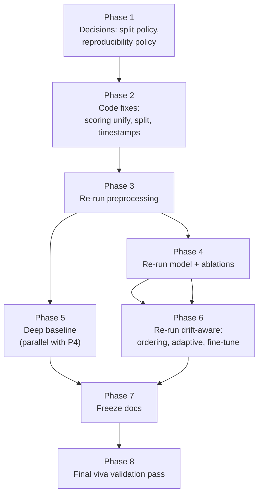

# Module 4 — Remediation Execution Plan

**Purpose:** Turn the existing gap list (`ISSUES_AND_IMPROVEMENT_PLAN.md` §7 Phase A, `claim_evidence_matrix.md` §10) into an **ordered execution plan** — what depends on what, what must happen before what, and the exact gate that proves each item is actually closed (not just re-run).
**Status:** Phase 2 code edits applied (2026-07-25). Phases 3–6 (actual Colab GPU runs) not executed — no GPU/PyTorch in the authoring environment. See §1a below for exactly what changed and what's still pending.
**Traceability:** Every action below maps to an existing ID (A1–A10, ISS-xx, C-xx) so nothing here is invented — it's the same backlog, sequenced.

## 1a. What was actually done (2026-07-25) vs. what's still pending

| # | Item | Code status | Still needed |
|---|---|---|---|
| ISS-08 | `RUN_ABLATIONS` | **Flipped `False → True`** in `mdc_model_vNext.ipynb` (cell `cell-ablations`) | Run on Colab GPU (~1 hr) |
| ISS-04 | Scoring protocol unification | **Done** — added `score_with_protocol()` to `mdc_model_vNext.ipynb` (cell `cell-scoring`); default (`cell-score-flip`), multi-seed (`cell-seeds`), and HPO (`cell-hpo-retrain`) paths now all call it instead of each having their own divergent `feat_std`/invert logic | Run all three paths on Colab and confirm the numbers shift as expected (default ROC will likely change since it's now on the exact same protocol as multi-seed/HPO) |
| ISS-06 | Timestamp ordering | **No code change needed** — verified `mdc_preprocess_vNext.ipynb` already writes `ts_val`/`ts_test` into the binary `windows_vnext.npz` (its npz-save cell), and `mdc_drift_aware.ipynb` already prefers timestamp ordering when those keys are valid (`ev.describe_stream_order`, `ev.stream_order_indices`). The `container_lexsort` seen in `run-final` is simply because that archived run predates this data, not a code bug. | Re-run `mdc_preprocess_vNext.ipynb` then `mdc_drift_aware.ipynb` — `ordering_mode` should read `timestamp` this time |
| Buffer size wording | `BENIGN_BUFFER_SIZE` | **Changed `100 → 500`** in `mdc_drift_aware.ipynb` (cell `6eb8c367`) to match the proposal's stated "500–1000 recent samples" | Run and check whether `claim_ok` changes; revert if it makes things worse and instead update the proposal wording |
| ISS-09 | Deep baseline | **New notebook created:** `notebook/mdc_baselines.ipynb` — Dense autoencoder baseline (chosen over LSTM-AE for fewer moving parts in an unexecuted handoff), same windows/protocol/metric set as the existing Isolation Forest baseline, builds a combined IF vs Dense-AE vs vNext-default vs vNext-HPO table | Run on Colab; needs `windows_vnext.npz` and (optionally) `metrics_vnext.json` / `baseline_comparison.json` already present to fill the full comparison table |
| ISS-07 | Val/test split | **Not changed** (your call) — kept window-level split | Document explicitly as a stated limitation in `claim_evidence_matrix.md` (Phase 7) |
| ISS-01, ISS-10 | Metric re-lock, fine-tune narrative | Not started — depend on Phase 4/6 run output | Do after the Colab runs above |

All edits verified: JSON is well-formed, every code cell still compiles (`compile(src, ..., 'exec')`, no syntax errors), and a `.bak` copy of `mdc_model_vNext.ipynb` was kept before editing (no git repo here to fall back on) — safe to delete once you've confirmed the notebook looks right.

## 1b. `run-final/` synced to the fixed code (2026-07-25)

Ground-truth check of the *actual* `run-final/` executed outputs (not just the docs) turned up two things worth recording:

- **Good news:** `mdc_drift_aware_output.ipynb`'s real printed output already showed `Stream ordering: timestamp` — ISS-06 was already working in that archived run, ahead of what the older docs said.
- **New finding:** with real timestamp ordering, the last-30% chronological drift slice turned out to be 100% attack traffic (zero benign windows), so the fine-tune before/after AUC came out as `NaN`, not a clean +/- number. This needs its own write-up, not just a re-run.
- **Traceability gap:** no notebook anywhere in the repo (`run/`, `run-final/`, `source-final/`) documented the actual execution that produced the timestamped `windows_vnext.npz` the above depended on. `run/mdc_preprocess_vNext_output.ipynb` exists but predates the timestamp feature (no `ts_test:` line in its output).

To close that gap and get today's code fixes into the evidence folder, `run-final/` was resynced:

- **Old executed outputs preserved** in `notebook/run-final-legacy-2026-07-24/` (untouched) — keep this; it's the only record of the 0.7042/0.8138/0.7529 numbers, the confirmed-working timestamp ordering, and the NaN fine-tune finding above.
- **`run-final/` now holds 5 notebooks**, all current source with today's fixes, **outputs cleared** (they have not been executed with this code) and a status banner cell at the top of each explaining exactly that:
  1. `mdc_preprocess_vNext_output.ipynb` — new, closes the traceability gap
  2. `mdc_preprocess_vNext_mc_output.ipynb` — replaced (unchanged by today's fixes, resynced so the batch is coherent)
  3. `mdc_model_vNext_output.ipynb` — replaced (`RUN_ABLATIONS=True`, unified `score_with_protocol()`)
  4. `mdc_drift_aware_output.ipynb` — replaced (`BENIGN_BUFFER_SIZE=500`)
  5. `mdc_baselines_output.ipynb` — new (Dense-AE deep baseline, ISS-09)

Run them on Colab in that numbered order (5 needs 3 and 4's outputs for its full comparison table).

## 1c. Bug found in the ISS-04 fix itself (2026-07-25, revision 2)

You ran `mdc_model_vNext_output 25-07.ipynb` on Colab. Result: default ROC-AUC 0.7316 (fine), but **multi-seed mean 0.2739 and HPO 0.1554 — both worse than random** — despite `best_val_auc` being reasonable for every model (0.7261–0.8134 range, from training's own internal check).

**Root cause:** `score_with_protocol()`'s first step computed each model's raw/flip AUC via `compute_scores(..., invert=None)`, which silently falls back to the module-level `SCORE_INVERT` global — a variable set once by whichever model is scored *first* (the default path) and left there. Every model scored afterward (multi-seed, HPO) inherited that stale global instead of deciding its own direction from a neutral baseline, which — worked through algebraically — flips the final direction decision to the *wrong* sign. The default path only looked correct in that run because the global happened to still be at its untouched initial value (`False`) when default ran first; that's coincidence, not correctness.

**Fix (cell `cell-scoring`, `mdc_model_vNext.ipynb`):** the two raw-score calls in step 1 of `score_with_protocol()` now pass `invert=False` explicitly instead of leaving it to fall through to the global. Direction decisions are now independent of call order.

**Consequence:** the 25-07 run's multi-seed and HPO numbers (and anything derived from them) are invalid and must not be cited — re-run is required. `run-final/mdc_model_vNext_output.ipynb` has been resynced with the fix (outputs cleared again, banner updated to revision 2) — this is the file to run next, not the 25-07 one.

## 1d. Second bug found — `SameFileError` crash at the end of the ablations cell (2026-07-25, revision 3)

Running the fixed notebook, `RUN_ABLATIONS=True` completed and saved correctly (`no_contractive` ROC 0.7242, `no_early_stop` ROC 0.7001, both `thesis_usable: True`), but the cell then crashed on `shutil.SameFileError`. **Not a data-loss bug** — the crash happens after the real save already succeeded.

**Root cause:** the cell's cleanup step copied `out_path`/`abl_csv` into `/content/vNEXT_test_local/runs` — but `RUN_DIR` (where those files were already saved) is *already* that exact path in Colab, so it was copying each file onto itself. Pre-existing bug in the original notebook, never triggered before because `RUN_ABLATIONS` was always `False` until r1.

**Fix (cell `cell-ablations`):** guarded the copy so it only runs when the local-runs path and `RUN_DIR` actually differ. `run-final/mdc_model_vNext_output.ipynb` resynced again (banner revision 3).

## 1e. Third bug found — fine-tune cell crash on `mdc_drift_aware.ipynb` (2026-07-25)

`ValueError: num_samples should be a positive integer value, but got num_samples=0` when running the fine-tune cell (`a3153a53`). Confirms the finding from §1a/1b in advance: with real timestamp ordering, the chronological drift slice (last 30% of the stream) is 100% attack traffic on this dataset — 0 benign windows. The old code (`benign_pick = benign_drift_idx[...] if len(...) >= N else benign_drift_idx`) had no fallback for the empty case, so it built a `DataLoader` over a zero-length array and PyTorch's `RandomSampler` rejected it.

Interestingly, an **older archived run** (`run-final-legacy-2026-07-24/mdc_drift_aware_output.ipynb`) already had a patch for exactly this — its output shows `source=stable_slice_fallback` — but that patch was never carried back into `notebook/mdc_drift_aware.ipynb`, so it was missing from the file this project has been maintaining and re-syncing.

**Fix (cell `a3153a53`):** when the drift slice has zero benign windows, fall back to the most recent benign windows from the *stable* slice instead; `finetune_report.json` now records which source was used (`drift_slice` vs `stable_slice_fallback`); `roc_auc_score` calls are guarded so a single-class slice reports `NaN` cleanly instead of crashing downstream. `run-final/mdc_drift_aware_output.ipynb` resynced (banner revision 2).

## 1f. Fourth bug found — `windows_vnext.npz` landing in the wrong Drive folder (2026-07-25)

User re-ran `mdc_preprocess_vNext_output.ipynb` after hitting the "npz not found" error in `mdc_baselines_output.ipynb` — same error persisted even after re-running. Root cause: `mdc_preprocess_vNext.ipynb`'s export cell (`cell-export`) was pushing to **`My Drive/Module4_MDC/processed_vnext/`** — an older folder convention. Every downstream notebook (model, drift-aware, baselines) only ever searches **`My Drive/vNEXT_test/processed/`**. `mdc_preprocess_vNext_mc.ipynb` already used the correct `vNEXT_test` path — only the plain (non-`_mc`) preprocess notebook had this stale destination. So no amount of re-running fixed it: the file was produced correctly every time, just saved to a folder nothing downstream ever looks in.

**Fix (cell `cell-export`):** destination changed to `/content/drive/MyDrive/vNEXT_test/processed`, matching every other notebook's convention. `run-final/mdc_preprocess_vNext_output.ipynb` resynced (banner revision 2).

**Action needed:** re-run this notebook once more with the fix — check your Drive afterward at `My Drive > vNEXT_test > processed > windows_vnext.npz` before moving on to steps 3–5. You may also want to manually delete/ignore the stray `My Drive/Module4_MDC/processed_vnext/` folder from earlier runs to avoid confusion later.

## 1g. Fifth issue — Drive FUSE lag (file visible in web UI, not visible to Colab mount) (2026-07-25)

Even after the 1f fix, the same "npz not found" error recurred in `mdc_baselines_output.ipynb`, despite the user confirming the file was visible in the Drive **web UI**. This is a known Colab quirk (`mdc_drive_io.py`'s own docstring already documents this exact class of issue) — the mounted FUSE filesystem at `/content/drive` can lag behind what drive.google.com shows, especially for recently-written files.

**Fix (cell `cell-load`, `mdc_baselines.ipynb`):** the load step now (1) retries with `drive.mount(..., force_remount=True)` if the file isn't found, and (2) if still not found, prompts a manual upload via `google.colab.files.upload()` instead of failing outright. `run-final/mdc_baselines_output.ipynb` resynced (banner revision 2).

**Not yet applied to `mdc_model_vNext.ipynb` / `mdc_drift_aware.ipynb`** — those use the fuller `mdc_drive_io.py`-based loader, which has its own (different) fallback machinery. If the same FUSE-lag symptom shows up there, say so and the same remount+upload pattern can be added.

## 1h. Kaggle track — full platform port, no Drive/Colab at all (2026-07-25)

All the Drive/Colab friction above (wrong export folder, FUSE lag, force-remount, `SameFileError`) is inherent to Colab's Drive-mount model. Per request, all 5 notebooks now also exist as a **Kaggle-native track** in `notebook/run-final/kaggle/`, with every Drive/Colab reference removed:

| File | Source | What changed |
|---|---|---|
| `mdc_preprocess_vNext_kaggle.ipynb` | `mdc_preprocess_vNext.ipynb` | Loads MDC dataset from `/kaggle/input` if attached, else `kagglehub` download. Saves to `/kaggle/working/processed/`. Zips + auto-downloads at the end. |
| `mdc_preprocess_vNext_mc_kaggle.ipynb` | `mdc_preprocess_vNext_mc.ipynb` | Same pattern; full embedded Drive-IO module (mount/push/FUSE-verify) removed entirely. |
| `mdc_model_vNext_kaggle.ipynb` | `mdc_model_vNext.ipynb` | Drive-IO module removed; npz/artifact resolution via `kaggle_find()` (searches `/kaggle/input/**` and `/kaggle/working/**`). §17b Drive push and §17c Drive-API-only cell replaced/removed; ablations cell's Colab-mirror guard simplified (dead code on Kaggle); §19's Drive push tail dropped (files already covered by the §17b zip). |
| `mdc_drift_aware_kaggle.ipynb` | `mdc_drift_aware.ipynb` | Same Drive-IO removal; §12 Drive push and the existing Colab `files.download()` zip fallback both replaced with the shared zip+auto-download helper; three separate `_IN_COLAB`/`/content/`-path fallback blocks (model-load cell, drift-slice fallback) rewired to plain `DATA_DIR`/`RUN_DIR`/`kaggle_find()`. |
| `mdc_baselines_kaggle.ipynb` | `mdc_baselines.ipynb` | Minimal custom Drive-IO (added earlier for the FUSE-lag fix) replaced with the same shared Kaggle helpers. |

**Shared helper pattern** (embedded fresh in each notebook, ~70 lines, replacing the ~600-line `mdc_drive_io.py` module or the smaller custom Drive-IO cells):
- `kaggle_find(name)` — searches `/kaggle/input/**` and `/kaggle/working/**` for a file by name.
- `kaggle_upload_fallback(name, dest_dir)` — best-effort `ipywidgets.FileUpload` widget for a live session (not available during headless "Save & Run All").
- `zip_and_offer_download(src_dir, zip_name, max_auto_mb=25)` — zips a directory and tries to trigger a browser download via a base64 data-URI anchor auto-clicked through injected JS. **Only fires in an actively open browser tab** — during a headless commit there's no browser to receive it, so Kaggle's own Output tab (right sidebar, after Save Version) is the reliable fallback either way. Files over the 25MB guard skip the browser trick entirely (avoids bloating notebook output) and are retrieved from the Output tab.

**Handoff between notebooks (no live shared storage on Kaggle, unlike Colab's Drive mount):** documented in each notebook's title cell — either attach the producing notebook's own output via **+ Add Data > Your Notebooks** (no manual zip needed), or download the zip and upload it as a new Kaggle Dataset, then attach that dataset. Either path lands the file under `/kaggle/input/<name>/...`, which `kaggle_find()` searches automatically.

**Run order is unchanged:** 1 preprocess → 2 preprocess-mc → 3 model → 4 drift-aware → 5 baselines (5 last, needs 3 and 4's outputs).

**Not yet done:** these Kaggle notebooks have not been executed (no Kaggle access from this environment) — same caveat as every other file in `run-final/`. Verified: all 5 are valid JSON, zero syntax errors, zero residual outputs, and a full-text scan confirms no `google.colab`, `_IN_COLAB`, `drive.mount`, `mount_drive_safe`, `gdown`, `DRIVE_PROJECT_FOLDER`, `dio.`, or `/content/` references remain in any of them.

## 1i. Preprocessing notebooks merged into one — pipeline is now 4 notebooks, not 5 (2026-07-26)

Diffed the two preprocess notebooks cell-by-cell: 13 of 35 cells were byte-identical, and the rest were 80-98% identical text. Real divergence was only in the save/export cells. This was genuine duplication, not two different pipelines — and it had already caused one bug (the `Module4_MDC/processed_vnext` vs `vNEXT_test/processed` Drive-path mismatch existed only in the plain notebook, never in the mc one, because they were two independently-maintained near-copies).

**Also discovered along the way:** `run-final-legacy-2026-07-24/mdc_preprocess_vNext_mc_output.ipynb` (the actually-executed archive) turned out to be a *more advanced* version of the code than the "live" source template this project had been maintaining — it already saved its own `drift_baseline_vnext.npz` conditionally, self-sufficient of the plain notebook. That upgrade never made it back into the tracked source files. Confirmed via grep that `preproc_vnext.pkl` and `manifest_vnext.json` are never loaded by any downstream notebook (model/drift-aware/baselines) — pure provenance artifacts, safe to keep for documentation but never a hard dependency.

**The merge (applied to live source, `run-final/`, and `run-final/kaggle/`):** `mdc_preprocess_vNext_mc.ipynb` (and its `_output`/`_kaggle` copies) is now the **sole preprocessing notebook**. One run of the existing multiclass+timestamp pipeline now also saves:
- `windows_vnext.npz` **and** `windows_vnext_mc.npz` — byte-identical copies (`shutil.copy2`, not a recompute), so `mdc_drift_aware` (which only ever looks for the plain name) and `mdc_model_vNext`'s §19 per-attack eval (which looks for the mc name) both keep working with **zero changes** to either notebook.
- `drift_baseline_vnext.npz` — always, unconditionally (no longer the "only if the other notebook didn't already make one" guard from the legacy version — there's no other notebook to race with anymore).
- `preproc_vnext.pkl`, `manifest_vnext.json` (manifest now also records the multiclass label sets) — kept for documentation/future-deployment value even though nothing currently loads them.
- `mdc_label_map.json`.

`mdc_preprocess_vNext.ipynb` (plain, no multiclass) is **retired, not deleted** — a `SUPERSEDED` banner was added to the live source, `run-final/`, and `run-final/kaggle/` copies telling you not to run it.

**Pipeline is now 4 notebooks in all three tracks:**
1. `mdc_preprocess_vNext_mc*.ipynb` (merged — run this, not the plain one)
2. `mdc_model_vNext*.ipynb`
3. `mdc_drift_aware*.ipynb`
4. `mdc_baselines*.ipynb`

Verified: all 6 touched files (live source ×2, `run-final` ×2, `run-final/kaggle` ×2) are valid JSON with zero syntax errors. While investigating a false-positive from a detection script, also confirmed (via direct hex-codepoint check) that no other notebook in the repo has any double-escaped `\n` bug — the one real instance (introduced by an earlier heredoc script of my own, in the Kaggle mc notebook's export cell) was isolated and is now fixed.

## 1j. 5th notebook added — `mdc_analysis_kaggle.ipynb` (2026-07-26)

Kaggle track only (scope explicitly limited to `run-final/kaggle/` for this addition — no live-source or Colab equivalent built). Run last, after preprocess → model → drift-aware → baselines; takes all four of their output zips as input (each optional — missing ones degrade gracefully to a partial result, same pattern as `mdc_baselines_kaggle.ipynb`).

**Sections:**
1. Load all four zips via `kaggle_find()`.
2. Dataset timeline (from `windows_vnext.npz`'s real `ts_val`/`ts_test` + `c_val`/`c_test` + multiclass labels) — attack-type-over-time, rolling attack rate, per-container activity. **Scope limit stated explicitly in the title cell:** `X_train` has no saved timestamps/container IDs, so there's no "normal behavior over time" baseline from the training split — only val+test can be time-analyzed.
3. Feature drift over time computed **directly from the raw windows** against `drift_baseline_vnext.npz`, using the identical PSI formula `mdc_drift_aware` itself uses (quantile-binned, Laplace-smoothed) — an independent cross-check, not just a re-display of drift-aware's own numbers.
4. Re-plot of drift-aware's own simulated-stream trace (`drift_aware_log`) alongside the direct PSI, for comparison.
5. One unified results table merging `metrics_vnext.json` + `metrics_ablation_vnext.json` + `deep_baseline_comparison.json`'s comparison table (IF + Dense AE + vNext default/HPO).
6. Drift-aware findings summary (`claim_ok`, fine-tune source/delta, freeze status) — paragraph-ready for the thesis Discussion section.
7. Cross-reference: per-attack-type recall vs. first/last occurrence in the real timeline.
8. Zip + auto-download of all analysis outputs (same Kaggle pattern as the other four).

Verified: valid JSON, zero syntax errors, no Colab/Drive references (caught and removed one leftover `google.colab` detection stub in the env cell before finalizing). Not executed anywhere (no Kaggle access from this environment) — same caveat as everything else in this track.

---

## 0. Why order matters here

Four of these fixes are not independent — doing them in the wrong order wastes a GPU run:

- **ISS-06 (timestamp ordering)** is the suspected root cause of **ISS-02 (adaptive threshold `claim_ok=False`)**. Fix ordering *before* re-judging the adaptive threshold, or you'll re-run and get the same failure for the same reason.
- **ISS-04 (scoring protocol inconsistency)** must be fixed *before* **ISS-01 (metric re-lock)** — locking headline numbers while default/multi-seed/HPO still use different scoring conventions just re-freezes an inconsistency.
- **ISS-07 (val/test split)** decision changes the F1-optimal threshold used everywhere downstream — decide this *before* the model re-run in Phase 4, not after.
- **ISS-10 (fine-tune narrative)** can only be locked *after* whichever freeze becomes canonical — don't lock it against a run you're about to replace.

So: **decide → fix code → regenerate data → retrain → re-evaluate drift-aware → freeze docs.** Not: re-run everything simultaneously and hope the numbers reconcile themselves.

---

## 1. Phase-by-phase plan

### Phase 1 — Decisions (no code, ~half a day)

Two policy calls block everything downstream; make them first.

| Decision | Options | Recommendation |
|---|---|---|
| **ISS-07** — val/test split | (a) Fix to session-disjoint split, or (b) keep window-level split, document as a stated limitation | If time allows: fix it — a session-disjoint split is a materially stronger claim and examiners will ask about leakage. If not: keep it, but the limitation wording in `claim_evidence_matrix.md` §9 must say so explicitly, not imply it's clean. |
| **Reproducibility policy** | Given `run-final` (0.7042) already disagrees with the older lock (0.7402), and fine-tune sign flipped between runs (+0.03 vs −0.06) | Adopt: **one freeze is canonical once Phase 6 completes; do not re-run afterward "just to check."** Re-running after freezing is how you got two conflicting numbers in the first place. |

**Gate to move on:** both decisions written down in `claim_evidence_matrix.md` (even before the numbers themselves change).

---

### Phase 2 — Root-cause code fixes (no GPU needed for the edits themselves)

| # | Fix | File | Closes |
|---|---|---|---|
| 2.1 | Unify scoring protocol — same `feat_std` / invert / ensemble policy across default, multi-seed, and HPO paths | `mdc_model_vNext.ipynb` | ISS-04 |
| 2.2 | Implement session-disjoint split (if Phase 1 chose to fix it) | `mdc_preprocess_vNext.ipynb`, `mdc_preprocess_vNext_mc.ipynb` | ISS-07 |
| 2.3 | Confirm `ts_val`/`ts_test` are actually threaded into the **binary** `windows_vnext.npz`, not only the multiclass `_mc` variant | `mdc_preprocess_vNext.ipynb` | ISS-06 (part 1) |

**Gate to move on:** code review of these three cells/sections — no execution required yet, just confirm the logic is correct before spending GPU time on it.

---

### Phase 3 — Re-run preprocessing (Colab, CPU-only, fast)

Run `mdc_preprocess_vNext.ipynb` and `mdc_preprocess_vNext_mc.ipynb` with Phase 2's fixes applied.

**Gate to move on:**
- `manifest_vnext.json` shows `leakage_free=true` under whichever split policy Phase 1 chose
- `windows_vnext.npz` (binary, not just `_mc`) contains `ts_val`/`ts_test` keys — verify by loading the npz and checking keys directly, don't assume from the code diff

---

### Phase 4 — Re-run model training (Colab GPU)

Run `mdc_model_vNext.ipynb` with:
- `RUN_ABLATIONS = True` (closes ISS-08)
- Phase 2.1's unified scoring protocol active on all three paths (default / multi-seed / HPO)
- Phase 3's regenerated windows as input

**Outputs:** new `metrics_vnext.json`, `metrics_ablation_vnext.json`, new checkpoint.

**Gate to move on:**
- Ablation table (Table A) has real numbers, not the `RUN_ABLATIONS=False` placeholder
- Default / multi-seed / HPO ROC-AUC numbers are now computed under the *same* scoring convention (spot-check: does the default-path number change once `feat_std`/invert match the other two paths? if so, that's expected and is the point of this fix)

---

### Phase 5 — Add deep baseline (can run in parallel with Phase 4, needs Phase 3's windows)

New cell or `mdc_baselines.ipynb`: train an LSTM-AE or Dense-AE on the **same** windows used in Phase 4, evaluate with the same metric set as the existing Isolation Forest baseline.

**Closes:** ISS-09
**Gate to move on:** comparison table exists with IF + new deep baseline + vNext default + vNext HPO, all on identical test windows.

---

### Phase 6 — Re-run drift-aware notebook (Colab, depends on Phase 4 checkpoint + Phase 3 windows)

Run `mdc_drift_aware.ipynb` loading Phase 4's checkpoint and Phase 3's timestamped windows.

**Verify, don't assume:**
1. Confirm the notebook actually logs `ordering_mode=timestamp` (not silently falling back to `container_lexsort` because a key was missing). This is the check that closes ISS-06 for real.
2. Re-evaluate the adaptive threshold. Two honest outcomes:
   - `claim_ok=True` now → ISS-02/C7 closes, you may claim adaptive improvement (per the "Yes, if claim_ok=True" policy already in your claim matrix).
   - Still `claim_ok=False` → this was **already anticipated** in your own WBS §8.0 fallback table ("report fixed threshold as primary; adaptive as attempted"). This is a legitimate outcome, not a failed task — write it up as a negative result.
3. Re-evaluate fine-tune. Lock **whichever sign comes out of this run** as the final narrative (per the Phase 1 reproducibility policy) — do not re-run again hoping for a different sign.
4. Optional cheap experiment: try `BENIGN_BUFFER_SIZE = 500` (matching the proposal's stated 500–1000, vs the current 100) and see if it changes the adaptive-threshold outcome. Low cost, directly answers the proposal-wording mismatch I flagged earlier — worth doing before deciding how to word that section.

**Gate to move on:** `freeze_manifest_v2.json` reports `freeze_ready=true`, matching the checklist already in `claim_evidence_matrix.md` §4.

---

### Phase 7 — Freeze & reconcile documentation (writing only, no code)

| Action | Closes |
|---|---|
| Update `claim_evidence_matrix.md` §1 headline metrics table to match Phase 4/6 output | ISS-01 |
| Update §2 claim statuses (C7, C8, C9, C11) from CONDITIONAL/PENDING/NOT SUPPORTED to whatever Phase 4–6 actually produced | ISS-01, ISS-02, ISS-10 |
| Rewrite Abstract/Methods/Results using whichever template in §9 matches the actual outcome (success wording vs honest-negative wording — both are already drafted, just pick the one that matches reality) | ISS-01, ISS-02, ISS-05 |
| Resolve the buffer-size wording: either the proposal text (500–1000) or the code (100, or 500 if Phase 6's optional experiment used it) — make them agree | New finding from validation pass |
| Mark `mdc_dataloader.ipynb` header as LEGACY | ISS-16 (Phase B, low priority — bundle in while you're touching docs) |

**Gate to move on:** every row in `claim_evidence_matrix.md` §10 checklist is checked.

---

### Phase 8 — Final validation pass before viva

Walk `claim_evidence_matrix.md` §10 top to bottom against the actual frozen artifacts. Confirm `docs/thesis_results_discussion.md` cites the same numbers as the final freeze — this is the same class of mismatch as ISS-01, just in a different document, so check it explicitly rather than assuming it inherited the fix.

---

## 2. Dependency summary

---

## 3. What could still go wrong (pre-declare the fallback now, don't discover it at viva)

| Risk | Fallback (already consistent with your own WBS §8.0) |
|---|---|
| Adaptive threshold still fails after ordering fix | Report fixed threshold as primary operating point; adaptive reported as attempted with honest negative result |
| Fine-tune still degrades AUC | Report as catastrophic-forgetting finding; recommend threshold recalibration over fine-tuning as the safer operational response (wording already drafted in `claim_evidence_matrix.md` §3) |
| Deep baseline beats vNext AE | Report honestly — reframe novelty claim around drift-awareness and multi-metric attention rather than raw ROC-AUC supremacy |
| Session-disjoint split lowers ROC-AUC vs current number | Expected — leakage-free numbers are often lower but defensible; frame as "conservative, leakage-free estimate" |
| Ablations show contractive/early-stop don't matter much | Still valuable — report as "component contributes less than expected," a legitimate ablation finding |

---

## 4. Effort estimate

| Phase | Effort |
|---|---|
| 1 — Decisions | 0.5 day |
| 2 — Code fixes | 1–2 days |
| 3 — Preprocess re-run | ~1 hour Colab (CPU) |
| 4 — Model + ablations | 1 Colab GPU session (~hours, ablations add ~30 min each per your own estimate) |
| 5 — Deep baseline | 0.5–1 day incl. Colab run |
| 6 — Drift-aware re-run | ~1 Colab session |
| 7 — Doc freeze | 1 day writing |
| 8 — Final validation | 0.5 day |

Matches the 3–5 day + 2–4 day estimates already in your WBS Phase C/D — this plan just sequences them correctly instead of leaving them as a flat list.

---

*Document status: planning only. No code changed. Written 2026-07-25.*
