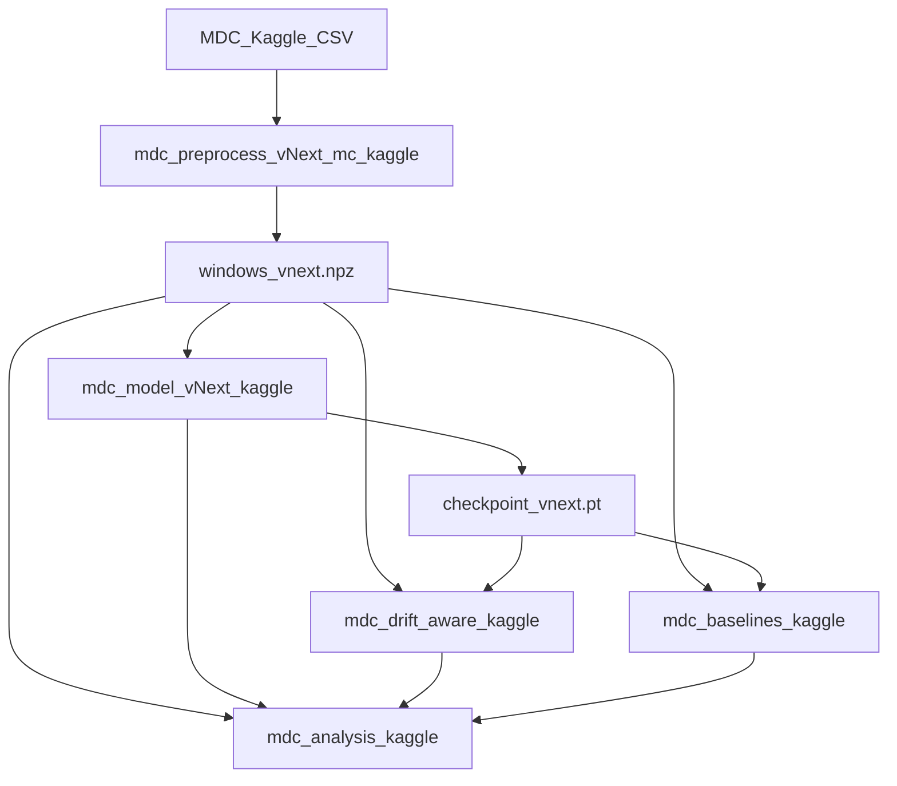

# 01 — Project Overview and Architecture

**Module:** Module 4 — Security Anomaly Detector (Drift-Aware Approach)  
**Project short name:** MDC vNext (Misuse Detection in Containers)  
**Documentation set:** Research record (5 files)  
**Canonical code + outputs (declared):** `module4/notebook/final/`  
**Historical trail:** `module4/notebook/output-legacy-experiments/`  
**This file status:** Evidence-based overview derived from notebooks and frozen artifacts. Claims that cannot be verified are marked **Not found / Not verified**.

---

## 1. Research objective

Develop an unsupervised anomaly detector for container misuse that:

1. Learns a model of **benign** container network behaviour only.
2. Flags attacks via elevated **reconstruction error**.
3. Evaluates whether a **drift-aware** streaming layer (sliding benign buffer, adaptive threshold, PSI monitoring, optional incremental fine-tune) improves decisions under distribution shift.

**Problem statement (research framing).** Container compromise and misuse produce behavioural deviations in telemetry. Supervised classifiers require labelled attack coverage and struggle with zero-day patterns. An autoencoder trained only on benign windows can surface unseen misuse as high reconstruction error, provided preprocessing is leakage-free and scoring/thresholding are integrity-gated.

**Proposal wording vs implemented evidence.** The proposal mentions CPU, memory, network flows, system calls, and file access. The **implemented vNext pipeline uses CICFlowMeter-style network flow features only** (163 features per 15 s bucket after filtering). Multi-modal CPU/mem/syscall/file inputs are **Not found** in `windows_vnext.npz` / `feat_names`.

Sources:

- Proposal PDF: `module4/docs/Updated Proposal (1) - Copy.pdf`
- Final preprocess notebook: `module4/notebook/final/kaggle-source/mdc_preprocess_vNext_mc_kaggle.ipynb`
- Manifest: `module4/notebook/final/output-metrics/windows_vnext_processed/manifest_vnext.json`

---

## 2. Research methodology (high level)

| Pillar | Approach in this project | Final status |
|--------|--------------------------|--------------|
| Learning paradigm | Unsupervised AE on benign windows | Final |
| Core model | `SequenceBottleneckAE` (Transformer encoder–bottleneck–decoder) | Final |
| Anomaly signal | Weighted mean/max reconstruction error + optional auto score-flip | Final |
| Threshold | Validation `f1_optimal` (primary) | Final |
| Robustness | Multi-seed + Optuna HPO | Final |
| Drift-aware layer | Timestamp-ordered simulated stream; adaptive threshold; PSI; fine-tune | Implemented; **adaptive claim not supported** (`claim_ok=false`) |
| Baselines | Isolation Forest (mean_max pool); Dense AE | Final |
| Synthesis | Optional 5th analysis notebook | Final (optional) |

Deep methodology detail: [02_data_pipeline_and_methodology.md](02_data_pipeline_and_methodology.md).  
Experiment history: [03_experiments_and_research_history.md](03_experiments_and_research_history.md).  
Final metrics: [04_final_model_results_and_reproducibility.md](04_final_model_results_and_reproducibility.md).

---

## 3. System architecture (derived from code)

```text
MDC Kaggle CSV (CIC flow features)
    ↓
Data loading (kagglehub / /kaggle/input)
    ↓
Container filter + timestamp + sessionization (60 s gap)
    ↓
Per-container session split (70% train / 30% holdout)
    ↓
Inf/NaN hygiene → VarianceThreshold → correlation drop
    ↓
IQR/p99 clip → flow StandardScaler + clip → 15 s bucketing (mean/max/std + flow_count)
    ↓
Short-gap fill → bucket StandardScaler + clip
    ↓
Sliding windows (T=10, stride=2) + attack-frac ≥ 0.5 labelling (+ multiclass)
    ↓
Holdout → stratified val/test (50/50)
    ↓
Save windows_vnext.npz (+ drift_baseline, manifest, label_map, preproc pkl)
    ↓
Benign-only SequenceBottleneckAE training
    ↓
score_with_protocol → thresholds → test evaluation
    ↓
checkpoint_vnext.pt + scores_vnext.npz + metrics_vnext.json
    ↓
Drift-aware timestamp stream (fixed thr + adaptive + PSI + fine-tune + IF)
    ↓
Dense AE deep baseline comparison
    ↓
Optional analysis synthesis
```



**Implementation form.** The project is **notebook-only**. No `module4/src/` package and no standalone inference service were found under `module4/`. All logic lives in Jupyter notebooks under `notebook/final/kaggle-source/`.

---

## 4. Major modules and relationships

| Order | Module | Source notebook | Executed notebook (final) | Zip / output dir |
|------:|--------|-----------------|---------------------------|------------------|
| 1 | Preprocess (merged MC) | `kaggle-source/mdc_preprocess_vNext_mc_kaggle.ipynb` | `kaggle-output/kaggle_preprocess_2607.ipynb` | `windows_vnext_processed.zip` |
| 2 | Model (vNext AE) | `kaggle-source/mdc_model_vNext_kaggle.ipynb` | `kaggle-output/kaggle_model_2607.ipynb` | `model_vnext_runs.zip` |
| 3 | Drift-aware | `kaggle-source/mdc_drift_aware_kaggle.ipynb` | `kaggle-output/kaggle_drift_aware_2607.ipynb` | `drift_aware_outputs.zip` |
| 4 | Baselines | `kaggle-source/mdc_baselines_kaggle.ipynb` | `kaggle-output/kaggle_baseline_2607.ipynb` | `deep_baseline_comparison.zip` |
| +1 | Analysis | `kaggle-source/mdc_analysis_kaggle.ipynb` | `kaggle-output/kaggle_analysis_final.ipynb` | `mdc_analysis_outputs.zip` |

**Handoff mechanism (Kaggle).** Each notebook zips its working directory. The next notebook attaches prior notebook outputs via **+ Add Data > Your Notebooks**, or via uploaded datasets. Helpers search `/kaggle/input/**` and `/kaggle/working/**` (`kaggle_find`).

**Superseded preprocess note.** The plain (non-MC) preprocess notebook is documented as superseded in remediation notes; the **canonical preprocess is the merged MC notebook**. The retired plain Kaggle file is **Not found** under `notebook/final/kaggle-source/` (only the MC notebook is present).

---

## 5. Project structure (important paths)

### 5.1 Canonical final tree

```text
module4/notebook/final/
├── kaggle-source/          # Current runnable source (5 notebooks)
├── kaggle-output/          # Executed notebooks (2607 / analysis_final)
└── output-metrics/         # Unpacked freeze artifacts
    ├── windows_vnext_processed/
    ├── model_vnext_runs/
    ├── drift_aware_outputs/
    ├── deep_baseline_comparison/
    └── mdc_analysis_outputs/
```

### 5.2 Historical / supporting trees

| Path | Role | Status |
|------|------|--------|
| `module4/notebook/output-legacy-experiments/` | May–Jul 2026 research trail (v0→vNext→drift v1) | Historical |
| `module4/notebook/output-legacy-2026-07-24/` | Integrity-gated archive (default ROC 0.7042 era) | Historical |
| `module4/notebook/output-legacy-kaggle-2026-07-25/` | Remediation handoff; mostly cleared; contains broken 25-07 model run | Historical / bug museum |
| `module4/docs/` | Thesis notes, claim matrix, remediation plan, WBS | Supporting (do not treat as metric freeze for final/) |
| `module4/docs/research-record/` | **This documentation set** | Current |

### 5.3 Paths referenced in docs but missing on disk

| Path | Status |
|------|--------|
| `module4/notebook/run/` | **Not found** |
| `module4/notebook/run-final/` | **Not found** (content moved to `final/` / `output-legacy-*`) |
| `module4/notebook/output-legacy-experiments/mdc_drift_aware_output_v2.ipynb` | **Not found** (listed as TARGET in `README_RUNS.md`) |
| `module4/src/` or standalone `*.py` inference package | **Not found** |
| `requirements.txt` / lockfile under `module4/` | **Not found** |

---

## 6. Technology stack

| Layer | Technology | Evidence |
|-------|------------|----------|
| Language | Python 3.11–3.12 (Kaggle runtime metadata varies by notebook) | Executed notebook metadata |
| Deep learning | PyTorch (`SequenceBottleneckAE`) | Model notebook + `checkpoint_vnext.pt` |
| Classical ML | scikit-learn (`StandardScaler`, `VarianceThreshold`, Isolation Forest) | Preprocess / drift notebooks |
| HPO | Optuna (TPE; 12 trials in final config) | Model notebook / `metrics_vnext.json` |
| Numerics / IO | NumPy, Pandas, joblib (preproc pickle) | Preprocess notebook |
| Platform | Kaggle notebooks (final track); earlier Colab/Drive track in remediation history | `module4_remediation_plan.md` |
| Orchestration | Zip handoffs between notebooks | All final notebooks |

Exact pinned `torch` / `sklearn` versions: **Not found / Not verified** (unpinned `pip install` style).

---

## 7. Data, training, evaluation, and persistence (overview)

| Flow | Summary | Detail file |
|------|---------|-------------|
| **Data flow** | Raw CSV → scaled windows NPZ `(N,10,163)` | 02 |
| **Training flow** | Benign `X_train` only; MSE + denoising + contractive; AUC early-stop | 02, 04 |
| **Evaluation flow** | Val thresholds → test metrics; multi-seed; HPO; stream replay | 04 |
| **Model persistence** | `checkpoint_vnext.pt` (`model_default`, `model_best`, `feat_std`, `config`, `hpo_params`) | 05 |
| **Inference flow** | Load ckpt + apply score protocol + `f1_optimal` threshold (no live API) | 05 |
| **Experiment flow** | v0→v3→vNext→drift→baselines→final freeze | 03 |

---

## 8. High-level execution flow (researcher)

```text
Step 1 → Run mdc_preprocess_vNext_mc_kaggle.ipynb
         Input: MDC Kaggle dataset
         Output: windows_vnext_processed.zip

Step 2 → Run mdc_model_vNext_kaggle.ipynb (attach preprocess zip/output)
         Output: model_vnext_runs.zip

Step 3 → Run mdc_drift_aware_kaggle.ipynb (attach preprocess + model)
         Output: drift_aware_outputs.zip

Step 4 → Run mdc_baselines_kaggle.ipynb (attach preprocess + model metrics; optional IF JSON)
         Output: deep_baseline_comparison.zip

Step 5 (optional) → Run mdc_analysis_kaggle.ipynb (attach all four zips)
         Output: mdc_analysis_outputs.zip
```

Exact reproducibility checklist: [04_final_model_results_and_reproducibility.md](04_final_model_results_and_reproducibility.md).

---

## 9. Scope limits and honesty constraints

1. **Offline simulation, not live deployment.** Drift-aware stream is timestamp-ordered replay of val/test windows. Live Falco/Kubernetes ingestion is planning-only (`system_integration_architecture.md`).
2. **Flow telemetry only** in the frozen NPZ (not multi-modal proposal stack).
3. **Adaptive threshold is implemented but not claimable** in the final freeze (`claim_adaptive_ok: false`).
4. **Metric era conflict.** Older thesis locks (0.7402 / 0.7529 / 0.8138) disagree with final `metrics_vnext.json` (0.6889 / 0.7261 / 0.8446). See §10 and file 04.
5. **`preproc_vnext.pkl` is provenance.** Downstream notebooks load scaled `windows_vnext.npz`, not the pickle.
6. **No production serving code** in-repo.

---

## 10. Metric freeze conflict (pointer)

Three default ROC-AUC lineages appear in the project record:

| Era | Default ROC-AUC | Where |
|-----|----------------:|-------|
| REFERENCE lat (2026-07-08) | 0.7402 | `output-legacy-experiments/mdc_model_vNext_lat_output.ipynb`; `docs/claim_evidence_matrix.md` |
| Jul-24 integrity archive | 0.7042 | `output-legacy-2026-07-24/mdc_model_vNext_output.ipynb` |
| **Canonical final freeze** | **0.6889** | `notebook/final/output-metrics/model_vnext_runs/metrics_vnext.json` |

`freeze_manifest_v2.json` sets `freeze_ready: true` but still embeds `headline_metrics_locked` from the claim matrix (0.7402 lineage). **For this documentation set, final offline detection numbers are taken from `metrics_vnext.json`.** Historical locks are preserved as historical.

---

## 11. Related documentation map

| File | Owns |
|------|------|
| [01 (this file)](01_project_overview_and_architecture.md) | Objective, architecture, structure, stack, coverage matrix |
| [02](02_data_pipeline_and_methodology.md) | Dataset, preprocess, methodologies, module I/O |
| [03](03_experiments_and_research_history.md) | Chronology, failures, why approaches changed |
| [04](04_final_model_results_and_reproducibility.md) | Final metrics, baselines, run procedure, conflicts |
| [05](05_model_integration_and_developer_guide.md) | Checkpoint load, scoring, proposed external integration |

Existing project docs (not replaced): `claim_evidence_matrix.md`, `thesis_results_discussion.md`, `ISSUES_AND_IMPROVEMENT_PLAN.md`, `module4_remediation_plan.md`, `system_integration_architecture.md`, `thesis_drift_aware_notes.md`, `Module4_WBS.md`, `DRIVE_vNEXT_test.md`.

---

## 12. Documentation coverage matrix

| Topic | 01 | 02 | 03 | 04 | 05 |
|-------|:--:|:--:|:--:|:--:|:--:|
| Complete project architecture | P | S | | | |
| Project folder/file structure | P | S | S | S | S |
| Research objective | P | | S | | |
| Major methodologies | S | P | S | S | |
| Data pipeline | S | P | | | |
| Module inputs | | P | | S | S |
| Module outputs | | P | | S | S |
| Complete execution flow | S | S | | P | |
| Historical experiments | | | P | S | |
| Failed experiments + reasons | | | P | S | |
| Experiment implementation paths | | | P | | |
| Final model | S | S | | P | S |
| Final metrics | | | S | P | |
| Baselines | | S | S | P | |
| Multi-seed results | | S | S | P | |
| HPO results | | S | S | P | |
| Model saving | | | | S | P |
| Model loading | | | | | P |
| Inference / anomaly scoring / thresholding | | S | | S | P |
| Required artifacts | | S | | S | P |
| Reproducibility | | | | P | S |
| External / API / deployment (proposed) | | | | | P |
| Known limitations | S | S | S | S | S |
| Troubleshooting | | | | S | P |
| Metric conflicts / claim gates | S | | S | P | S |

**Legend:** P = primary coverage, S = secondary / cross-reference.

### Coverage checklist

- [x] Complete project architecture
- [x] Complete project folder/file structure
- [x] Research objective
- [x] All major methodologies (file 02)
- [x] Data pipeline (file 02)
- [x] Every module's inputs/outputs (file 02)
- [x] Complete execution flow (files 01 + 04)
- [x] Historical / failed experiments (file 03)
- [x] Final model / metrics / baselines / multi-seed / HPO (file 04)
- [x] Model saving / loading / inference / scoring / thresholding (file 05)
- [x] Required artifacts / reproducibility (file 04–05)
- [x] External integration / API / deployment considerations (file 05; proposed)
- [x] Known limitations / troubleshooting (files 01, 04, 05)
