# 02 — Data Pipeline and Methodology

**Canonical preprocess source:** `module4/notebook/final/kaggle-source/mdc_preprocess_vNext_mc_kaggle.ipynb`  
**Canonical artifacts:** `module4/notebook/final/output-metrics/windows_vnext_processed/`  
**Related:** [01 overview](01_project_overview_and_architecture.md) · [03 history](03_experiments_and_research_history.md) · [04 results](04_final_model_results_and_reproducibility.md)

---

## 1. Dataset

| Item | Value | Evidence |
|------|-------|----------|
| Dataset | Misuse Detection in Containers (MDC) | Kaggle: `yigitsever/misuse-detection-in-containers-dataset` (notebook config) |
| Citation | Sever & Dogan (2023), ITU Journal / MDC Kaggle | `mdc_label_map.json` |
| Modality in vNext | Network flow features (CICFlowMeter-style) | `feat_names` in `drift_baseline_vnext.npz`; preprocess notebook |
| CPU / memory / syscall / file-access columns | **Not found** in final NPZ feature names | Audit of `feat_names` |
| Labels | Binary BENIGN vs attack; multiclass 0–11 | `mdc_label_map.json` |

### 1.1 Label map

Source: `module4/notebook/final/output-metrics/windows_vnext_processed/mdc_label_map.json`

| ID | Name |
|---:|------|
| 0 | BENIGN |
| 1 | CVE-2020-13379 |
| 2 | Node-RED Recon |
| 3 | Node-RED RCE |
| 4 | Node-RED Escape |
| 5 | CVE-2021-43798 |
| 6 | CVE-2019-20933 |
| 7 | CVE-2021-30465 |
| 8 | CVE-2021-25741 |
| 9 | CVE-2022-23648 |
| 10 | CVE-2019-5736 |
| 11 | DSB Nuclei Scan |

**Holdout presence (final manifest).** Val/test multiclass unique labels: `{0,1,2,3,4,8,11}`. Classes 5, 6, 7, 9, 10 are **absent from holdout windows** in this freeze (`manifest_vnext.json`).

---

## 2. End-to-end data pipeline

```mermaid
flowchart LR
  csv[Raw_flows_CSV]
  sess[Sessions_60s]
  split[Session_split_70_30]
  filt[Var_corr_clip]
  scale1[Flow_StandardScaler]
  buck[Bucket_15s]
  scale2[Bucket_StandardScaler]
  win[Windows_T10_S2]
  vt[Val_Test_stratified]
  out[windows_vnext.npz]
  csv --> sess --> split --> filt --> scale1 --> buck --> scale2 --> win --> vt --> out
```



### 2.1 Stage table (preprocess notebook sections)

| Stage | What happens | Key parameters | Output to next stage |
|------:|--------------|----------------|----------------------|
| 0 | Environment / config | `RANDOM_STATE=42` | Constants |
| 1 | Load raw MDC CSV | Kaggle input or kagglehub | Raw DataFrame |
| 2 | Container filter, timestamps, sessions | `MIN_FLOWS=10000`, `GAP_THRESHOLD=60` s | Sessionized flows |
| 3 | Per-container session random split | `TRAIN_RATIO=0.70` | Train ∪ holdout sessions |
| 4 | Inf/NaN hygiene | — | Clean floats |
| 5 | Variance filter | `VARIANCE_THRESHOLD=0.01` | Reduced feature set |
| 6 | Correlation filter | `CORR_THRESHOLD=0.95` | Further reduced features |
| 7 | Clip bounds from train benign | IQR-3 / p99 style clip | Clip limits |
| 8 | Flow `StandardScaler` + clip | Fit on train benign only | Scaled flows |
| 9 | 15 s bucketing | `BUCKET_FREQ='15s'`, `BUCKET_AGG='mean_max_std'` | Bucket rows + `flow_count` |
| 10 | Short-gap fill + bucket scaler | `MAX_GAP_BUCKETS=4`, `POST_SCALE_CLIP=10.0` | Scaled buckets |
| 11 | Sliding windows | `WINDOW_SIZE=10`, `STRIDE=2`, `ATTACK_FRAC_THRESHOLD=0.5` | Window tensors + labels |
| 12 | Stratified val/test from holdout | 50/50 by container×label key | `X_val/test`, `y_*`, `ts_*`, `c_*` |
| 13 | Validation gates | Leakage / benign-train checks | Pass/fail prints |
| 14 | Drift baseline | Quantiles + mean/std over train features | `drift_baseline_vnext.npz` |
| 15–16 | Save + zip | — | `windows_vnext_processed.zip` |

Source: section titles and config cell in `mdc_preprocess_vNext_mc_kaggle.ipynb`.

### 2.2 Verified frozen shapes and rates

Source: `manifest_vnext.json` + NPZ keys under `output-metrics/windows_vnext_processed/`.

| Split | Shape | Notes |
|-------|-------|-------|
| `X_train` | `(16795, 10, 163)` | Benign-only for AE training (no `y_train` in NPZ) |
| `X_val` | `(5153, 10, 163)` | Binary + multiclass labels; `ts_val`, `c_val` |
| `X_test` | `(5153, 10, 163)` | Binary + multiclass labels; `ts_test`, `c_test` |
| Attack rate (val) | 0.3821 | Manifest |
| Attack rate (test) | 0.3819 | Manifest |
| Window wall-clock | 10 × 15 s = 150 s | Config print |
| Stride wall-clock | 2 × 15 s = 30 s | Config print |
| Test unix TS range | 1679230305 – 1715107245 | Manifest |
| `leakage_free` | `true` | Manifest flag |

**NPZ keys:** `X_train`, `X_val`, `X_test`, `y_val`, `y_test`, `y_val_multiclass`, `y_test_multiclass`, `c_val`, `c_test`, `ts_val`, `ts_test`.  
**Not present:** `ts_train`, `c_train`, `y_train` — **Not found** in final NPZ (train is benign windows without saved timestamps/container IDs).

`windows_vnext_mc.npz` is a **byte-identical copy** of `windows_vnext.npz` (merged preprocess design) so drift-aware (plain name) and model per-attack eval (mc name) both resolve.

---

## 3. Module inputs and outputs (complete chain)

```text
Module A: Preprocess
   ↓  windows_vnext_processed.zip
Module B: Model
   ↓  model_vnext_runs.zip
Module C: Drift-aware  (also needs Module A)
   ↓  drift_aware_outputs.zip
Module D: Baselines    (needs A; prefers B metrics + C IF JSON)
   ↓  deep_baseline_comparison.zip
Module E: Analysis     (optional; consumes A–D)
   ↓  mdc_analysis_outputs.zip
```

### 3.1 Module A — Preprocess

```text
Module: mdc_preprocess_vNext_mc_kaggle
Purpose: Leakage-free window generation + drift baseline + label map

INPUT
- File: MDC raw CSV via /kaggle/input or kagglehub
- Format: tabular flow records (CIC-style columns)
- Required preprocessing: none before notebook (notebook performs all hygiene)

PROCESSING
- Main steps: see §2.1
- Important parameters: RANDOM_STATE=42, TRAIN_RATIO=0.70, WINDOW_SIZE=10,
  STRIDE=2, BUCKET_FREQ=15s, ATTACK_FRAC_THRESHOLD=0.5, POST_SCALE_CLIP=10.0

OUTPUT (zip: windows_vnext_processed.zip → /kaggle/working/processed)
- windows_vnext.npz / windows_vnext_mc.npz — shape (N,10,163) float32 windows
- drift_baseline_vnext.npz — mean, std, q, q_levels, feat_names
- preproc_vnext.pkl — scalers/masks/hyperparams (provenance; see §5)
- manifest_vnext.json — shapes, rates, flags
- mdc_label_map.json — class id → name

Used by: Model, Drift-aware, Baselines, Analysis
Execution stage: Final pipeline step 1
Current / Historical: Current
```

### 3.2 Module B — Model

```text
Module: mdc_model_vNext_kaggle
Purpose: Train SequenceBottleneckAE; score; threshold; multi-seed; HPO; save checkpoint

INPUT
- File: windows_vnext.npz (required)
- Format: NPZ with X_train/val/test (+ labels for val/test)
- Shape: (N, 10, 163)
- Required preprocessing: already applied in Module A (do not re-scale)

PROCESSING
- Benign-only MSE training + denoising + contractive penalty
- score_with_protocol (auto invert + optional feat_std weighting)
- Thresholds on val; primary = f1_optimal
- Multi-seed [42, 7, 1337]; Optuna HPO 12 trials
- Optional ablations / per-attack eval cells

OUTPUT (zip: model_vnext_runs.zip → /kaggle/working/runs)
- checkpoint_vnext.pt
- scores_vnext.npz (s_val, s_test, y_val, y_test)
- metrics_vnext.json
- drift_report_vnext.npz (psi, ks length 163)
- eval_vnext.png
- Optional (not in this freeze dump): metrics_ablation_vnext.json, eval_multiclass.json
  → Not found under final/output-metrics/model_vnext_runs/

Used by: Drift-aware, Baselines (metrics), Analysis
Execution stage: Final pipeline step 2
Current / Historical: Current
```

### 3.3 Module C — Drift-aware

```text
Module: mdc_drift_aware_kaggle
Purpose: Simulated stream evaluation; adaptive threshold; PSI; fine-tune; IF baseline; freeze gates

INPUT
- windows_vnext.npz (+ optional drift_baseline)
- checkpoint_vnext.pt
- scores_vnext.npz
- metrics_vnext.json (for offline f1_optimal threshold provenance)

PROCESSING
- Timestamp ordering of test stream (n=5153 in freeze)
- Fixed threshold from metrics JSON (integrity-gated)
- Adaptive: median(benign_alert) + α·std; buffer 500; update every 20; α=2.5
- PSI checks every 100 steps; trigger 0.10
- Fine-tune last 30% slice; fallback to stable benign if drift slice has 0 benign
- Isolation Forest mean_max (+ flatten sensitivity)
- Matched-policy claim gate

OUTPUT (zip: drift_aware_outputs.zip)
- adaptive_report.json, matched_policy_comparison.json, finetune_report.json
- baseline_comparison.json, stats_report.json, drift_aware_summary.json
- drift_aware_log.csv/.json, ablation_table*.csv, freeze_manifest_v2.json
- Thesis figures under thesis_figures_300dpi/

Used by: Analysis; thesis Discussion
Execution stage: Final pipeline step 3
Current / Historical: Current (integrity-gated v2 behaviour; not the invalid v1 adaptive FPR claim)
```

### 3.4 Module D — Baselines

```text
Module: mdc_baselines_kaggle
Purpose: Dense AE deep baseline + unified comparison table

INPUT
- windows_vnext.npz (required)
- metrics_vnext.json (optional, for vNext rows)
- baseline_comparison.json from drift-aware (optional, for IF row)

PROCESSING
- Flatten (10×163=1630) → Dense AE 1630→256→64→256→1630
- Benign-only train; auto score flip; f1_optimal on val

OUTPUT (zip: deep_baseline_comparison.zip)
- deep_baseline_comparison.json
- deep_baseline_comparison.csv

Used by: Analysis; thesis comparison tables
Execution stage: Final pipeline step 4
Current / Historical: Current
Note: Dense AE weights are not persisted as a separate .pt file in the freeze dump
      (in-memory best_state during notebook run) — Not found as standalone baseline checkpoint
```

### 3.5 Module E — Analysis (optional)

```text
Module: mdc_analysis_kaggle
Purpose: Cross-module synthesis (timeline, direct PSI, unified table, findings)

INPUT (each optional): all four zips above
OUTPUT: mdc_analysis_outputs.zip
  - timeline_val_test.csv, psi_over_time_direct.csv, unified_results_table.csv
  - drift_aware_findings_summary.json, figures/*
  - per_attack_type_vs_timeline.csv — Not found in freeze (needs eval_multiclass.json)

Execution stage: Final pipeline step 5 (optional)
Current / Historical: Current
```

---

## 4. Methodologies actually present

Only methods supported by project files are listed.

### 4.1 Data preprocessing and feature engineering

| Aspect | Detail |
|--------|--------|
| What | Hygiene, variance/corr filtering, dual scaling, 15 s aggregation |
| Why | Stabilise AE training; reduce redundancy; enforce leakage-free stats |
| Where | Preprocess notebook §§4–10 |
| Final vs experiment | **Final** |
| Limitations | Drops rare/low-variance signals; correlation filter can remove informative collinear cues |

### 4.2 Normalisation / scaling

| Aspect | Detail |
|--------|--------|
| What | Flow `StandardScaler` then bucket `StandardScaler`, each with post-scale clip ±10 |
| Fit scope | Train benign only |
| Where | Preprocess §§8, 10; recorded in `manifest_vnext.json` as `StandardScaler+clip(flow & bucket)` |
| Effect on next stage | Windows consumed as already scaled by model/drift/baselines |
| Limitations | Clip can squash extreme attack signatures; scaler objects in pickle unused downstream |

### 4.3 Sliding windows / temporal processing

| Aspect | Detail |
|--------|--------|
| What | Contiguous buckets → windows of length 10, stride 2 |
| Label rule | Window is attack if fraction of attack buckets ≥ 0.5 |
| Where | Preprocess §11 |
| Effect | Sequence AE input `(B,T,F)` with T=10 |
| Limitations | Window-level split (not container-holdout for val/test after session split); documented as design choice / limitation in issues docs |

### 4.4 Dimensionality reduction

| Aspect | Detail |
|--------|--------|
| VarianceThreshold + corr drop | **Final** preprocess |
| PCA | Appears in Exp A historical notebook as diagnostic (PC1 AUC); **not** part of final inference path |
| Bottleneck AE (dim 24 default / 16 HPO) | Learned compression — **Final** model |

### 4.5 Autoencoder / neural architecture

| Aspect | Detail |
|--------|--------|
| Class | `SequenceBottleneckAE` — “no temporal mean-pool” |
| Structure | Linear project → sinusoidal PE → TransformerEncoder → bottleneck → learned pos queries → TransformerDecoder → Linear |
| Default config | `d_model=64`, `bottleneck_dim=24`, `nhead=4`, `num_enc_layers=2`, `num_dec_layers=2`, `dim_ff=256`, `dropout=0.15` |
| Loss | MSE + input denoising + contractive finite-difference regularisation |
| Where | `mdc_model_vNext_kaggle.ipynb` |
| Final vs experiment | **Final** |

### 4.6 Reconstruction error / anomaly scoring

```text
err = (recon - x)^2
optional: err = err / feat_std
s_mean = mean(err over T,F)
s_max  = max_over_T(mean_over_F(err))
score  = 0.3 * s_mean + 0.7 * s_max
if SCORE_INVERT: score = -score
```

| Aspect | Detail |
|--------|--------|
| Weights | `SCORE_MEAN_W=0.3`, `SCORE_MAX_W=0.7` (model notebook) |
| Protocol | `score_with_protocol()` chooses invert from val AUC; may fit `feat_std` |
| Final freeze | `auto_score_flip: true` in `metrics_vnext.json` |
| Limitations | Ensemble path may alter saved scores without changing single `model_default` weights — whether ensemble won in this freeze: **Not verified** |

### 4.7 Thresholding

| Method | Role |
|--------|------|
| `youden_j` | Computed, secondary |
| `p95_benign` / `p99_benign` | Computed; often poor F1 on this dataset |
| `f1_optimal` | **Primary / production research threshold** |
| `fbeta_0.5` | Computed, secondary |
| Adaptive stream | Experiment only; `claim_ok=false` in final |

### 4.8 Hyperparameter optimisation

| Aspect | Detail |
|--------|--------|
| Tool | Optuna TPE |
| Trials | 12 (final config) |
| Best params (freeze) | See `metrics_vnext.json` → `hpo_best_params` (bn=16, enc=3, ff=192, lr≈1.07e-4, …) |
| Final vs experiment | **Final** (best-case numbers); default config remains the integrity baseline for drift stream |

### 4.9 Multi-seed evaluation

| Aspect | Detail |
|--------|--------|
| Seeds | `[42, 7, 1337]` |
| Reporting | mean ± std of ROC-AUC, PR-AUC, F1, MCC, etc. |
| Final values | ROC-AUC 0.7261 ± 0.0302 (`metrics_vnext.json`) |

### 4.10 Isolation Forest

| Aspect | Detail |
|--------|--------|
| Where | Drift-aware notebook §8 |
| Pooling | Primary: mean_max over time; sensitivity: flatten |
| Final mean_max ROC-AUC | 0.6741 (`baseline_comparison.json` / deep comparison table) |
| Flatten sensitivity | Competitive with HPO in some archives — treat as sensitivity, not primary classical row unless explicitly stated |

### 4.11 Dense AE baseline

| Aspect | Detail |
|--------|--------|
| Where | `mdc_baselines_kaggle.ipynb` |
| Arch | Flatten → 256 → 64 → 256 → 1630 |
| Final ROC-AUC | 0.6624 |
| Role | Deep baseline vs Transformer AE (ISS-09) |

### 4.12 Drift detection / online monitoring / distribution shift

| Mechanism | Implemented? | Notes |
|-----------|--------------|-------|
| PSI vs train baseline (feature) | Yes | Model `drift_report_vnext.npz`; drift-aware stream log; analysis direct PSI |
| KS per feature | Yes | In `drift_report_vnext.npz` |
| Adaptive threshold (benign buffer) | Yes | Buffer 500 (proposal 500–1000); **claim_ok=false** |
| Incremental fine-tune | Yes | 50 steps, lr 1e-5; final AUC before/after **NaN** (`stable_slice_fallback`) |
| Live online deployment | **No** | Explicitly simulated replay |

### 4.13 Evaluation metrics

Used throughout: ROC-AUC, PR-AUC, F1, MCC, balanced accuracy, precision, recall, FPR, FNR, confusion counts (TP/FP/TN/FN). Bootstrap CIs and CPU latency in `stats_report.json`.

---

## 5. Preprocessing artifacts: used vs provenance

| Artifact | Loaded by model/drift/baselines? | Role |
|----------|----------------------------------|------|
| `windows_vnext.npz` | **Yes** | Primary data |
| `drift_baseline_vnext.npz` | Yes (drift PSI / analysis) | Feature drift reference |
| `manifest_vnext.json` | Mostly documentation / gates | Provenance |
| `mdc_label_map.json` | Model §19 / analysis | Name mapping |
| `preproc_vnext.pkl` | **No** (grep: no `joblib.load` in final kaggle-source) | Provenance for future deployment |

Implication for integration: either (a) reuse the preprocess notebook to produce scaled windows, or (b) re-implement the dual-scaler pipeline using the pickle — the latter path is **not exercised** by current downstream notebooks. See [05](05_model_integration_and_developer_guide.md).

---

## 6. Final pipeline vs experiment-only methodologies

| Methodology | Final pipeline | Experiment / not claimable |
|-------------|----------------|----------------------------|
| Leakage-free session split + windows | Yes | |
| SequenceBottleneckAE default | Yes | |
| Multi-seed / HPO | Yes (report separately) | |
| Fixed `f1_optimal` threshold | Yes (primary) | |
| Adaptive threshold | Implemented | **Do not claim improvement** (`claim_ok=false`) |
| Fine-tune improves detection | Implemented | **Do not cite** (`do_not_cite` in freeze; AUC NaN) |
| Live temporal deployment | | **Not validated** |
| PCA diagnostic | | Historical Exp A only |
| v1 adaptive FPR↓≈0.92 | | **Invalid — never cite** |

---

## 7. Important file catalogue (data-centric)

| Path | Purpose | Used by | Current / Historical |
|------|---------|---------|----------------------|
| `final/kaggle-source/mdc_preprocess_vNext_mc_kaggle.ipynb` | Preprocess source | Researcher | Current |
| `final/output-metrics/windows_vnext_processed/windows_vnext.npz` | Scaled windows | Model/Drift/Baselines | Current |
| `final/output-metrics/windows_vnext_processed/drift_baseline_vnext.npz` | PSI baseline | Drift/Analysis | Current |
| `final/output-metrics/windows_vnext_processed/preproc_vnext.pkl` | Scaler provenance | Not loaded downstream | Current (provenance) |
| `final/output-metrics/windows_vnext_processed/manifest_vnext.json` | Run metadata | Docs/gates | Current |
| `output-legacy-experiments/mdc_preprocess_and_dataloader_output.ipynb` | v0 preprocess | History | Historical |
| `output-legacy-experiments/mdc_preprocess_v3_output(4).ipynb` | Exp A preprocess | History | Historical |
| `output-legacy-experiments/mdc_preprocess_vNext_output.ipynb` | Early vNext preprocess | History | Historical |

---

## 8. Known data-pipeline limitations

1. Train timestamps/container IDs not saved → no train timeline baseline.
2. Some attack classes absent from holdout windows in this freeze.
3. Window-level val/test stratification after session split (limitation noted in issues docs; not changed in final).
4. Proposal multi-modal sensors not present in NPZ.
5. Exact pre-filter raw feature count: **Not verified** (only final 163 confirmed).
