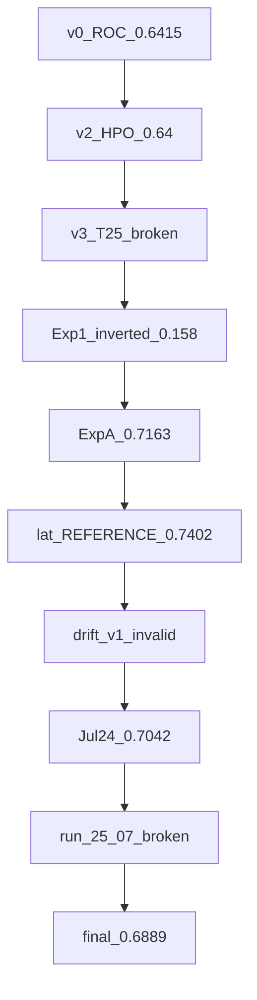

# 03 — Experiments and Research History

**Primary historical folder:** `module4/notebook/output-legacy-experiments/`  
**Supporting archives:** `output-legacy-2026-07-24/`, `output-legacy-kaggle-2026-07-25/`  
**Canonical final freeze:** `module4/notebook/final/`  
**Freeze policy note:** `output-legacy-experiments/README_RUNS.md`  
**Issue / remediation evidence:** `docs/ISSUES_AND_IMPROVEMENT_PLAN.md`, `docs/module4_remediation_plan.md`, `docs/claim_evidence_matrix.md`

This file preserves the research journey. Metrics from different eras are **never mixed** as a single “final” number. Failure reasons are stated only when project evidence supports them.

---

## 1. Evolution spine

```text
v0 preprocess + train (ROC 0.6415)
      ↓
v2 + Optuna (default 0.5425 → HPO 0.6407)
      ↓
v3 T=25 (test ROC ~0.3969 — collapsed / inverted behaviour)
      ↓
v3 Exp1 56 features (ROC 0.1582 — explicit INVERTED)
      ↓
v3 Exp A StandardScaler+clip + auto invert (ROC 0.7163)  ← first solid detector
      ↓
vNext preprocess (163f + drift baseline)
      ↓
vNext model early (0.6837) → lat REFERENCE (0.7402) + multi-seed/HPO stack
      ↓
Drift-aware v1 (INVALID adaptive FPR↓≈0.92)
      ↓
Jul-24 integrity archive (0.7042; claim_ok=false; timestamp ordering)
      ↓
Remediation + Colab 25-07 (broken multi-seed/HPO scoring — do not cite)
      ↓
final/ Kaggle freeze (default 0.6889; HPO 0.8446; Dense AE; claim_ok=false)
```



---

## 2. Folder roles

| Folder | Era | Cite for thesis? |
|--------|-----|------------------|
| `output-legacy-experiments/` | May–Jul 13 trail | Yes for history; lat for 0.7402 lineage; **no** for v1 adaptive FPR |
| `output-legacy-2026-07-24/` | Integrity-gated Colab/Drive era | Yes as 0.7042 evidence pack |
| `output-legacy-kaggle-2026-07-25/` | Remediation templates + broken 25-07 | Cite 25-07 only as **bug museum** |
| `notebook/final/` | Canonical executed Kaggle freeze | **Yes — current offline metrics** |

---

## 3. Experiment cards (chronological)

### 3.1 Experiment: v0 — first preprocess + AE

```text
Experiment: v0 preprocess_and_dataloader + model_training
Purpose: Establish end-to-end MDC windows → Transformer AE train loop
Implementation path: Colab/local notebooks (archived as executed outputs)
Files involved:
  module4/notebook/output-legacy-experiments/mdc_preprocess_and_dataloader_output.ipynb
  module4/notebook/output-legacy-experiments/mdc_model_training_output.ipynb
Configuration: RobustScaler; window T=10 / stride=2; Youden threshold
Method: Benign-only AE; binary eval on val/test
Input: Raw MDC flows
Processing: Early window pipeline → train
Output: Executed notebook metrics in cell outputs
Observed result / Metrics: Test ROC-AUC 0.6415; Val ROC 0.6506; Test F1 0.8300; thr ≈ 0.0047
  Shapes cited in lineage: train ~(15826,10,162), attack rate ~65%
What worked: End-to-end loop; later tables cite as v0 baseline
What failed: Not found as a crash; discrimination modest
Why it failed: Not diagnosed beyond modest AUC in archives
What was changed afterwards: v2 with Optuna + Drive windows_v2.npz
Why the next approach was selected: Need stronger discrimination and HPO
```

---

### 3.2 Experiment: v2

```text
Experiment: mdc_model_v2
Purpose: Improve AE with HPO and richer pooling
Files involved:
  module4/notebook/output-legacy-experiments/mdc_model_v2_output.ipynb
Configuration: windows_v2.npz (~10,166); Optuna 15 trials; early stop on val benign MSE
Method: Sequence AE + HPO retrain
Observed metrics: Default test ROC 0.5425 (F1 0.8092, MCC 0.3305);
  HPO retrain test ROC 0.6407 (F1 0.8415, MCC 0.4785)
What worked: HPO lifted ROC ~0.54 → ~0.64
What failed: Default still near-weak discrimination
Why it failed: Not fully diagnosed in notebook beyond low AUC
What changed next: v3 experiments (window length / features / labelling)
```

---

### 3.3 Experiment: v3 early — T=25

```text
Experiment: v3 longer windows (T=25)
Purpose: Capture longer temporal context
Files involved:
  module4/notebook/output-legacy-experiments/mdc_model_v3_output.ipynb
  module4/notebook/output-legacy-experiments/mdc_model_v3 output (1).ipynb
  module4/notebook/output-legacy-experiments/mdc_preprocess_v3 output.ipynb  (0 outputs — Not verified as executed)
Configuration: windows_v3.npz T=25, 166 features; AUC-aware early stop
Observed metrics: Test ROC ≈ 0.3969 (< 0.5); F1-optimal F1 ≈ 0.8497 at FPR ≈ 0.9886
What worked: Pipeline ran
What failed: Scores non-separating / effectively inverted; trivial high-recall operating point
Why it failed: Training logs / notebook warnings about inversion and ATTACK_FRAC_THRESHOLD
  (evidence: notebook outputs; category = incorrect score orientation / poor separation)
What changed next: Exp1 with T=10 and aggressive feature reduction (56 features)
```

---

### 3.4 Experiment: v3 Exp1 — 56 features, inverted

```text
Experiment: v3 Exp1 reduced features
Purpose: Fix labelling/scaling with fewer features
Files involved:
  module4/notebook/output-legacy-experiments/mdc_model_v3 (2).ipynb   (KeyboardInterrupt)
  module4/notebook/output-legacy-experiments/mdc_model_v3 (3) output .ipynb
Configuration: T=10, 56 features; shapes match later vNext (16795/5153/5153)
Observed metrics: Default test ROC 0.1582, MCC −0.1666, F1 0.5345; HPO test ROC 0.2573
  Explicit notebook text: “Direction: INVERTED — benign scores higher than attacks”
What worked: Session holdout shape pattern established
What failed: Catastrophic inversion (AUC ≪ 0.5); run (2) interrupted with exploding MSE (~1e11)
Why it failed: Notebook ACTION text points to need for StandardScaler + clip preprocess re-export
  (category = poor preprocessing / score orientation)
What changed next: Exp A Tier preprocess + auto score-flip model
```

---

### 3.5 Experiment: v3 Exp A (best pre-vNext)

```text
Experiment: Exp A leakage-validated preprocess + AE
Purpose: First scientifically usable detector
Files involved:
  module4/notebook/output-legacy-experiments/mdc_preprocess_v3_output(4).ipynb
  module4/notebook/output-legacy-experiments/mdc_model_v3_output_4.ipynb
Configuration: Attack-frac ≥ 0.5 labelling; StandardScaler+clip±10; auto invert scores
Observed metrics: Test ROC 0.7163, F1 0.7105, MCC 0.5278, thr ≈ −0.1436
  PCA PC1 AUC 0.5848 (diagnostic)
What worked: Leakage report PASS; score flip fixed orientation; strong ROC
What failed: Notebook ends with ValueError: bins must increase monotonically (histogram cell)
Why it failed: Plotting/binning only — metrics already printed (non-fatal for results)
What changed next: vNext research structure (contractive loss, AUC early-stop, drift baseline, multi-seed/HPO packaging)
Why next selected: Need research-grade packaging + drift awareness beyond a single offline AE
```

---

### 3.6 Experiment: vNext preprocess (2026-06-13)

```text
Experiment: vNext preprocess
Purpose: Research-grade windows + drift baseline artifact
Files involved:
  module4/notebook/output-legacy-experiments/mdc_preprocess_vNext_output.ipynb
Configuration: T=10/stride=2; 163 features; drift_baseline_vnext.npz
Observed: shapes (16795/5153/5153, 10, 163), attack ~38.2%; gates PASS
What worked: Stable windows + drift baseline
What failed: No failure in this notebook
Later engineering issue (remediation §1f): export path Module4_MDC/processed_vnext vs
  vNEXT_test/processed used by downstream — wrong folder confusion on Colab Drive
What changed next: vNext model training
```

---

### 3.7 Experiment: vNext model — early (2026-06-13)

```text
Experiment: vNext model early run
Files involved:
  module4/notebook/output-legacy-experiments/mdc_model_vNext_output.ipynb
Method: SequenceBottleneckAE + contractive + multi-seed + HPO; ensemble rejected
Observed metrics: Default ROC 0.6837 / F1 0.6694 / MCC 0.4492;
  multi-seed 0.7529±0.023; HPO 0.8138
What worked: Multi-seed/HPO stack established (numbers reused in later locks)
What failed: Default underperformed Exp A (0.7163)
Why it failed: Not fully diagnosed in outputs
What changed next: Re-run producing lat REFERENCE (0.7402)
```

---

### 3.8 Experiment: vNext model — lat REFERENCE (2026-07-08)

```text
Experiment: vNext lat / REFERENCE core detector
Purpose: Freeze headline detector numbers for thesis lock (0.7402 lineage)
Files involved:
  module4/notebook/output-legacy-experiments/mdc_model_vNext_lat_output.ipynb
Status in README_RUNS.md: REFERENCE (core detector)
Observed metrics: Default ROC 0.7402, F1 0.7412, MCC 0.5884, thr ≈ −0.1434;
  multi-seed 0.7529±0.023; HPO 0.8138
  Per-attack example: Attack_1 recall 0.8434; sparse classes ≈ 0
What worked: Beat Exp A on default; locked Abstract/Methods numbers in claim_evidence_matrix.md
What failed: Ensemble still worse than default (test 0.7081 vs 0.7402) — not a pipeline crash
What changed next: Drift-aware streaming evaluation (v1)
```

**Documentation note:** These numbers remain the **historical thesis lock**. They are **not** the canonical `final/` freeze metrics. See [04](04_final_model_results_and_reproducibility.md).

---

### 3.9 Experiment: Drift-aware v1 — LEGACY (invalid adaptive claim)

```text
Experiment: Drift-aware v1
Purpose: Streaming adaptive threshold, fine-tune, IF, thesis figures
Files involved:
  module4/notebook/output-legacy-experiments/mdc_drift_aware_output.ipynb
Status: LEGACY v1 — README_RUNS.md says DO NOT cite adaptive FPR↓0.92
Method: container_lexsort ordering (no ts_test in that run’s data path);
  threshold recomputed with invert → thr ≈ −0.0923 (alert 0.0923); SCORE_INVERT=True
Observed metrics:
  Offline AE ROC 0.7402 (from linked model era)
  Stream fixed FPR ≈ 0.97
  fpr_reduction_last_half ≈ 0.9205  ← INVALID ARTIFACT
  Fine-tune ΔAUC ≈ −0.0605 (0.8508 → 0.7902)
  IF ROC 0.6741; latency ≈ 3.36 ms; bootstrap CI ≈ [0.725, 0.757]
What worked: IF baseline, fine-tune negative result as evidence, latency, figures
What failed: Adaptive “FPR reduction ≈ 0.92” is not a real operating improvement
Why it failed: Documented double-invert / wrong threshold convention
  Evidence: README_RUNS.md (thr −0.0923 vs offline −0.1434); ISS-03; claim matrix C10
  Category: incorrect evaluation methodology / threshold problems
What changed next: Integrity-gated drift (Tasks 1–3); load offline f1_optimal thr; alert_invert=false
```

Target freeze file `mdc_drift_aware_output_v2.ipynb`: **Not found** in `output-legacy-experiments/` (README lists it as TARGET).

---

### 3.10 Experiment: Jul-24 integrity archive

```text
Experiment: Jul-24 run-final era (executed archive)
Purpose: Integrity-gated drift + multiclass timestamps
Files involved (all under module4/notebook/output-legacy-2026-07-24/):
  mdc_preprocess_vNext_mc_output.ipynb
  mdc_model_vNext_output.ipynb
  mdc_drift_aware_output.ipynb
Method: MC + timestamps; thr from metrics_vnext.json with ALERT_INVERT=False;
  ordering=timestamp; fine-tune stable_slice_fallback when drift slice 100% attack
Observed metrics:
  Default ROC 0.7042 / F1 0.6935 / MCC 0.4892 / thr ≈ −0.1775
  multi-seed 0.7529±0.023; HPO 0.8138 (note: multi-seed/HPO may be carried from prior lock — treat carefully)
  THRESHOLD INTEGRITY PASS; claim_ok=False
  IF 0.6741; latency ≈ 2.30 ms; freeze_ready True but claim_adaptive_ok false
  Fine-tune AUC NaN (single-class drift slice)
What worked: Integrity gates; timestamp ordering confirmed; honest claim_ok=False
What failed: Adaptive claim unsupported (recall/F1 collapse); fine-tune Δ undefined
Why it failed:
  Adaptive: last-half FPR↓ with recall→0 (matched policy)
  Fine-tune: chronological last 30% = 100% attack windows (documented)
What changed next: ISS remediation (scoring unify, ablations, baselines notebook, Kaggle port)
```

---

### 3.11 Experiment: Colab 25-07 — broken `score_with_protocol` (invalid)

```text
Experiment: Model re-run after ISS-04 scoring unification (first buggy revision)
Purpose: Re-execute model with score_with_protocol()
Files involved:
  module4/notebook/output-legacy-kaggle-2026-07-25/mdc_model_vNext_output 25-07.ipynb
Observed metrics: Default ROC 0.7316 (plausible);
  multi-seed mean 0.2739; HPO test 0.1554 (worse than random)
  despite best_val_auc up to ~0.8134 during training
What worked: Default path looked OK; ablations partially ran
What failed: Multi-seed/HPO worse than chance
Why it failed: Remediation §1c — compute_scores(..., invert=None) inherited stale
  SCORE_INVERT global from first scored model → wrong flip for later models
  Category: incorrect evaluation methodology / reproducibility bug
What changed next: Explicit invert=False in protocol step 1; re-run on Kaggle final track
Citation rule: DO NOT cite 25-07 multi-seed/HPO
```

Sibling notebooks in `output-legacy-kaggle-2026-07-25/` (preprocess, drift, baselines, cleared model): **outputs cleared** — metrics **Not verified** from those files.

---

### 3.12 Experiment: `final/` Kaggle freeze (canonical)

```text
Experiment: final/ Kaggle executed pack
Purpose: Canonical post-remediation freeze
Files involved:
  module4/notebook/final/kaggle-source/*.ipynb
  module4/notebook/final/kaggle-output/*.ipynb
  module4/notebook/final/output-metrics/**
Method: Merged MC preprocess; fixed score protocol; timestamp drift; Dense AE; analysis
Observed metrics (from JSON — see file 04 for full tables):
  Default ROC 0.688916 / F1 0.660342 / MCC 0.423353 / thr ≈ −0.199246
  Multi-seed ROC 0.726114 ± 0.030248
  HPO ROC 0.844607 / F1 0.803018 / MCC 0.708034
  Dense AE ROC 0.662446; IF mean_max 0.674149
  claim_adaptive_ok=false; fine-tune AUC NaN; freeze_ready=true
What worked: Full 4+1 pipeline + deep baseline comparison + analysis artifacts
What failed / limited: Adaptive still not claimable; fine-tune still NaN;
  freeze_manifest headline_metrics_locked still pastes 0.7402 lineage from docs
Why next: Thesis re-lock (ISS-01) still required if Abstract must match one era
```

---

## 4. Failure taxonomy (evidence-backed only)

| Failure category | Experiment | Evidence |
|------------------|------------|----------|
| Incorrect evaluation / threshold double-invert | Drift v1 | README_RUNS.md; thr −0.0923 vs −0.1434; FPR≈0.97 |
| Score orientation / preprocessing | v3 Exp1 | AUC 0.1582; “INVERTED” notebook text |
| Poor temporal window choice | v3 T=25 | AUC ~0.40; FPR~0.99 at F1-opt |
| Model instability (exploding loss) | v3 Exp1 run (2) | KeyboardInterrupt; MSE ~1e11 |
| Distribution shift / empty benign drift slice | Jul-24 + final fine-tune | `stable_slice_fallback`; AUC NaN |
| Adaptive threshold collapses alerts | Jul-24 + final | matched_policy adaptive F1/recall 0 |
| Scoring protocol global invert bug | 25-07 | multi-seed 0.2739 / HPO 0.1554; remediation §1c |
| Engineering path mismatch | Colab Drive export | remediation §1f wrong folder |
| Drive FUSE lag | Colab baselines load | remediation §1g |
| Non-fatal plotting crash | Exp A | histogram bins ValueError after metrics |
| Metric lock conflict | Docs vs freezes | 0.7402 vs 0.7042 vs 0.6889 (ISS-01) |

**Not claimed without evidence:** data leakage in Exp A/final (gates report PASS); “fine-tune improves detection” (contradicted / NaN / `do_not_cite`).

---

## 5. Baselines history

| Baseline | First strong appearance | Final freeze value |
|----------|-------------------------|--------------------|
| Isolation Forest mean_max | Drift v1 / Jul-24 / final drift | ROC 0.6741 |
| Dense AE | `mdc_baselines` (ISS-09); final executed | ROC 0.6624 |
| Exp A AE (historical reference) | Exp A notebook | ROC 0.7163 |
| vNext default / HPO | lat → Jul-24 → final | See era table in §6 |

---

## 6. Multi-seed / HPO across eras (do not mix)

| Era | Multi-seed ROC | HPO ROC | Notes |
|-----|---------------:|--------:|-------|
| Early vNext / lat lock | 0.7529±0.023 | 0.8138 | Claim matrix / lat notebook |
| Jul-24 printed stack | 0.7529±0.023 | 0.8138 | Same numbers appear; whether fully re-computed: treat with care |
| 25-07 buggy run | 0.2739 | 0.1554 | **Invalid** |
| **final/ metrics_vnext.json** | **0.7261±0.030** | **0.8446** | **Canonical for final freeze** |

---

## 7. Why the final approach was selected

1. **Exp A** proved leakage-free StandardScaler+clip + score flip is necessary.
2. **vNext** packaged research controls (contractive AE, multi-seed, HPO, drift baseline).
3. **Drift v1 failure** forced integrity gates (offline thr provenance, alert_invert=false, claim_ok).
4. **Timestamp ordering** replaced lexsort so stream evaluation matches real chronology (when `ts_*` present).
5. **Kaggle final track** removed Drive/FUSE fragility and merged duplicate preprocess notebooks.
6. **Dense AE baseline** closed the “deep baseline missing” gap (ISS-09).
7. **Adaptive / fine-tune** remain in the pipeline as evaluated mechanisms, reported **honestly as non-claimable** in the final freeze.

---

## 8. Files index (historical)

| Path | Role | Status |
|------|------|--------|
| `output-legacy-experiments/README_RUNS.md` | Freeze policy | Historical policy |
| `output-legacy-experiments/mdc_model_vNext_lat_output.ipynb` | REFERENCE 0.7402 | Historical REFERENCE |
| `output-legacy-experiments/mdc_drift_aware_output.ipynb` | LEGACY v1 drift | Historical — do not cite adaptive FPR |
| `output-legacy-experiments/mdc_drift_aware_output_v2.ipynb` | TARGET | **Not found** |
| `output-legacy-2026-07-24/*` | Integrity archive | Historical |
| `output-legacy-kaggle-2026-07-25/mdc_model_vNext_output 25-07.ipynb` | Broken scoring | Historical / invalid metrics |
| `docs/claim_evidence_matrix.md` | Locked claims (0.7402 era) | Supporting lock — conflicts with final/ |
| `docs/module4_remediation_plan.md` | Bug trail ISS-04 etc. | Supporting |

---

## 9. Not found / Not verified

- `mdc_drift_aware_output_v2.ipynb` as a saved file under legacy-experiments
- `notebook/run/` and `notebook/run-final/` directories
- Executed metrics for cleared notebooks in `output-legacy-kaggle-2026-07-25/` (except 25-07)
- Executed outputs for `mdc_preprocess_v3 output.ipynb` (0 outputs)
- ISSUES text claiming fine-tune ΔAUC +0.0319 in Jul-24 notebooks (**Not found** there; Jul-24/final show NaN)
- Whether Abstract should permanently use 0.7402 vs 0.6889 — **Not frozen** in this research-record set; eras are documented separately
