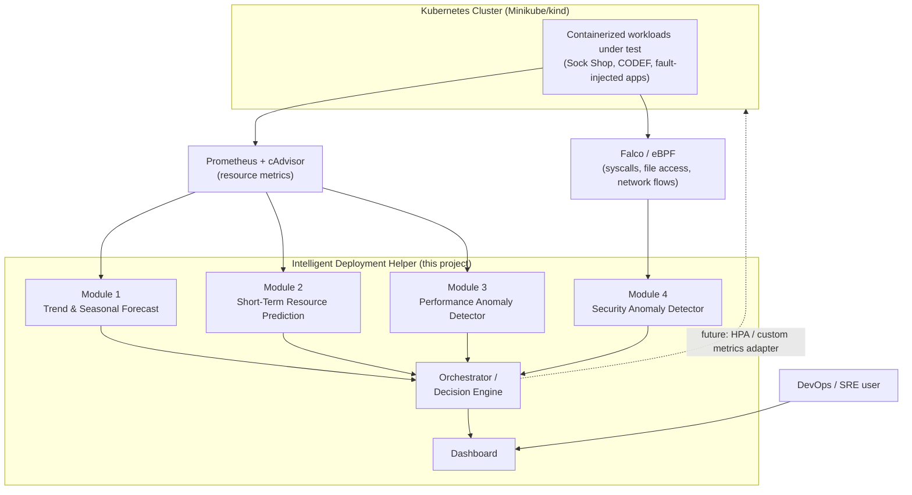

# Intelligent Deployment Helper — System Integration Architecture

**Scope:** How to integrate Modules 1–4 (DracaSys, Group 24) into one deployable, containerized system.
**Status:** Planning document only — no code in this document. Feeds a future implementation phase.
**Author context:** Written from Module 4 (Security Anomaly Detector), reasoning about the group's full proposal.
**Fusion pattern chosen:** Independent parallel signals → shared orchestrator → unified dashboard/decision.
**Deployment target:** Real containerized, Kubernetes-deployable system (not just a thesis diagram).

---

## 1. Framing

The proposal already tells you the correct integration pattern — don't fight it:

- Module 1 (Prophet+LSTM) operates on **daily/weekly** horizons.
- Module 2 (GRU) operates on **near-real-time** short-term forecasts.
- Module 3 (VAE+PCA) operates on **30–60 timestep** performance windows.
- Module 4 (attention autoencoder) operates on **500–1000 sample** security windows.

These four models have different input cadences, different feature spaces, and different math. Trying to merge them into one shared preprocessing pipeline or one shared model would destroy the drift-aware tuning each module already has. **The correct integration point is not the data or the model — it's the output contract.** Each module stays a fully independent system; a thin orchestration layer normalizes what they emit and combines it into one decision. This is exactly the "independent parallel signals" pattern you selected, and it is also the only pattern that keeps each teammate's individual thesis chapter scientifically self-contained (defensible on its own dataset/metrics) while still producing one system for the group defense.

---

## 2. System Context (C4 Level 1)



---

## 3. Data Architecture — reconciling 3 datasets, 4 preprocessing pipelines

You have three distinct data lineages, not four:

| Dataset | Used by | Grain | Notes |
|---|---|---|---|
| A — long-horizon cluster trace (e.g. Alibaba Cluster Trace) | Module 1 only | daily/weekly aggregates | Separate dataset, separate lineage |
| B — resource telemetry (e.g. Sock Shop / CODEF traces) | Modules 2 **and** 3 | sub-minute CPU/mem/net/disk | **Shared raw source, divergent preprocessing** |
| C — security telemetry (MDC: flows, syscalls, file access) | Module 4 only | per-session windows | Separate dataset, separate lineage (this repo) |

Because Modules 2 and 3 share dataset B but need different shapes (Module 2: sliding window 500–1000 samples for GRU; Module 3: 30–60 timestep windows + PCA for VAE), use a **medallion (bronze/silver/gold) pattern per dataset lineage**, not per module:

```
Bronze (raw, immutable)          Silver (cleaned, canonical)         Gold (model-ready, per module)
─────────────────────             ──────────────────────              ───────────────────────────
Dataset A raw traces      ──▶     A-silver: resampled,        ──▶     A-gold: Module 1 features
                                  gap-filled, schema-aligned            (trend/season decomposition,
                                                                         missing-data simulation)

Dataset B raw traces      ──▶     B-silver: ONE canonical      ──┬──▶  B-gold-M2: 500–1000 sample
                                  cleaned CPU/mem/net/disk        │     sliding window, GRU scaling
                                  series, deduped, timestamped    │
                                                                   └──▶  B-gold-M3: 30–60 timestep
                                                                         window + PCA projection

Dataset C raw traces      ──▶     C-silver: sessions,          ──▶     C-gold-M4: StandardScaler,
(this repo's mdc_*)              short-gap fill                        benign-only fit, T=10 windows
```

**Why this matters:** the *silver* layer for dataset B is the one genuine data-integration point in the whole system — build it once, let Modules 2 and 3 each derive their own *gold* features from it. Do **not** try to force a shared feature set between Modules 2 and 3; only the cleaned raw series should be shared. Module 4's existing preprocessing (in this repo) already follows this bronze→silver→gold shape (raw flows → sessions → scaled windows) — reuse that same structure as the template for the other three, for consistency across the group's thesis chapters.

---

## 4. Model & Training Architecture

Each module keeps its **existing notebook-based training pipeline** exactly as-is. Do not unify training code across modules — only standardize the *conventions* around them so the four notebooks read as one coherent body of work in the thesis:

- **Freeze convention:** each module locks a "final" notebook + manifest once results are stable (Module 4 already does this: `notebook/run-final/`, `freeze_manifest_v2.json`, `docs/claim_evidence_matrix.md`). Recommend all four modules adopt this same `run-final/` + manifest + claim-evidence-matrix pattern — it gives the group a uniform reproducibility story at the viva.
- **Model card per module:** one page per module (dataset, preprocessing summary, architecture, headline metric, drift mechanism, known limitations) — four of these become the "Proposed Solution" methodology sections, and their consistency is what makes the thesis read as one project instead of four bolted-together reports.
- **Artifact naming:** `module{N}_{name}_v{version}.{ext}` for trained checkpoints, so the serving layer (§5) can always resolve "latest frozen artifact" deterministically per module.

---

## 5. Serving Contract — the one required agreement across all 4 teammates

This is the entire integration surface. Everything upstream of it (data, preprocessing, model architecture) stays independent per module. Every module's inference wrapper must emit this envelope, regardless of what's inside:

```json
{
  "module_id": "module_1 | module_2 | module_3 | module_4",
  "entity": { "cluster": "", "namespace": "", "pod": "", "container": "" },
  "timestamp_utc": "ISO-8601",
  "signal_type": "long_term_forecast | short_term_forecast | perf_anomaly | security_anomaly",
  "horizon_sec": "null for anomaly types, seconds-ahead for forecast types",
  "value_or_score": "predicted value OR reconstruction/anomaly score",
  "is_anomaly": "bool, null for forecast types",
  "confidence": "0-1",
  "drift_status": "stable | adapting | drift_detected",
  "model_version": "matches artifact naming in §4"
}
```

Each module's own thin API wrapper (not the notebook) is responsible for translating its native output into this shape. This is the **only** contract negotiation the four of you need to have as a group — agree on it in Phase 0 below before anyone touches Docker.

---

## 6. Orchestration / Decision Engine

**Problem:** Module 1 emits weekly, Module 2 emits every few seconds, Modules 3/4 emit every window (~30s–150s). You cannot join these on a common clock tick.

**Solution — latest-value state store per entity:**

```
entity_id (namespace/pod/container) →
  { module_1: <latest envelope>,
    module_2: <latest envelope>,
    module_3: <latest envelope>,
    module_4: <latest envelope> }
```

A simple key-value store (Redis, or even an in-memory dict for the FYP demo scale) keyed by entity, updated whenever any module posts a new envelope. The decision engine reads the current snapshot for an entity whenever it needs to decide — it never waits for all four to agree on a timestamp.

**Decision engine — rule-based, not a learned meta-model.** This is a deliberate choice, not a simplification you need to apologize for: a transparent rule matrix is easier to defend at viva than an opaque fusion model, and it matches your proposal's language ("actionable decision support"), not "a fifth model." Example rules:

| Condition | Recommendation |
|---|---|
| `module_4.is_anomaly = true` (any confidence) | **HIGH** priority — isolate/quarantine, independent of everything else |
| `module_3.is_anomaly = true` AND `module_2` trending up | Scale up now (load-driven degradation) |
| `module_3.is_anomaly = true` AND `module_2` flat/down | Investigate — likely non-load fault (e.g. memory leak) |
| No anomalies, `module_1` shows sustained upward trend | Proactive capacity-planning alert (non-urgent) |
| Any `drift_status = drift_detected` | Surface system-health banner; discount that module's vote for N minutes |

Keep this matrix in a small config file (YAML/JSON), not hardcoded — lets you tune thresholds during the demo without touching the orchestrator's code.

---

## 7. Deployment Architecture

**Repo layout (converge four notebooks into one integration repo without giving up individual repos):**

```
intelligent-deployment-helper/
├── modules/
│   ├── module1-forecast/        # Dockerfile + inference wrapper only
│   ├── module2-shortterm/
│   ├── module3-perf-anomaly/
│   └── module4-security-anomaly/  # this repo's future export
├── orchestrator/                # state store + rule engine (§6)
├── dashboard/
├── data-contracts/               # the §5 JSON schema — single source of truth
└── infra/
    ├── docker-compose.yml        # local dev / demo
    └── k8s/                      # manifests or Helm chart for cluster deploy
```

- **One container image per module** — small, single-responsibility. This also gives you a nice viva narrative: *"we built a container-based intelligent helper, and shipped it as containers."*
- **Local dev:** `docker-compose` brings up all four modules + orchestrator + dashboard + a **mock trace-replay generator** (replays recorded datasets at accelerated speed) — lets you demo without a live cluster.
- **Target env:** the Minikube/kind cluster from your own resource-requirements section, with Prometheus+cAdvisor+Falco as real sources. Same container images as local dev — only a config/env-var flip changes the data source from "replay" to "live," so there's no code fork between demo mode and "real" mode.

---

## 8. Cross-cutting concerns (say these explicitly in the thesis — they read as rigor, not gaps)

- **Entity/ID reconciliation:** Alibaba trace machine IDs, Sock Shop pod names, and MDC container IDs are all shaped differently. That's fine for *training* (historical public datasets, don't need to match). For **live serving**, all four modules must be fed off real Kubernetes `(namespace, pod, container)` labels — meaning each module's live feature extractor has to map cluster telemetry into whatever shape it was trained on. Call this out explicitly as a **train/serve schema gap** in the limitations section, the same way this repo's own `ISSUES_AND_IMPROVEMENT_PLAN.md` is upfront about gaps (ISS-06, ISS-07 etc.) — reviewers respond well to acknowledged limitations over silent ones.
- **Observability of the helper itself:** since you're citing sub-100ms-class latency targets (Module 4's own WBS target), instrument the orchestrator and each serving container with basic latency/error metrics — you are building a monitoring system, so it should be monitorable.
- **Least privilege for the security module:** Module 4's serving container touches syscall/flow data — keep it read-only / least-privileged even though its *job* is analyzing privileged signals.
- **Independent failure domains:** if Module 1's forecast service goes down, Modules 2–4 and the orchestrator must keep working (missing `module_1` key in the state store, not a crash) — this is a direct consequence of choosing "independent parallel signals" and should be tested, not assumed.

---

## 9. Phased build plan

| Phase | Deliverable | Depends on |
|---|---|---|
| **0 — Contract freeze** | All 4 teammates agree on §5 envelope schema + entity ID scheme | Nothing — do this first, before any Docker work |
| **1 — Inference extraction** | Each teammate pulls a pure inference function (no retraining code) out of their existing notebook | Phase 0 |
| **2 — Containerize** | Dockerfile + thin API (`/predict`, `/health`) per module wrapping Phase 1's function | Phase 1 |
| **3 — Local integration** | `docker-compose` brings up all 4 + mock replay source; verify each `/predict` matches schema | Phase 2 |
| **4 — Orchestrator + dashboard** | State store + rule engine (§6) + dashboard consuming it | Phase 3 |
| **5 — Kubernetes migration** | Helm chart/manifests; swap mock generator for real Prometheus/cAdvisor/Falco | Phase 4 |
| **6 — End-to-end validation** | Synthetic fault injection (CPU spike + simulated attack) proving cross-module correlation; capture latency numbers for thesis | Phase 5 |

Nothing here requires touching any module's model or preprocessing — the whole plan is additive around the four notebooks you already have.

---

## 10. Showcase / viva narrative

**Demo storyline (staggered, not simultaneous — proves the timeline, not just the pieces):**

1. Replay a recorded trace with a synthetic CPU-leak fault injected at `t = T1`.
2. Module 3 flags a performance anomaly near `T1`; Module 2's short-term forecast shows the abnormal trend at the same time.
3. At `t = T2` (later), replay a simulated MDC attack; Module 4 flags a security anomaly.
4. Module 1's panel provides long-horizon context throughout (so the dashboard never looks empty).
5. The orchestrator issues two distinct, correctly-timed recommendations — this is the proof that it's **one integrated system**, not four unrelated demos running side by side.

**Framing for examiners:** each teammate is individually examined on their module's ML rigor (dataset, preprocessing, model, metrics — already the focus of this repo's own WBS for Module 4). The **group** is examined on the integration layer in this document — so this architecture doc doubles as the shared "systems chapter" that ties the four individual results chapters into one thesis narrative.

---

*Document status: planning only. No implementation performed. Written 2026-07-24.*
*DracaSys — Group 24 — University of Moratuwa, Faculty of Information Technology.*
