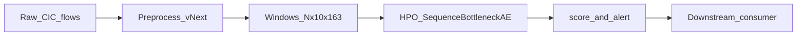
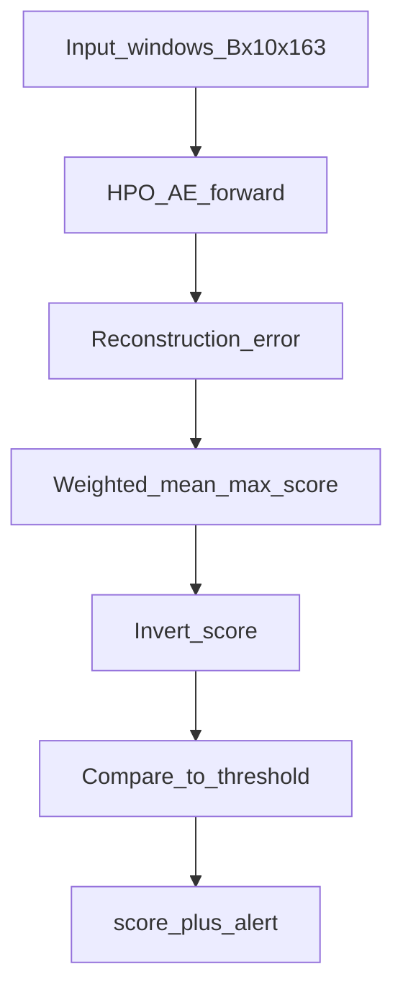

# Module 4 — Final Model Technical Handover

**Document type:** Teammate / integrator handover  
**Model artifact:** [`model_hpo_best_vnext.pt`](model_hpo_best_vnext.pt)  
**Model tag:** `HPO_best` (Optuna-retrained Sequence Bottleneck Autoencoder)  
**Module:** Module 4 — Misuse Detection in Containers (MDC vNext)  
**Audience:** Developers who did not build this module but must run and integrate it  
**Status:** Final HPO detector for integration (best held-out ROC-AUC ≈ **0.845**)

---

## 1. Model Overview

### 1.1 Brief description

The final model is an unsupervised **Sequence Bottleneck Autoencoder** (`SequenceBottleneckAE`):

- Transformer encoder → low-dimensional bottleneck → Transformer decoder  
- Trained on **benign-only** container network-flow windows  
- Anomalies are inferred from **reconstruction error** (unseen / attack behaviour reconstructs poorly)

This file is the **HPO best** checkpoint (Optuna-tuned architecture + weights), exported as a standalone PyTorch package for handover.

| Property | Value |
|----------|--------|
| Format | `mdc_vnext_hpo_standalone` (`.pt` dict) |
| Architecture | `d_model=64`, `bottleneck=16`, `enc=3`, `dec=2`, `dim_ff=192`, `nhead=4` |
| Input window | `(batch, T=10, F=163)` |
| Held-out test ROC-AUC | **0.8446** |
| Recommended alert threshold | **−0.3474787175655365** |
| Score convention | Higher score = more anomalous (`invert=True`) |

### 1.2 Purpose

Detect **container misuse / attack behaviour** in CICFlowMeter-style network telemetry without requiring attack labels at training time.

Primary outputs for integration:

1. Continuous **anomaly score** per window  
2. Binary **alert** (`score >= threshold`)

### 1.3 Where it fits in the overall project pipeline

```text
[Upstream] Module data / CIC flows
        ↓
 Preprocess → scaled sliding windows (N, 10, 163)
        ↓
 ★ THIS MODEL ★  → score + alert
        ↓
[Downstream] Orchestrator / dashboard / Module 3–NEX / alerting / storage
```



**Related research notebooks (source of truth for training, not required at runtime):**

| Notebook | Role |
|----------|------|
| `module4/notebook/final/kaggle-source/mdc_preprocess_vNext_mc_kaggle.ipynb` | Build windows |
| `module4/notebook/final/kaggle-source/mdc_model_vNext_kaggle.ipynb` | Train + HPO |
| `module4/notebook/final/kaggle-source/mdc_drift_aware_kaggle.ipynb` | Drift research (optional; not required for basic inference) |

---

## 2. Model Input

### 2.1 What input data the model requires

The model does **not** accept raw CSV flow rows directly.

It requires **preprocessed sliding windows** of bucketed network-flow features:

- Already filtered, scaled, and windowed by the Module 4 preprocess pipeline  
- Same feature order / scale as training

### 2.2 Required file formats

| Purpose | Format | Notes |
|---------|--------|-------|
| Model weights + metadata | `.pt` (this folder) | Required |
| Batch of windows (offline) | `.npz` (`windows_vnext.npz`) | Recommended for testing |
| Live input | `numpy.ndarray` / `torch.Tensor` `float32` | Shape `(B, 10, 163)` |

Optional provenance (for rebuilding windows from raw flows):

- `preproc_vnext.pkl` (scalers / masks) — produced by preprocess notebook  
- `manifest_vnext.json`

### 2.3 Input shape and dimensions

| Axis | Size | Meaning |
|------|------|---------|
| `B` | ≥ 1 | Batch size (number of windows) |
| `T` | **10** | Timesteps (15 s buckets × 10) |
| `F` | **163** | Flow-derived features per timestep |

**Required dtype:** `float32`  
**Tensor layout:** `(B, 10, 163)`

### 2.4 Required features

- **163** engineered/bucketed CIC-style network features (not CPU/mem/syscall).  
- Exact feature names and column order come from preprocess (`feat_names` in NPZ / manifest).  
- Do **not** reorder, drop, or insert columns.

### 2.5 Preprocessing that must be completed before the model

Must already be done upstream (or by calling the preprocess notebook):

1. Container filter + sessionization  
2. Leakage-safe session split (for training/eval only)  
3. Feature hygiene (inf/NaN, variance, correlation filters)  
4. Flow scaling → 15 s bucketing (mean/max/std + flow count) → bucket scaling  
5. Sliding windows: **T=10**, stride typically **2**  
6. Values in the **same scaled space** as `windows_vnext.npz`

**Critical:** Passing raw unscaled features will produce invalid scores silently.

### 2.6 Example input

```python
import numpy as np

# One window: 10 timesteps × 163 features (already preprocessed/scaled)
x = np.zeros((1, 10, 163), dtype=np.float32)

# Or load real windows from the project NPZ:
# z = np.load("windows_vnext.npz")
# x = z["X_test"][:8].astype(np.float32)   # shape (8, 10, 163)
```

---

## 3. Model Output

### 3.1 What outputs the model generates

| Output | Type | Description |
|--------|------|-------------|
| `score` | `float32` array `(B,)` | Anomaly score per window |
| `threshold` | `float` | Fixed operating point from HPO eval |
| `is_anomaly` / `alert` | `bool` array `(B,)` | `score >= threshold` |

Optional downstream fields you may attach: `container_id`, `timestamp`, `window_index`.

### 3.2 Output format and dimensions

```text
score:       shape (B,)   float32/float64
is_anomaly:  shape (B,)   bool
threshold:   scalar       ≈ -0.3474787175655365
```

### 3.3 Meaning of each output

| Field | Meaning |
|-------|---------|
| `score` | Higher = more anomalous (alert-space; reconstruction error after invert) |
| `threshold` | Locked HPO `f1`-style operating point from offline test (`metrics_hpo`) |
| `is_anomaly=True` | Window flagged as misuse / attack-like |

Locked offline quality at this threshold (from package `metrics_hpo`):

| Metric | Value |
|--------|-------|
| ROC-AUC | 0.8446 |
| F1 | 0.8030 |
| Precision | 0.8920 |
| Recall | 0.7302 |
| FPR | 0.0546 |
| MCC | 0.7080 |

### 3.4 How to interpret the outputs

1. Compute `score` for each window.  
2. Compare to **package threshold** (−0.3475).  
3. `score >= threshold` → alert.  
4. Do **not** re-invert scores (invert is already applied in the scoring protocol).  
5. Do **not** mix this HPO threshold with the **default-model** threshold (~−0.199).

### 3.5 Example output

```python
{
  "score": np.array([-0.21, -0.41, -0.10], dtype=np.float32),
  "threshold": -0.3474787175655365,
  "is_anomaly": np.array([True, False, True])
}
```

Interpretation:

- Window 0: score −0.21 ≥ −0.3475 → **alert**  
- Window 1: score −0.41 < −0.3475 → **benign**  
- Window 2: score −0.10 ≥ −0.3475 → **alert**

---

## 4. How to Run the Model

### 4.1 Software and library requirements

| Dependency | Role | Suggested |
|------------|------|-----------|
| Python | Runtime | 3.10+ (Kaggle freeze used 3.10–3.12) |
| PyTorch | Load + forward | Compatible with your OS; CPU is enough for inference |
| NumPy | Arrays | Prefer `numpy<2` if your local torch build warns about NumPy 2.x |
| scikit-learn / joblib | Only if rebuilding preprocess from pickle | Optional for score-only use |

**Hardware:** CPU inference is fine (~2–3 ms per window in project latency tests). GPU not required for integration.

### 4.2 Project structure (handover-relevant)

```text
module4/notebook/final/
├── models/                              ← YOU ARE HERE
│   ├── model_hpo_best_vnext.pt          ← final HPO model package
│   └── MODEL_HANDOVER.md                ← this document
├── kaggle-source/
│   ├── mdc_preprocess_vNext_mc_kaggle.ipynb
│   ├── mdc_model_vNext_kaggle.ipynb     ← SequenceBottleneckAE class source
│   └── mdc_drift_aware_kaggle.ipynb     ← optional drift research
└── output-metrics/                      ← frozen research artifacts (optional)
    ├── windows_vnext_processed/
    └── model_vnext_runs/
```

### 4.3 Required files and folders

**Minimum to score pre-made windows:**

1. `models/model_hpo_best_vnext.pt`  
2. `SequenceBottleneckAE` class code (copy from `mdc_model_vNext_kaggle.ipynb` or drift notebook §3)  
3. Input windows `(B, 10, 163)` (e.g. from `windows_vnext.npz`)

**Also recommended for conformance testing:**

- `windows_vnext.npz`  
- Original `metrics_vnext.json` (`test_hpo` block should match package `metrics_hpo`)

### 4.4 Step-by-step: run on another computer

1. **Copy** this `models/` folder (at least the `.pt` + this doc).  
2. **Install** Python 3.10+, PyTorch, NumPy.  
3. **Copy** the `SequenceBottleneckAE` (+ `SinusoidalPE`) class from:
   - `module4/notebook/final/kaggle-source/mdc_model_vNext_kaggle.ipynb`  
4. **Load** the package:

```python
import torch
from pathlib import Path

ckpt = torch.load(
    Path("model_hpo_best_vnext.pt"),
    map_location="cpu",
    weights_only=False,  # required: file contains numpy + dict metadata
)
assert ckpt["format"] == "mdc_vnext_hpo_standalone"
arch = ckpt["arch"]
n_features = ckpt["n_features"]
T = ckpt["T"]
feat_std = ckpt["feat_std"]
proto = ckpt["score_protocol"]
thr = float(ckpt["metrics_hpo"]["threshold"])
```

5. **Build model** with `arch` (not the default-model config):

```python
model = SequenceBottleneckAE(
    n_features,
    d_model=arch["d_model"],
    nhead=arch["nhead"],
    num_enc_layers=arch["num_enc_layers"],
    num_dec_layers=arch["num_dec_layers"],
    dim_ff=arch["dim_ff"],
    dropout=arch["dropout"],
    bottleneck_dim=arch["bottleneck_dim"],
    max_len=max(T + 10, 200),
)
model.load_state_dict(ckpt["state_dict"])
model.eval()
```

6. **Score** windows (see §5) and apply `thr`.  
7. **Sanity-check** on a known batch from `windows_vnext.npz` if available.

### 4.5 Configuration / parameters to update

| Parameter | Source in `.pt` | Change? |
|-----------|-----------------|---------|
| Architecture | `arch` | **No** — must match weights |
| `feat_std` | `feat_std` | **No** |
| `mean_w` / `max_w` | `score_protocol` (0.3 / 0.7) | **No** |
| `invert` | `score_protocol.invert=True` | **No** |
| `threshold` | `metrics_hpo.threshold` | Only if you deliberately retune on new labeled data |
| Device | `cpu` / `cuda` | Yes, as needed |

### 4.6 Common setup issues

| Issue | Cause | Fix |
|-------|-------|-----|
| `weights_only` / unpickling error | Torch 2.x default | Use `weights_only=False` |
| NumPy 1.x / 2.x warning | Local env mismatch | Prefer `numpy<2` or upgrade torch build |
| `size mismatch` on `load_state_dict` | Built default arch instead of HPO `arch` | Use `ckpt["arch"]` (bn=16, enc=3, ff=192) |
| Absurd FPR / all alerts | Double invert or wrong thr | Keep `invert=True` once; use HPO thr −0.3475 |
| Scores disagree with research | Wrong feature scale / order | Must use vNext-preprocessed windows |
| `n_features` mismatch | Input not 163 cols | Fix preprocess; do not pad/truncate ad hoc |

---

## 5. How to Use the Model

### 5.1 Complete execution workflow (input → output)

```text
1. Obtain scaled windows X: (B, 10, 163) float32
2. Load model_hpo_best_vnext.pt
3. Build SequenceBottleneckAE from arch + load state_dict
4. Forward: recon = model(X)
5. err = (recon - X)^2 / feat_std   (feat_std clamped)
6. raw = 0.3 * mean(err) + 0.7 * max_over_time(mean_over_features(err))
7. score = -raw                     (because invert=True)
8. alert = (score >= threshold)
9. Return {score, threshold, is_anomaly}
```



### 5.2 Order of scripts / notebooks

**For integration (recommended):**

1. Upstream system (or preprocess notebook) produces windows  
2. Your inference module loads `model_hpo_best_vnext.pt` and scores  
3. Downstream consumes alerts/scores  

**For reproducing research from scratch (optional):**

1. `mdc_preprocess_vNext_mc_kaggle.ipynb` → `windows_vnext.npz`  
2. `mdc_model_vNext_kaggle.ipynb` → train/HPO (already done; you have the export)  
3. Optional: `mdc_drift_aware_kaggle.ipynb` → drift/adaptive experiments  

You do **not** need to retrain to integrate.

### 5.3 Expected intermediate outputs

| Stage | Intermediate |
|-------|----------------|
| After preprocess | `X` shape `(B, 10, 163)` |
| After forward | `recon` same shape as `X` |
| After error | `err` shape `(B, 10, 163)` |
| After combine | per-window scalar before invert |
| After invert | final `score` |

### 5.4 Final outputs generated by the model

Per window (or batch arrays):

- `score`  
- `is_anomaly`  
- `threshold` (constant for this package)

Reference scoring implementation:

```python
import numpy as np
import torch

@torch.no_grad()
def score_windows(model, x_np, feat_std, mean_w=0.3, max_w=0.7, invert=True):
    """x_np: (B, 10, 163) float32"""
    x = torch.from_numpy(np.asarray(x_np, dtype=np.float32))
    model.eval()
    recon = model(x)
    err = (recon - x).pow(2)
    if feat_std is not None:
        fs = torch.as_tensor(feat_std, dtype=err.dtype).clamp_min(1e-6)
        err = err / fs.view(1, 1, -1)
    s = mean_w * err.mean(dim=(1, 2)) + max_w * err.mean(dim=2).amax(dim=1)
    if invert:
        s = -s
    return s.cpu().numpy()

def predict(model, x_np, ckpt):
    proto = ckpt["score_protocol"]
    scores = score_windows(
        model, x_np, ckpt["feat_std"],
        mean_w=proto["mean_w"], max_w=proto["max_w"], invert=proto["invert"],
    )
    thr = float(ckpt["metrics_hpo"]["threshold"])
    return {
        "score": scores,
        "threshold": thr,
        "is_anomaly": scores >= thr,
    }
```

---

## 6. Model Integration Guide

### 6.1 How another developer should integrate this model

Treat this module as a **pure inference service / library**:

```text
integrate_preprocess()  →  windows
integrate_score(windows, model_hpo_best_vnext.pt)  →  {score, is_anomaly}
integrate_downstream(alerts)  →  UI / tickets / DB / next module
```

Suggested interface contract:

```python
def detect_misuse(windows: np.ndarray) -> dict:
    """
    windows: float32 array, shape (B, 10, 163), vNext-preprocessed
    returns: {
      "score": np.ndarray[B],
      "threshold": float,
      "is_anomaly": np.ndarray[B, bool],
      "model_tag": "HPO_best",
      "model_version": "vnext",
    }
    """
```

### 6.2 What provides input to this model

| Provider | Supplies |
|----------|----------|
| Module 4 preprocess notebook / shared preprocess service | Scaled windows `(B,10,163)` |
| Possibly Module 1–2 telemetry collectors | Raw flows **only if** preprocess is applied first |
| Offline NPZ | `X_test` / live window buffers for batch jobs |

### 6.3 What consumes this model's output

| Consumer | Uses |
|----------|------|
| Alerting / SOC dashboard | `is_anomaly`, score severity |
| Storage / Elasticsearch / DB | score, thr, timestamp, container id |
| Drift-aware research layer (optional) | scores as stream input (research only) |
| Other FYP modules | Binary misuse flag + continuous score |

### 6.4 Required input/output interfaces

**Input interface**

| Field | Constraint |
|-------|------------|
| `windows` | `float32`, shape `(B, 10, 163)` |
| Feature order | Identical to training preprocess |
| Scale | Identical to `windows_vnext.npz` |

**Output interface**

| Field | Constraint |
|-------|------------|
| `score` | Higher = more anomalous |
| `threshold` | Use package value unless retuned with evidence |
| `is_anomaly` | `score >= threshold` (`alert_invert=False`) |

### 6.5 Data flow between preprocess, model, and downstream

```text
Raw CIC flows
   → Preprocess (scalers, 15s buckets, T=10 windows)
   → Model HPO AE
   → score / alert
   → Downstream module(s)
```

Do **not** insert an extra standardisation layer between preprocess and model.

### 6.6 Assumptions and dependencies that must be maintained

1. Feature dimensionality remains **163**.  
2. Window length remains **T=10**.  
3. Scoring uses **mean_w=0.3, max_w=0.7, invert=True**.  
4. Threshold paired with **this** HPO weights is **−0.3475**.  
5. `feat_std` from the package is applied during scoring.  
6. Class definition must match training (`norm_first=True` Transformer layers, bottleneck AE).  
7. Adaptive-threshold research logic is **optional** and not required for basic integration.

---

## 7. Important Notes

### 7.1 Key assumptions

- Training distribution = benign container network behaviour from the MDC/CIC-style corpus.  
- Inputs are already in the **vNext scaled window space**.  
- Binary labels (if used for eval) follow project window labelling (attack-fraction rule).  
- This package is the **HPO best** model, not the default drift-notebook model.

### 7.2 Limitations

- **Not multi-modal:** network flows only (no CPU/mem/syscall fusion in this artifact).  
- **Not a live CSV API by itself:** needs preprocess.  
- **Not calibrated probability:** score is reconstruction-based, not a probability.  
- Domain shift (new network environments) may require re-validation / threshold retune.  
- Drift-aware adaptive thresholding is a separate research path; do not assume it is enabled here.

### 7.3 Best practices

- Conformance-test: score a known `windows_vnext.npz` batch and compare behaviour to expected alert rate / AUC ballpark.  
- Log `model_tag=HPO_best`, threshold, and file hash with every prediction.  
- Keep preprocess and model versions pinned together.  
- Prefer CPU batch inference; measure latency in your stack.  
- Use `.pt` (`torch.load`); do not convert blindly to pickle of a live `nn.Module`.

### 7.4 Things to avoid

| Avoid | Why |
|-------|-----|
| Loading default arch with HPO weights | Shape / silent wrong model |
| Using default thr (−0.199) with HPO model | Wrong operating point |
| Double-inverting scores | Extreme FPR / broken alerts |
| Feeding raw unscaled flows | Invalid scores |
| Reordering features | Silent failure |
| Claiming drift-adaptive behaviour from this file alone | Adaptive logic lives in the drift notebook |
| Editing weights without re-eval | Invalidates locked metrics |

### 7.5 Troubleshooting tips

1. **All benign / all attack:** check invert + threshold pairing.  
2. **`RuntimeError` size mismatch:** print `arch` from ckpt and constructor args.  
3. **Good offline AUC, bad live:** preprocess drift — compare live window stats to NPZ.  
4. **Torch load fails:** `weights_only=False`.  
5. **Need class code:** copy from `mdc_model_vNext_kaggle.ipynb` (model definition cell).  
6. **Need full research context:** see `module4/docs/research-record/` (esp. `05_model_integration_and_developer_guide.md`).

---

## Appendix A — Contents of `model_hpo_best_vnext.pt`

| Key | Contents |
|-----|----------|
| `format` | `mdc_vnext_hpo_standalone` |
| `version` | `vnext` |
| `tag` | `HPO_best` |
| `state_dict` | 84 tensors (PyTorch weights) |
| `arch` | Build kwargs for `SequenceBottleneckAE` |
| `hpo_params` | Optuna best params (includes train lr/noise/etc.) |
| `feat_std` | `float32` array shape `(163,)` |
| `n_features` | `163` |
| `T` | `10` |
| `score_protocol` | `{mean_w, max_w, invert, alert_invert}` |
| `metrics_hpo` | Locked test metrics + threshold |
| `source_checkpoint` | Origin path on Kaggle export machine |
| `note` | Human-readable load hint |

---

## Appendix B — Quick checklist for the receiving teammate

- [ ] Have `model_hpo_best_vnext.pt`  
- [ ] Have `SequenceBottleneckAE` class code  
- [ ] Can produce or load windows `(B, 10, 163)`  
- [ ] Load with `weights_only=False`  
- [ ] Build from `ckpt["arch"]`  
- [ ] Score with `feat_std` + protocol invert  
- [ ] Threshold = `ckpt["metrics_hpo"]["threshold"]`  
- [ ] Emit `{score, threshold, is_anomaly}` to downstream  

**Contact / source owners:** Module 4 notebook authors; canonical training code under `module4/notebook/final/kaggle-source/`.
